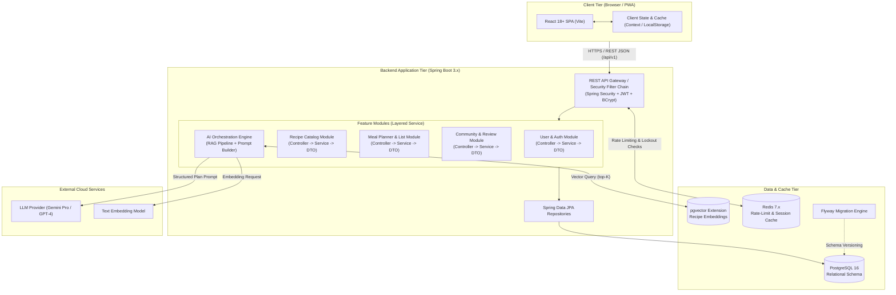

# SOFTWARE ARCHITECTURE DOCUMENT: WIKICOOK

## DOCUMENT METADATA & RESPONSIBILITY MATRIX

| Section | Title | Performed by (Author) | Reviewed by | Edited by |
| :---: | :--- | :---: | :---: | :---: |
| **Section 1** | System Overview | **Mai Văn Hiển (MaiHien3507)** | **Nguyễn Thành Dự (ThanhDu14)** | **Lê Quốc Hưng (LqHung06)** |
| **Section 2** | High-Level Architecture Diagram | **Mai Văn Hiển (MaiHien3507)** | **Nguyễn Thành Dự (ThanhDu14)** | **Lê Quốc Hưng (LqHung06)** |
| **Section 3** | Technology Stack Selection | **Mai Văn Hiển (MaiHien3507)** | **Nguyễn Thành Dự (ThanhDu14)** | **Lê Quốc Hưng (LqHung06)** |

---

## 1. System Overview
*Performed by: Mai Văn Hiển (MaiHien3507) | Reviewed by: Nguyễn Thành Dự (ThanhDu14) | Edited by: Lê Quốc Hưng (LqHung06)*

### 1.1. Architectural Style & Design Philosophy

WikiCook follows a modern, decoupled **Layered Client-Server Architecture** designed to balance development velocity, testability, and operational simplicity:

1. **Strict Layered Separation:**
   - Client tier: Single Page Application (SPA / PWA) delivering rich interactive experiences.
   - API tier: Stateless RESTful API layer managing requests, rate-limiting, and validation.
   - Business service tier: Encapsulates domain logic, recipe algorithms, and AI orchestration.
   - Persistence tier: Relational data mapping and semantic vector retrieval.
2. **Security & Boundary Isolation:**
   - Controllers never interact directly with database repositories; all flows pass through explicit domain services.
   - Data transfer between tiers uses immutable Data Transfer Objects (DTOs); JPA entities are never exposed across the network boundary.
   - External LLM API keys are strictly confined to the backend server environment.
3. **Spec-Driven & Test-First Compatibility:**
   - Architecture strictly adheres to the principles ratified in `constitution.md` (Java 21, Spring Boot 3.x, PostgreSQL 16).

---

## 2. High-Level Architecture Diagram
*Performed by: Mai Văn Hiển (MaiHien3507) | Reviewed by: Nguyễn Thành Dự (ThanhDu14) | Edited by: Lê Quốc Hưng (LqHung06)*

---

## 3. Technology Stack Selection
*Performed by: Mai Văn Hiển (MaiHien3507) | Reviewed by: Nguyễn Thành Dự (ThanhDu14) | Edited by: Lê Quốc Hưng (LqHung06)*

In accordance with the team's engineering constitution (`.specify/memory/constitution.md`), the chosen technology stack comprises:

| Architecture Layer | Technology Selected | Version | Selection Rationale |
|:---|:---|:---:|:---|
| **Frontend Framework** | **ReactJS** with **Vite** | 18+ | Fast HMR development, robust ecosystem for calendar drag-and-drop and state management. |
| **Frontend Styling** | **Tailwind CSS** | 3.4+ | Utility-first responsive design, ensuring clean display across viewports from 360px up to 4K. |
| **Backend Framework** | **Spring Boot** | 3.x | Enterprise-grade stability, dependency injection, and comprehensive Spring ecosystem. |
| **Language Runtime** | **Java (LTS)** | 21 | Modern LTS features (Virtual Threads, Pattern Matching, Record classes for DTOs). |
| **Security & Auth** | **Spring Security** | 6.x | Standardized RBAC, BCrypt password hashing, and stateless JWT session handling. |
| **Database** | **PostgreSQL** | 16 | ACID-compliant relational storage with JSONB support for recipe parameters. |
| **Vector Search** | **pgvector** | 0.7+ | Native vector similarity search (Cosine/ANN) within PostgreSQL, eliminating dedicated vector DB overhead. |
| **Cache & Rate Limiting** | **Redis** | 7.x | In-memory key-value store for anti-abuse rate limiting (FR-017), brute-force account lockout tracking (FR-012), and temporary token blacklisting. |
| **Database Migration** | **Flyway** | Latest | Version-controlled database schema evolution; prevents `ddl-auto` deployment risks. |
| **AI Integration** | **Gemini Pro / GPT-4** | Cloud API | High-reasoning structured JSON generation for 7-day meal planning and nutritional estimation. |
| **Containerization** | **Docker Compose** | v2 | Replicable local development environment running Backend, Frontend, PostgreSQL, and Redis. |
