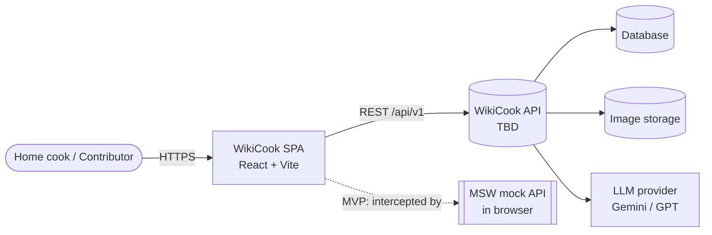
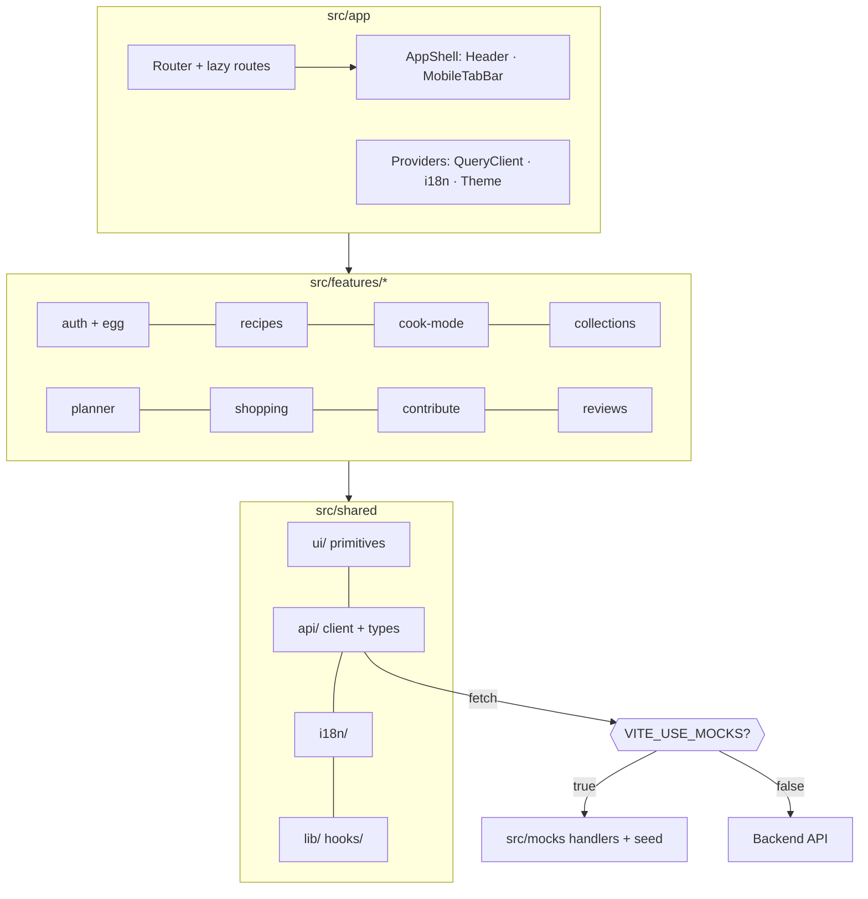

# Software Architecture

*Author:* DucDuyNguyen15-IT (frontend sections)  
*Reviewer:*  
*Editor:*  

> Scope of this version: the **frontend** (React SPA). Backend sections are marked *TBD — backend team*.
> Related: PRD `.claude/PRPs/prds/wikicook-frontend.prd.md` · ADRs `docs/adr/` · API contract `api-contract.md` · Design system `ui-ux/design-system.md`.

## 1. System Overview

WikiCook is a responsive single-page web application. The browser loads a static bundle (HTML/JS/CSS) and talks to a REST API over HTTPS. During the MVP the API is **mocked in the browser by MSW** (ADR-0007); switching to the real backend is a configuration change (`VITE_USE_MOCKS=false`, `VITE_API_BASE_URL`).

| Part | Responsibility | Owner |
|---|---|---|
| Web client (SPA) | All screens S1–S13, routing, i18n, theming, Cook Mode timers, egg transition, client caching | Frontend |
| Mock API (MSW) | Implements `api-contract.md` with seed data during MVP; reused in tests | Frontend |
| REST API | Auth, recipes, collections, planner, shopping list, reviews, uploads | *TBD — backend team* |
| AI service (LLM) | Natural-language search, meal-plan suggestion, nutrition/allergen estimation; called **only by the backend** | *TBD — backend / MaiHien3507 (§4 proposal)* |
| Storage | Database, image storage | *TBD — backend team* |

Key quality targets (PRD): Lighthouse mobile ≥ 90 (Performance, Accessibility), WCAG 2.2 AA, vi/en, light/dark, Cook Mode survives reload and Wi-Fi drop.

## 2. High-Level Architecture Diagram

### 2.1 Context



### 2.2 Frontend layers



### 2.3 Request / state flow

```
Component ─► feature hook (useRecipes) ─► TanStack Query ─► shared/api/client ─► fetch ─► MSW | backend
    ▲                                         │ cache, retry, invalidation
    └──────────── data / loading / error ◄────┘

Component ─► Zustand store (session, prefs, cook session) ─► localStorage (persist)
```

## 3. Technology Stack Selection

| Concern | Choice | ADR |
|---|---|---|
| Framework & build | React + TypeScript (strict) + Vite, client-rendered SPA | [0001](../adr/0001-react-spa-vite-typescript.md) |
| Code organisation | Feature folders + `shared/` | [0002](../adr/0002-feature-based-folder-structure.md) |
| Routing | React Router (data router, lazy routes, protected routes) | [0003](../adr/0003-react-router.md) |
| Server state | TanStack Query | [0004](../adr/0004-tanstack-query-and-zustand.md) |
| Client state | Zustand (+ persist) | [0004](../adr/0004-tanstack-query-and-zustand.md) |
| Styling & theming | Tailwind CSS mapped to CSS-variable tokens from `design-tokens.json` | [0005](../adr/0005-tailwind-with-css-variable-tokens.md) |
| i18n | i18next + react-i18next, vi default | [0006](../adr/0006-react-i18next.md) |
| API & mocks | Typed fetch client + MSW | [0007](../adr/0007-mock-first-api-with-msw.md) |
| Forms & validation | react-hook-form + zod | [0008](../adr/0008-react-hook-form-and-zod.md) |
| Testing | Vitest + React Testing Library + Playwright | [0009](../adr/0009-vitest-rtl-playwright.md) |
| 3D egg transition | Three.js (vanilla, lazy chunk) + Static image fallback | [0010](../adr/0010-egg-transition-vanilla-threejs-lazy.md) |
| Cook Mode timers | Timestamp-based Zustand store, Web Audio, Wake Lock | [0011](../adr/0011-cook-mode-timestamp-timers.md) |
| Drag-and-drop | dnd-kit | [0012](../adr/0012-dnd-kit-for-planner.md) |
| Icons | lucide-react | design-system §5 |
| Lint/format | ESLint (incl. import boundaries, jsx-a11y) + Prettier | — |
| Backend, DB, hosting | *TBD — backend team* | — |

Library versions: latest stable at Phase 1 scaffold time, pinned in `package.json` / lockfile.

## 4. Frontend Structure

```
src/
  app/            main.tsx, App.tsx, router.tsx, providers/, layout/
  features/
    auth/         login, register, onboarding, profile, egg/ (scene.ts, EggTransition.tsx)
    recipes/      home, search, detail, components (RecipeCard, FilterPanel…), api/
    cook-mode/    CookStepView, TimerTray, store/cookSession.ts
    collections/  planner/  shopping/  contribute/  reviews/
  shared/
    ui/           Button, Pill, Badge, TextField, Stepper, Dialog, BottomSheet…
    api/          client.ts, types.ts, errors.ts
    i18n/         index.ts, locales/{vi,en}/*.json
    lib/          units.ts (scaling/merging), format.ts, device.ts (tier detection)
  mocks/          browser.ts, server.ts, handlers/*, data/*
  styles/         tokens.css, global.css
e2e/              Playwright specs
```

Import rule: `features/*` → `shared/*` and other features' public `index.ts` only; `shared/` never imports from `features/`.

## 5. Routing

| Route | Screen | Access | Chunk |
|---|---|---|---|
| `/` | S1 Home | public | main |
| `/login`, `/register` | S2 Auth (+ egg) | guest only | auth (+ three.js lazy) |
| `/onboarding` | S3 | logged in | auth |
| `/profile` | S4 | logged in | auth |
| `/recipes` | S5 Search (filters in query string) | public | recipes |
| `/recipes/:id` | S6 Detail | public | recipes |
| `/recipes/:id/cook` | S7 Cook Mode (fullscreen, no AppShell) | public | cook-mode |
| `/planner` | S8 | logged in | planner |
| `/shopping-list` | S9 | logged in | shopping |
| `/collections`, `/collections/:id` | S10 | logged in | collections |
| `/recipes/new`, `/recipes/:id/edit` | S11 Wizard | logged in | contribute |
| `/me/recipes` | S12 | logged in | contribute |
| `*` | S13 Not found | public | main |

## 6. Cross-cutting Concerns

- **State ownership**: API data → TanStack Query only; session/prefs/cook session → Zustand; form state → react-hook-form; filters → URL.
- **Errors**: `client.ts` normalises failures to `ApiError { status, code, message, details }`; 401 clears session and redirects; per-route error boundary renders S13 or a retryable error state; toasts for mutation failures.
- **Loading**: skeletons per component (no full-page spinners); optimistic updates for bookmark and shopping-item check.
- **Theming**: `data-theme` on `<html>` set before first paint; Cook Mode uses its own palette class.
- **i18n**: namespaces per feature; numbers/dates via `Intl`; units/aisles via codes → keys.
- **Accessibility**: jsx-a11y lint, RTL role queries, visible focus, reduced-motion respected, non-drag alternative in planner.
- **Performance budget**: initial JS ≤ 180 KB gzip (excl. lazy chunks); route chunks lazy; images WebP with `width`/`height`; Three.js only in auth chunk; LCP < 2.5 s on mid-range mobile (Lighthouse).
- **Resilience**: Cook Mode session in `localStorage` (`wikicook.cook-session.v1`); TanStack Query cache keeps last viewed recipe readable offline for the session.
- **Security (client side)**: access token in memory (+ refresh per backend decision, contract §7); no tokens in `localStorage` outside mock mode; user content rendered as text (no `dangerouslySetInnerHTML`); external video links open with `rel="noopener noreferrer"`.

## 7. Environments & Configuration

| Variable | Dev (default) | Demo build | Production (later) |
|---|---|---|---|
| `VITE_USE_MOCKS` | `true` | `true` | `false` |
| `VITE_API_BASE_URL` | `/api/v1` | `/api/v1` | backend URL |
| `VITE_DEFAULT_LOCALE` | `vi` | `vi` | `vi` |

Static hosting must rewrite unknown paths to `index.html` (SPA fallback). CI (GitHub Actions, proposed): `lint → typecheck → test → build` on every PR to `main`.

## 8. Backend Architecture

*TBD — backend team.* Frontend expectations are in `api-contract.md` §7 (open questions).
