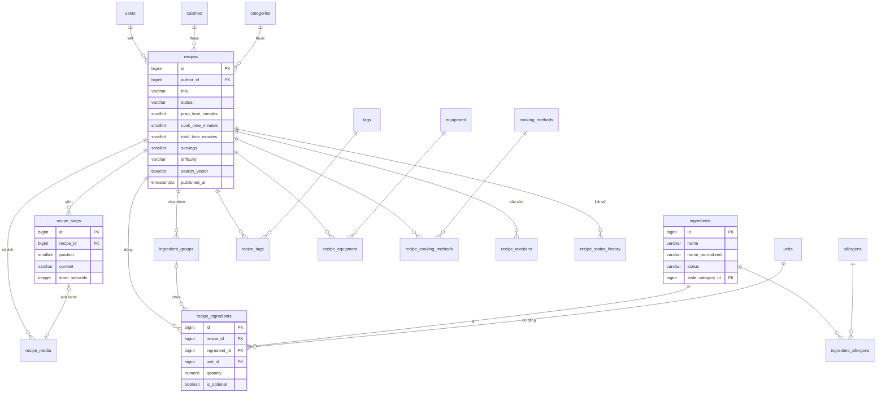
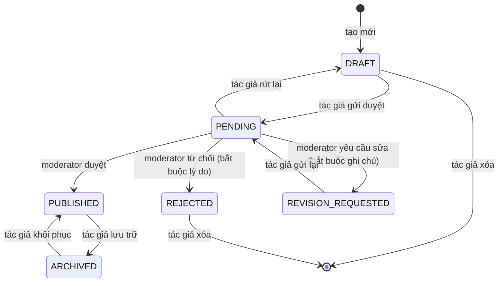

# Bản nháp schema: nhóm bảng công thức và nguyên liệu (B)

*Soạn bởi: Nguyễn Đức Duy (DucDuyNguyen15-IT) | Review: Lê Quốc Hưng (LqHung06) – phần `ingredients` dùng cho shopping list | Trạng thái: **bản nháp gửi nhóm trước T3 13/10***

File này là bản nháp phần CSDL của B theo [mục 2 file phân công](../../management/w1-spec-design-assignment.md#2-phần-csdl-của-từng-người). Sau họp T4 14/10, nội dung đã chốt sẽ được chuyển vào `docs/analysis-and-design/database/README.md` (khung do A tạo) và file này sẽ bị xóa.

Nguồn yêu cầu: [spec 020](../../../specs/020-recipe-search-filter/spec.md) (tìm kiếm, lọc) và [spec 060](../../../specs/060-recipe-editor/spec.md) (wizard, vòng đời công thức).

> **Ký hiệu:** 🟡 *chờ A chốt quy ước chung* · 🔵 *bảng/cột đề xuất thêm, ngoài danh sách được giao* · ❓ *điểm giao cần thống nhất (mục 6)*

---

## 1. Quy ước đang giả định 🟡

Các quy ước dưới đây là đề xuất của B để viết được bản nháp. A chốt ở họp T4; nếu khác, B sửa lại toàn bộ.

| Vấn đề | Đề xuất | Lý do |
|---|---|---|
| Khóa chính | `BIGINT GENERATED ALWAYS AS IDENTITY` | Đơn giản với JPA, index nhỏ; bảo mật bản nháp dựa vào kiểm tra quyền phía server (spec 060 FR-003), không dựa vào ID khó đoán |
| Enum | `VARCHAR` + `CHECK (... IN (...))` | Thêm giá trị chỉ cần sửa `CHECK` trong migration; map thẳng `@Enumerated(EnumType.STRING)` |
| Thời gian | `created_at`, `updated_at` kiểu `TIMESTAMPTZ NOT NULL DEFAULT now()` | Theo file phân công |
| Xóa | Công thức **không** soft delete: dùng `status = 'ARCHIVED'`; bản nháp và bài bị từ chối xóa hẳn (spec 060 FR-028). Danh mục (ẩm thực, thẻ, dụng cụ…) dùng `is_active` thay vì xóa | Giữ đánh giá, bookmark, meal plan của người khác |
| Tên bảng/cột | `snake_case`, tên bảng số nhiều | Theo file phân công |
| Migration | `V{n}__{mo_ta}.sql`; B đề xuất dùng dải số `V2xx` cho nhóm bảng này | Tránh 5 người trùng số migration |

Extension cần có trong Docker Compose của C: `unaccent` (bắt buộc), `pg_trgm` (đề xuất, xem 4.2).

---

## 2. Sơ đồ quan hệ



`users` (A), `allergens` (A) và `aisle_categories` (D) thuộc nhóm bảng của người khác, chỉ vẽ ở đây để thấy khóa ngoại.

---

## 3. Máy trạng thái công thức



- Chuyển trạng thái chỉ thực hiện ở tầng Service, mỗi lần chuyển ghi một dòng `recipe_status_history` trong **cùng transaction**.
- Sửa công thức đã `PUBLISHED` không đổi trạng thái của công thức: tạo một dòng `recipe_revisions` có vòng đời riêng (mục 4.11), công thức vẫn hiển thị bản cũ (spec 060 FR-027).
- Sự kiện "công thức vào `PUBLISHED`" (lần đầu, khôi phục, hoặc duyệt bản sửa) là điểm C gắn tính dinh dưỡng và embedding ❓.

---

## 4. Đặc tả từng bảng

### 4.1. `recipes`

Bản nháp được phép thiếu trường, nên các cột nội dung để `NULL` được; ràng buộc `chk_recipes_complete` buộc đủ trường khi rời `DRAFT`.

| Cột | Kiểu | NULL | Mặc định | Ghi chú |
|---|---|---|---|---|
| `id` | `BIGINT` | NOT NULL | identity | PK |
| `author_id` | `BIGINT` | NULL | | FK `users(id)` `ON DELETE SET NULL` ❓ (xóa tài khoản → "Người dùng đã xóa") |
| `title` | `VARCHAR(100)` | NULL | | 5–100 ký tự khi gửi duyệt |
| `description` | `VARCHAR(500)` | NULL | | |
| `cuisine_id` | `BIGINT` | NULL | | FK `cuisines(id)` `ON DELETE RESTRICT` |
| `category_id` | `BIGINT` | NULL | | FK `categories(id)` `ON DELETE RESTRICT` |
| `difficulty` | `VARCHAR(10)` | NULL | | `CHECK IN ('EASY','MEDIUM','HARD')` |
| `prep_time_minutes` | `SMALLINT` | NULL | | `CHECK BETWEEN 0 AND 1440` |
| `cook_time_minutes` | `SMALLINT` | NULL | | `CHECK BETWEEN 0 AND 1440` |
| `total_time_minutes` | `SMALLINT` | NULL | | `GENERATED ALWAYS AS (prep_time_minutes + cook_time_minutes) STORED` – dùng cho lọc/sắp xếp "nấu nhanh nhất" |
| `servings` | `SMALLINT` | NULL | | `CHECK BETWEEN 1 AND 50`; khẩu phần gốc mà spec 040/050 nhân theo |
| `video_url` | `VARCHAR(500)` | NULL | | |
| `video_platform` | `VARCHAR(10)` | NULL | | `CHECK IN ('YOUTUBE','TIKTOK')`; `CHECK ((video_url IS NULL) = (video_platform IS NULL))` |
| `status` | `VARCHAR(20)` | NOT NULL | `'DRAFT'` | `CHECK IN ('DRAFT','PENDING','PUBLISHED','REJECTED','REVISION_REQUESTED','ARCHIVED')` |
| `last_wizard_step` | `SMALLINT` | NOT NULL | `1` | `CHECK BETWEEN 1 AND 6` – mở lại nháp đúng bước (spec 060 FR-020) |
| `rating_avg` | `NUMERIC(3,2)` | NOT NULL | `0` | ❓ E: lưu sẵn hay tính khi truy vấn |
| `review_count` | `INTEGER` | NOT NULL | `0` | ❓ như trên |
| `search_vector` | `TSVECTOR` | NULL | | Xem 4.2 |
| `version` | `INTEGER` | NOT NULL | `0` | Optimistic lock (`@Version`) – phát hiện sửa trên 2 thiết bị (spec 060 FR-021) |
| `submitted_at` | `TIMESTAMPTZ` | NULL | | Lần gửi duyệt gần nhất |
| `published_at` | `TIMESTAMPTZ` | NULL | | Lần xuất bản đầu tiên; dùng sắp xếp "mới nhất" |
| `archived_at` | `TIMESTAMPTZ` | NULL | | |
| `created_at`, `updated_at` | `TIMESTAMPTZ` | NOT NULL | `now()` | |

**Ràng buộc**

```sql
CONSTRAINT chk_recipes_complete CHECK (
  status = 'DRAFT' OR (
    title IS NOT NULL AND char_length(title) >= 5
    AND cuisine_id IS NOT NULL AND category_id IS NOT NULL
    AND difficulty IS NOT NULL AND servings IS NOT NULL
    AND prep_time_minutes IS NOT NULL AND cook_time_minutes IS NOT NULL
    AND prep_time_minutes + cook_time_minutes > 0
  )
),
CONSTRAINT chk_recipes_published_at CHECK (status NOT IN ('PUBLISHED','ARCHIVED') OR published_at IS NOT NULL)
```

Các điều kiện cần bảng khác (có ảnh bìa, ≥ 1 nguyên liệu, ≥ 1 bước) kiểm tra ở Service khi gửi duyệt (spec 060 FR-025).

**Index**

| Index | Phục vụ |
|---|---|
| `idx_recipes_published` trên `(published_at DESC, id DESC) WHERE status = 'PUBLISHED'` | Danh sách mặc định "mới nhất", phá hòa ổn định (spec 020 FR-015) |
| `idx_recipes_search` GIN trên `search_vector` `WHERE status = 'PUBLISHED'` | Tìm full-text |
| `idx_recipes_author_status` trên `(author_id, status, updated_at DESC)` | Trang "Công thức của tôi" (spec 060 FR-031) |
| `idx_recipes_filter` trên `(cuisine_id, category_id, difficulty, total_time_minutes) WHERE status = 'PUBLISHED'` | Lọc kết hợp; đo lại bằng `EXPLAIN` ở `/speckit-plan` |
| `idx_recipes_rating` trên `(rating_avg DESC, review_count DESC) WHERE status = 'PUBLISHED'` | Sắp xếp "đánh giá cao nhất" |
| `idx_recipes_pending` trên `(submitted_at) WHERE status = 'PENDING'` | Hàng đợi duyệt của E |

### 4.2. Tìm kiếm full-text (cột `search_vector`)

- `unaccent()` không phải hàm `IMMUTABLE` nên không dùng được trong cột generated hay index biểu thức. Đề xuất một hàm bọc:

  ```sql
  CREATE EXTENSION IF NOT EXISTS unaccent;
  CREATE FUNCTION f_unaccent(text) RETURNS text
    LANGUAGE sql IMMUTABLE PARALLEL SAFE STRICT
    AS $$ SELECT public.unaccent('public.unaccent', $1) $$;
  ```

- `search_vector` lấy dữ liệu từ **nhiều bảng** (tên, thẻ, nguyên liệu, mô tả), nên không làm cột generated được. Service ghi lại cột này trong cùng transaction mỗi khi công thức vào `PUBLISHED` hoặc bản sửa được duyệt:

  ```sql
  setweight(to_tsvector('simple', f_unaccent(lower(title))), 'A') ||
  setweight(to_tsvector('simple', f_unaccent(lower(<tên thẻ + tên nguyên liệu>))), 'B') ||
  setweight(to_tsvector('simple', f_unaccent(lower(coalesce(description, '')))), 'C')
  ```

- Dùng cấu hình `simple` (PostgreSQL không có cấu hình tiếng Việt); từ khóa người dùng cũng qua `f_unaccent(lower(...))` rồi `plainto_tsquery('simple', ...)` → tham số hóa, không nối chuỗi (constitution IV). Xếp hạng bằng `ts_rank` theo trọng số A > B > C (spec 020 FR-005).
- `đ` → `d`: `unaccent` mặc định đã xử lý; kiểm thử bằng bộ 30 tên món ở spec 020 SC-002.
- Gợi ý nguyên liệu khi gõ (spec 060 FR-007) dùng `ingredients.name_normalized` (4.3), không dùng `search_vector`. Nếu cần khớp giữa chuỗi ("la" → "Hành lá") thì bật `pg_trgm` và index GIN `gin_trgm_ops`; nếu chỉ khớp đầu từ thì index B-tree `text_pattern_ops` là đủ.

### 4.3. `ingredients` (danh mục nguyên liệu dùng chung)

| Cột | Kiểu | NULL | Mặc định | Ghi chú |
|---|---|---|---|---|
| `id` | `BIGINT` | NOT NULL | identity | PK |
| `name` | `VARCHAR(100)` | NOT NULL | | Tên hiển thị, có dấu ("Hành lá") |
| `name_normalized` | `VARCHAR(100)` | NOT NULL | | `f_unaccent(lower(trim(name)))` – Service ghi khi tạo/sửa |
| `status` | `VARCHAR(10)` | NOT NULL | `'APPROVED'` | `CHECK IN ('APPROVED','PROPOSED','REJECTED')` – nguyên liệu tác giả đề xuất (spec 060 FR-006) |
| `proposed_by` | `BIGINT` | NULL | | FK `users(id)` `ON DELETE SET NULL` |
| `aisle_category_id` | `BIGINT` | NULL | | FK `aisle_categories(id)` (bảng của D) `ON DELETE SET NULL` ❓ ai nhập |
| `created_at`, `updated_at` | `TIMESTAMPTZ` | NOT NULL | `now()` | |

- `UNIQUE (name_normalized) WHERE status = 'APPROVED'` → không có hai nguyên liệu đã duyệt trùng tên khi bỏ dấu; nhiều người vẫn đề xuất trùng được, moderator gộp.
- Index `(name_normalized text_pattern_ops) WHERE status = 'APPROVED'` (hoặc GIN trigram, xem 4.2) cho gợi ý khi gõ.

### 4.4. 🔵 `ingredient_allergens` ❓

Bảng nối nguyên liệu – chất gây dị ứng, là **nguồn sự thật** để ẩn công thức theo dietary profile (spec 020 FR-018) và cho AI planner (031). Không nằm trong danh sách của B hay A; đề xuất B giữ vì gắn với `ingredients`.

| Cột | Kiểu | Ghi chú |
|---|---|---|
| `ingredient_id` | `BIGINT NOT NULL` | FK `ingredients(id)` `ON DELETE CASCADE` |
| `allergen_id` | `BIGINT NOT NULL` | FK `allergens(id)` (bảng của A) `ON DELETE CASCADE` |

PK `(ingredient_id, allergen_id)`; index `(allergen_id)` để tìm mọi nguyên liệu chứa một chất gây dị ứng.

**Quy tắc loại công thức** dùng chung với 031: ẩn công thức nếu tồn tại `recipe_ingredients.ingredient_id` thuộc `user_excluded_ingredients` của người dùng, **hoặc** thuộc `ingredient_allergens` có `allergen_id` nằm trong `user_allergens` của người dùng (dạng `NOT EXISTS`).

### 4.5. `units`

| Cột | Kiểu | NULL | Ghi chú |
|---|---|---|---|
| `id` | `BIGINT` | NOT NULL | PK |
| `code` | `VARCHAR(20)` | NOT NULL | `UNIQUE`; ví dụ `g`, `kg`, `ml`, `l`, `tsp`, `tbsp`, `cup`, `piece`, `to_taste` |
| `name_vi` | `VARCHAR(30)` | NOT NULL | "muỗng cà phê", "vừa ăn"… |
| `unit_type` | `VARCHAR(10)` | NOT NULL | `CHECK IN ('MASS','VOLUME','COUNT','NONE')` – D dùng để quy đổi trong `unit_conversions` |
| `requires_quantity` | `BOOLEAN` | NOT NULL | `DEFAULT true`; `false` với "vừa ăn" (spec 060 Edge Cases) |
| `is_active` | `BOOLEAN` | NOT NULL | `DEFAULT true` |

Dữ liệu mặc định nạp bằng migration `R__seed_units.sql` (repeatable).

### 4.6. 🔵 `ingredient_groups`

Nhóm nguyên liệu trong một công thức ("Phần nước dùng") – spec 060 FR-008.

| Cột | Kiểu | NULL | Ghi chú |
|---|---|---|---|
| `id` | `BIGINT` | NOT NULL | PK |
| `recipe_id` | `BIGINT` | NOT NULL | FK `recipes(id)` `ON DELETE CASCADE` |
| `name` | `VARCHAR(60)` | NOT NULL | |
| `position` | `SMALLINT` | NOT NULL | `UNIQUE (recipe_id, position) DEFERRABLE INITIALLY DEFERRED` – đổi thứ tự trong một transaction |

### 4.7. `recipe_ingredients`

| Cột | Kiểu | NULL | Ghi chú |
|---|---|---|---|
| `id` | `BIGINT` | NOT NULL | PK |
| `recipe_id` | `BIGINT` | NOT NULL | FK `recipes(id)` `ON DELETE CASCADE` |
| `group_id` | `BIGINT` | NULL | FK `ingredient_groups(id)` `ON DELETE CASCADE`; `NULL` = không thuộc nhóm |
| `ingredient_id` | `BIGINT` | NOT NULL | FK `ingredients(id)` `ON DELETE RESTRICT` (kể cả nguyên liệu `PROPOSED`) |
| `quantity` | `NUMERIC(10,3)` | NULL | `CHECK (quantity IS NULL OR quantity > 0)`; "1/2" lưu `0.5` |
| `unit_id` | `BIGINT` | NOT NULL | FK `units(id)` `ON DELETE RESTRICT` |
| `note` | `VARCHAR(100)` | NULL | "thái hạt lựu" |
| `is_optional` | `BOOLEAN` | NOT NULL | `DEFAULT false` |
| `position` | `SMALLINT` | NOT NULL | `UNIQUE (recipe_id, position) DEFERRABLE INITIALLY DEFERRED` |

- `quantity` phải có khi `units.requires_quantity = true` → kiểm tra ở Service (khác bảng nên không dùng `CHECK` được).
- Index `(ingredient_id)` cho quy tắc loại theo dị ứng và cho shopping list của D.

### 4.8. `recipe_steps`

| Cột | Kiểu | NULL | Ghi chú |
|---|---|---|---|
| `id` | `BIGINT` | NOT NULL | PK |
| `recipe_id` | `BIGINT` | NOT NULL | FK `recipes(id)` `ON DELETE CASCADE` |
| `position` | `SMALLINT` | NOT NULL | `UNIQUE (recipe_id, position) DEFERRABLE INITIALLY DEFERRED` |
| `content` | `VARCHAR(1000)` | NULL | Bắt buộc khi gửi duyệt |
| `timer_seconds` | `INTEGER` | NULL | `CHECK (timer_seconds IS NULL OR timer_seconds BETWEEN 10 AND 86400)` – **một** đồng hồ mỗi bước ❓ D |
| `created_at`, `updated_at` | `TIMESTAMPTZ` | NOT NULL | `now()` |

### 4.9. `recipe_media`

| Cột | Kiểu | NULL | Ghi chú |
|---|---|---|---|
| `id` | `BIGINT` | NOT NULL | PK |
| `recipe_id` | `BIGINT` | NOT NULL | FK `recipes(id)` `ON DELETE CASCADE` |
| `step_id` | `BIGINT` | NULL | FK `recipe_steps(id)` `ON DELETE CASCADE` |
| `role` | `VARCHAR(10)` | NOT NULL | `CHECK IN ('COVER','STEP')` |
| `storage_key` | `VARCHAR(255)` | NOT NULL | Đường dẫn file ❓ E: local disk hay object storage |
| `content_type` | `VARCHAR(20)` | NOT NULL | `CHECK IN ('image/jpeg','image/png','image/webp')` |
| `size_bytes` | `INTEGER` | NOT NULL | `CHECK (size_bytes BETWEEN 1 AND 5242880)` – ≤ 5 MB ❓ E |
| `uploaded_by` | `BIGINT` | NULL | FK `users(id)` `ON DELETE SET NULL` |
| `created_at` | `TIMESTAMPTZ` | NOT NULL | `now()` |

- `CHECK ((role = 'COVER' AND step_id IS NULL) OR (role = 'STEP' AND step_id IS NOT NULL))`
- `UNIQUE (recipe_id) WHERE role = 'COVER'` → một ảnh bìa; `UNIQUE (step_id) WHERE role = 'STEP'` → một ảnh mỗi bước.
- Xóa dòng không tự xóa file: Service xóa file sau khi transaction commit (spec 060 FR-028).

### 4.10. Danh mục do admin quản lý: `cuisines`, `categories`, `tags`, `equipment`, 🔵 `cooking_methods`

Năm bảng cùng cấu trúc:

| Cột | Kiểu | NULL | Ghi chú |
|---|---|---|---|
| `id` | `BIGINT` | NOT NULL | PK |
| `name` | `VARCHAR(60)` | NOT NULL | Tên tiếng Việt |
| `slug` | `VARCHAR(60)` | NOT NULL | `UNIQUE`; dùng trên URL lọc (spec 020 FR-023) |
| `is_active` | `BOOLEAN` | NOT NULL | `DEFAULT true`; admin "xóa" = tắt, công thức cũ không bị gãy |
| `position` | `SMALLINT` | NOT NULL | `DEFAULT 0`; thứ tự hiển thị trong bộ lọc |
| `created_at`, `updated_at` | `TIMESTAMPTZ` | NOT NULL | `now()` |

`cooking_methods` (chiên không dầu, luộc, nướng…) là bảng mới: proposal và spec 020 có lọc theo cách nấu nhưng danh sách được giao chưa có.

**Bảng nối** (PK kép, FK công thức `ON DELETE CASCADE`, FK danh mục `ON DELETE RESTRICT`, index trên cột thứ hai):

- `recipe_tags (recipe_id, tag_id)` – tối đa 10 thẻ, kiểm tra ở Service.
- `recipe_equipment (recipe_id, equipment_id)`
- 🔵 `recipe_cooking_methods (recipe_id, cooking_method_id)`

### 4.11. 🔵 `recipe_revisions`

Bản sửa của công thức đã xuất bản (spec 060 FR-027) ❓ E.

| Cột | Kiểu | NULL | Ghi chú |
|---|---|---|---|
| `id` | `BIGINT` | NOT NULL | PK |
| `recipe_id` | `BIGINT` | NOT NULL | FK `recipes(id)` `ON DELETE CASCADE` |
| `status` | `VARCHAR(20)` | NOT NULL | `CHECK IN ('DRAFT','PENDING','REVISION_REQUESTED','REJECTED','APPROVED')` |
| `content` | `JSONB` | NOT NULL | Ảnh chụp toàn bộ nội dung đã sửa (thông tin chung, nguyên liệu, bước…) |
| `version` | `INTEGER` | NOT NULL | `DEFAULT 0`; optimistic lock |
| `submitted_at`, `decided_at` | `TIMESTAMPTZ` | NULL | |
| `created_at`, `updated_at` | `TIMESTAMPTZ` | NOT NULL | `now()` |

- `UNIQUE (recipe_id) WHERE status IN ('DRAFT','PENDING','REVISION_REQUESTED')` → tối đa một bản sửa đang mở.
- Khi duyệt: Service chép `content` vào `recipes` và các bảng con trong một transaction, giữ nguyên `recipes.id` nên đánh giá, bookmark, meal plan không đổi.
- Lưu JSONB thay vì nhân đôi 6 bảng con: đơn giản hơn, bản sửa chỉ cần đọc và ghi nguyên khối.

### 4.12. 🔵 `recipe_status_history` ❓ E

Lịch sử chuyển trạng thái, lý do từ chối, ghi chú yêu cầu sửa (spec 060 FR-024, FR-029).

| Cột | Kiểu | NULL | Ghi chú |
|---|---|---|---|
| `id` | `BIGINT` | NOT NULL | PK |
| `recipe_id` | `BIGINT` | NOT NULL | FK `recipes(id)` `ON DELETE CASCADE` |
| `revision_id` | `BIGINT` | NULL | FK `recipe_revisions(id)` `ON DELETE CASCADE` |
| `from_status` | `VARCHAR(20)` | NULL | `NULL` khi tạo mới |
| `to_status` | `VARCHAR(20)` | NOT NULL | |
| `actor_id` | `BIGINT` | NULL | FK `users(id)` `ON DELETE SET NULL` |
| `message` | `VARCHAR(1000)` | NULL | `CHECK (to_status NOT IN ('REJECTED','REVISION_REQUESTED') OR message IS NOT NULL)` |
| `created_at` | `TIMESTAMPTZ` | NOT NULL | `now()` |

Index `(recipe_id, created_at DESC)`. Bảng này có thể trùng với `moderation_actions` của E: đề xuất `moderation_actions` dành cho đánh giá/Cooksnap/người dùng, còn lịch sử công thức nằm ở đây.

---

## 5. Migration Flyway dự kiến 🟡

| File | Nội dung |
|---|---|
| `V201__create_recipe_taxonomies.sql` | `cuisines`, `categories`, `tags`, `equipment`, `cooking_methods` |
| `V202__create_ingredients_units.sql` | `unaccent`, `f_unaccent`, `units`, `ingredients`, `ingredient_allergens` (cần `allergens` của A và `aisle_categories` của D chạy trước) |
| `V203__create_recipes.sql` | `recipes` + `CHECK`, index |
| `V204__create_recipe_children.sql` | `ingredient_groups`, `recipe_ingredients`, `recipe_steps`, `recipe_media`, các bảng nối |
| `V205__create_recipe_revisions_history.sql` | `recipe_revisions`, `recipe_status_history` |
| `R__seed_units.sql`, `R__seed_taxonomies.sql` | Dữ liệu mặc định (đơn vị, ẩm thực, danh mục, cách nấu) |

---

## 6. Câu hỏi cần chốt ở họp T4 14/10

| # | Với | Câu hỏi | Đề xuất của B |
|---|---|---|---|
| 1 | A | Khóa chính `BIGINT IDENTITY` hay `UUID`? Enum `VARCHAR + CHECK` hay `CREATE TYPE`? Dải số migration cho từng người? | `BIGINT`, `VARCHAR + CHECK`, mỗi người một dải `Vx01–Vx99` |
| 2 | A | Xóa tài khoản: công thức của người đã xóa giữ lại với "Người dùng đã xóa"? | Có → `recipes.author_id` `ON DELETE SET NULL` |
| 3 | A, C | Ai giữ bảng `ingredient_allergens`? Nhãn dị ứng do LLM (spec 090) có dùng để lọc không? | B giữ bảng; chỉ `ingredient_allergens` dùng để lọc, nhãn LLM chỉ hiển thị |
| 4 | A, C | Quy tắc loại công thức theo dietary profile (mục 4.4) dùng chung cho 020 và 031? | Có, viết một hàm/Specification dùng chung |
| 5 | C | Sự kiện xuất bản gọi tính dinh dưỡng + embedding thế nào? Lỗi LLM có chặn xuất bản không? | Chạy sau khi commit, lỗi không chặn; job hằng đêm chạy bù |
| 6 | D | `ingredients.aisle_category_id` do ai nhập? Một hay nhiều đồng hồ mỗi bước? | Admin nhập khi duyệt nguyên liệu; một đồng hồ mỗi bước |
| 7 | E | `rating_avg`, `review_count` lưu trên `recipes` và ai cập nhật? | Lưu sẵn; Service đánh giá của E cập nhật trong cùng transaction |
| 8 | E | Lý do từ chối / ghi chú sửa lưu ở `recipe_status_history` hay `moderation_actions`? | `recipe_status_history` (mục 4.12) |
| 9 | E | Ảnh lưu local disk hay object storage? Giới hạn 5 MB? | Local disk (volume Docker) cho bản demo, 5 MB |
| 10 | Cả nhóm | Các cột lõi của `recipes` mọi người dùng: `servings`, `prep_time_minutes`, `cook_time_minutes`, `total_time_minutes`, `difficulty`, `status`, `author_id`, `published_at` | Như mục 4.1 |
