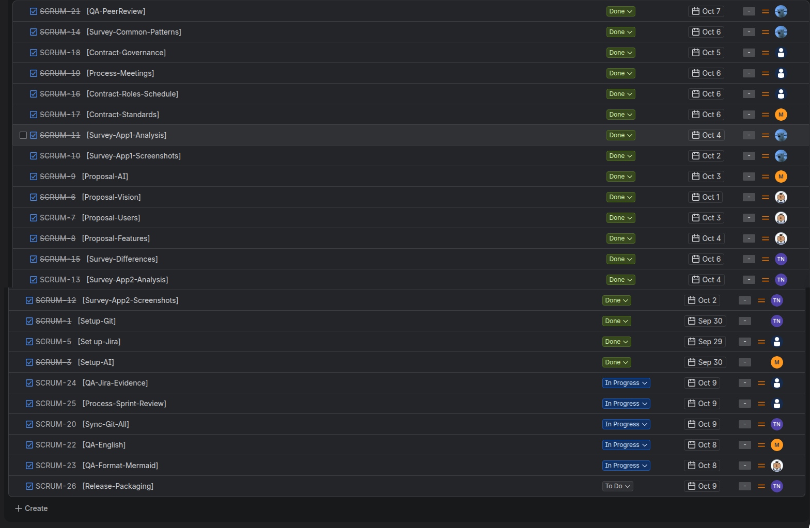
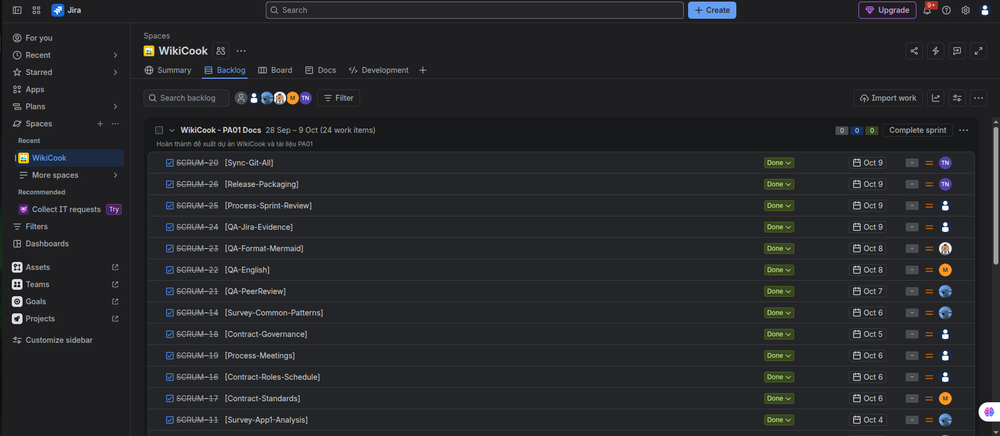
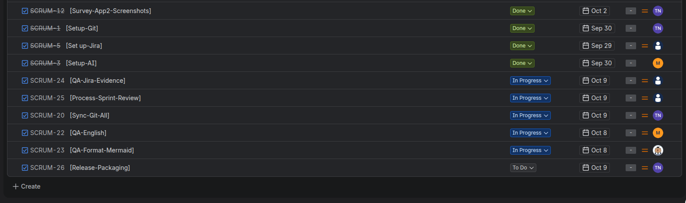
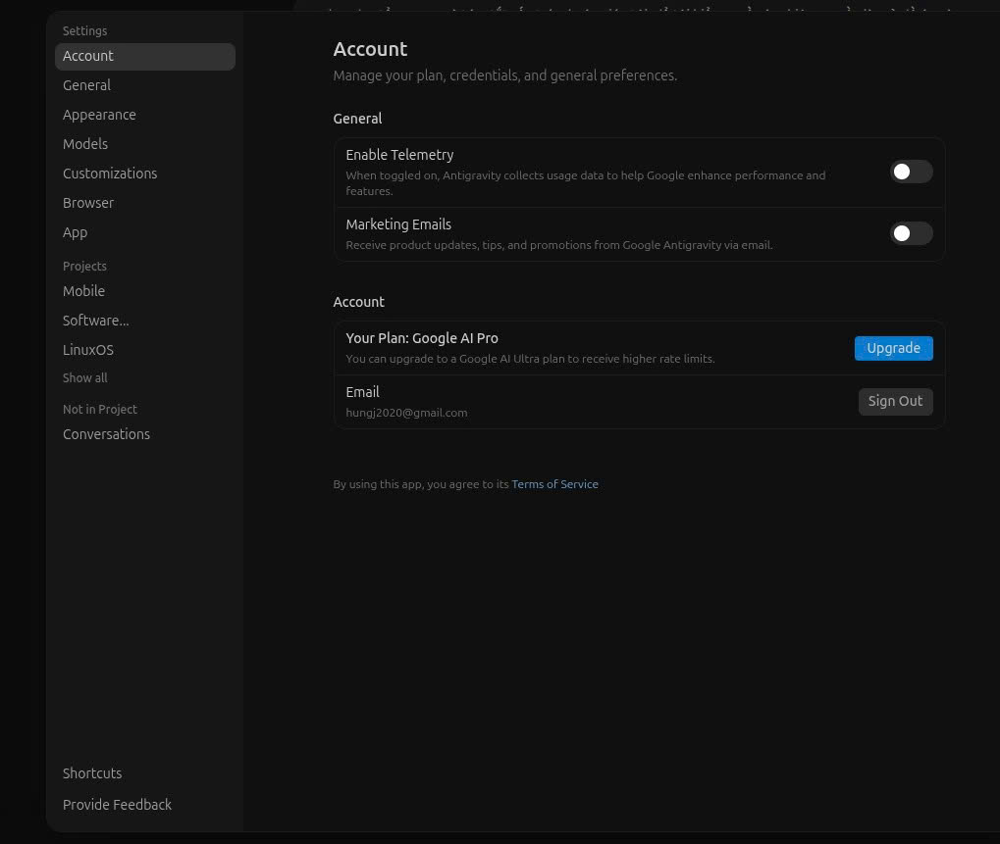
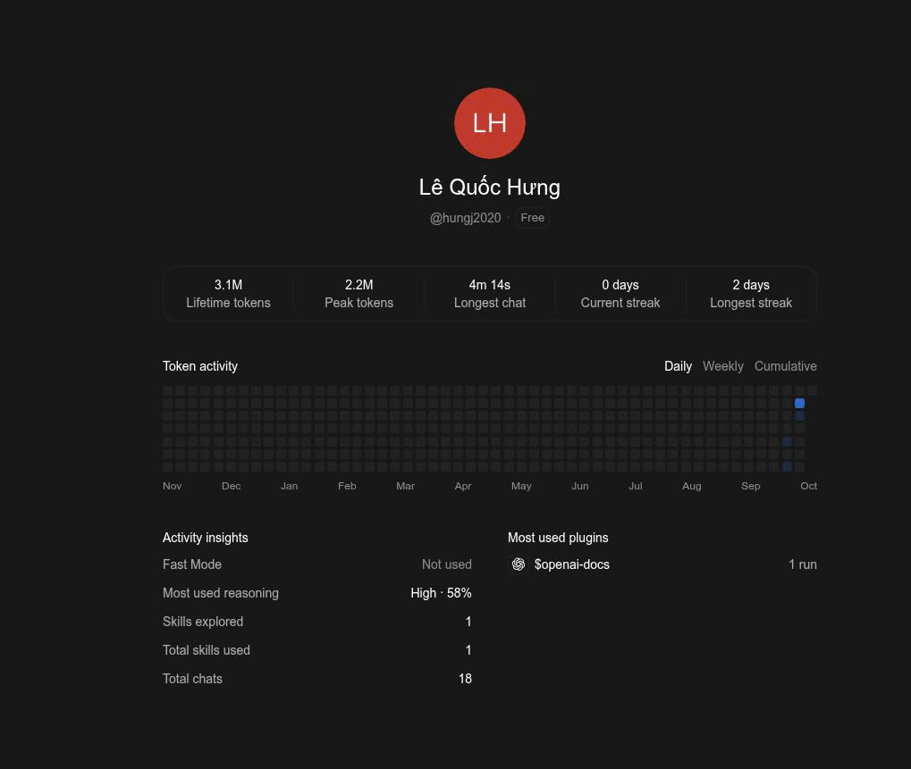
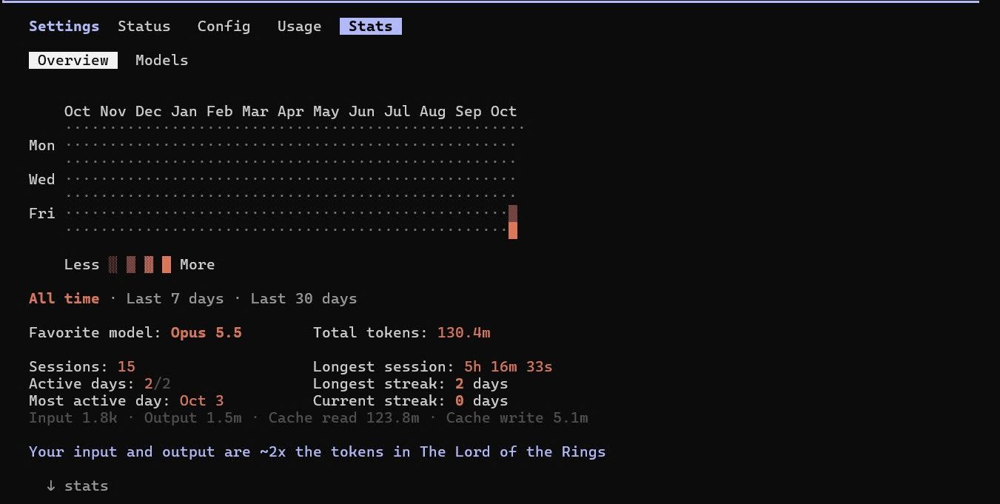
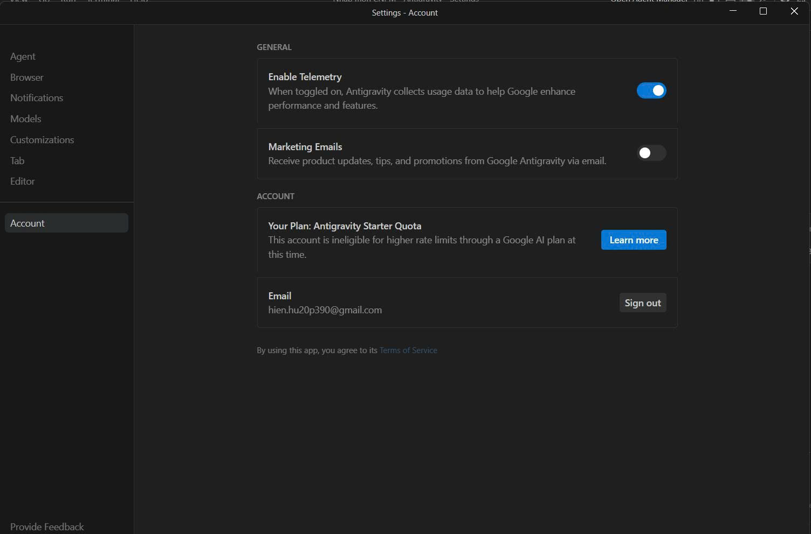
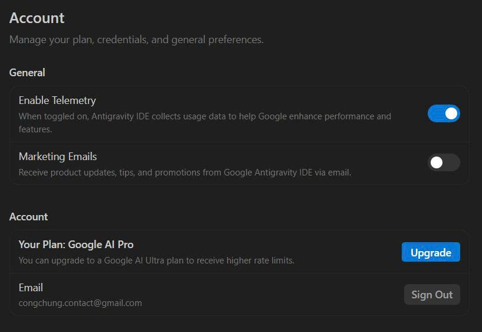
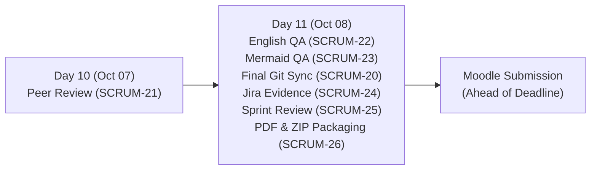

# SPRINT 01 REPORT: WIKICOOK PROJECT

**Course:** Introduction to Software Engineering  
**Project:** WikiCook  
**Sprint Cycle:** Sprint 01 (Project Assignment 1 — Preparation, Proposal & Team Setup)  
**Sprint Duration:** September 28, 2026 – October 09, 2026  

---

## DOCUMENT METADATA & RESPONSIBILITY MATRIX

| Document Section | Performed by | Reviewed by | Edited by |
| :--- | :---: | :---: | :---: |
| **Section 1 (Goals & Scope)** | **Lê Quốc Hưng (LqHung06) & Trần Nguyễn Công Chung (itzchugnn)** | Nguyễn Đức Duy (DucDuyNguyen15-IT) | Nguyễn Thành Dự (ThanhDu14) |
| **Section 2 - 3 (Jira Tracking & Evidence)** | **Lê Quốc Hưng (LqHung06)** | Nguyễn Đức Duy (DucDuyNguyen15-IT) | Nguyễn Thành Dự (ThanhDu14) |
| **Section 4 (Meeting Minutes 1 - 4)** | **Lê Quốc Hưng (LqHung06)** | Trần Nguyễn Công Chung (itzchugnn) | Mai Văn Hiển (MaiHien3507) |
| **Section 5 (AI Account Evidence)** | **Mai Văn Hiển (MaiHien3507)** | Lê Quốc Hưng (LqHung06) | Nguyễn Thành Dự (ThanhDu14) |
| **Section 6 (Retrospective & Next Steps)** | **Lê Quốc Hưng (LqHung06)** | Nguyễn Đức Duy (DucDuyNguyen15-IT) | Trần Nguyễn Công Chung (itzchugnn) |

---

## 1. SPRINT 01 GOALS & SCOPE
*Performed by: Lê Quốc Hưng (LqHung06) & Trần Nguyễn Công Chung (itzchugnn) | Reviewed by: Nguyễn Đức Duy (DucDuyNguyen15-IT) | Edited by: Nguyễn Thành Dự (ThanhDu14)*

The overarching objective of **Sprint 01 (PA01)** is to establish a rock-solid software engineering foundation, conceptualize product specifications, study existing market solutions, and formalize agile team dynamics for the **WikiCook** platform.

### Core Sprint Objectives

1. **Administrative Setup & Team Registration:** Register the group with 5 members, appoint leadership roles, and establish GitHub repository and Jira project tracking.
2. **Project Proposal (Part B - 10 Pts):** Author a comprehensive vision document with target personas, operational environments, 10 core functional feature modules, and the AI Weekly Meal Planner architecture.
3. **Existing Market Survey (Part C - 10 Pts):** Benchmark at least 2 comparable cooking applications, capture and annotate high-fidelity UI/UX screenshots, and construct a comparative feature matrix.
4. **Team Contract (Part D - 5 Pts):** Establish a binding team charter defining roles, communication protocols, 12-day schedule milestones, coding/doc standards, and conflict escalation pathways.
5. **Agile Process & Tooling (Part E - 5 Pts):** Adhere to the Scrum framework (conducting 4 distinct Scrum events), maintain individual-assigned Jira task histories, and compile AI coding platform registration proofs.

---

## 2. JIRA TASK BREAKDOWN & PROGRESS STATUS
*Performed by: Lê Quốc Hưng (LqHung06) | Reviewed by: Nguyễn Đức Duy (DucDuyNguyen15-IT) | Edited by: Nguyễn Thành Dự (ThanhDu14)*

The team decomposed Sprint 01 into **24 granular, individually-assigned tasks** on Jira Software Cloud. The live progress tracking table updated as of **October 08, 2026** (reflecting the completed Jira Board state with all 24 tasks completed) is summarized below:

|    Issue Key   | Summary (Task Name)                                           |        Assignee        |    Status   | Due Date | Completion Status / Output                                      |
| :------------: | :------------------------------------------------------------ | :--------------------: | :---------: | :------: | :-------------------------------------------------------------- |
|  **`SCRUM-1`** | `[Setup-Git]` Initialize Standard WikiCook Git Repository     |     Nguyễn Thành Dự    |   **DONE**  |  Sep 30  | Initialized private repository with standard directory structure, `.gitignore`, and branching rules |
|  **`SCRUM-3`** | `[Setup-AI]` Collect AI Account Registration Evidence         |      Mai Văn Hiển      |   **DONE**  |  Sep 30  | Collected AI educational license registration proofs from all 5 members (Antigravity & Claude Code) |
|  **`SCRUM-5`** | `[Set up-Jira]` Configure Scrum Board & 24 Tasks              |      Lê Quốc Hưng      |   **DONE**  |  Sep 29  | Sprint 1 configured, active Scrum board established, and 24 tasks loaded |
|  **`SCRUM-6`** | `[Proposal-Vision]` Problem Statement & Vision                |     Nguyễn Đức Duy     |   **DONE**  |  Oct 01  | Section 1 completed in `project-proposal.md` (Problem Statement & Product Vision) |
|  **`SCRUM-7`** | `[Proposal-Users]` Target Personas & Environments             |     Nguyễn Đức Duy     |   **DONE**  |  Oct 03  | Section 2 completed in `project-proposal.md` (4 Target Personas & Operating Environments) |
|  **`SCRUM-8`** | `[Proposal-Features]` 10 Functional Modules                   |     Nguyễn Đức Duy     |   **DONE**  |  Oct 04  | Section 3 completed in `project-proposal.md` (10 core functional modules with What & Why) |
|  **`SCRUM-9`** | `[Proposal-AI]` AI Weekly Meal Planner & Mermaid Flow         |      Mai Văn Hiển      |   **DONE**  |  Oct 03  | Section 4 completed in `project-proposal.md` (AI Weekly Meal Planner RAG architecture & pipeline flow) |
| **`SCRUM-10`** | `[Survey-App1-Screenshots]` 5 Screenshots of App 1            | Trần Nguyễn Công Chung |   **DONE**  |  Oct 02  | 5 high-resolution annotated screenshots of MyFridgeFood saved in `docs/assets/screenshots/` |
| **`SCRUM-11`** | `[Survey-App1-Analysis]` Detailed Analysis of App 1           | Trần Nguyễn Công Chung |   **DONE**  |  Oct 04  | Completed App 1 (MyFridgeFood) feature tree, comparison matrix & UI/UX analysis |
| **`SCRUM-12`** | `[Survey-App2-Screenshots]` App 2 Screenshots                 |     Nguyễn Thành Dự    |   **DONE**  |  Oct 02  | 5 high-resolution annotated screenshots of Ăn Gì Ngon captured and cataloged |
| **`SCRUM-13`** | `[Survey-App2-Analysis]` Detailed Analysis of App 2           |     Nguyễn Thành Dự    |   **DONE**  |  Oct 04  | Completed App 2 (Ăn Gì Ngon) survey, feature comparison & UI/UX workflow analysis |
| **`SCRUM-14`** | `[Survey-Common-Patterns]` Common Features & UX Patterns      | Trần Nguyễn Công Chung |   **DONE**  |  Oct 06  | Common culinary app patterns & UI/UX workflows synthesized in Section 9 of `existing-app-survey.md` |
| **`SCRUM-15`** | `[Survey-Differences]` WikiCook Differentiating Features      |     Nguyễn Thành Dự    |   **DONE**  |  Oct 06  | WikiCook differentiating value propositions and opportunities synthesized in `existing-app-survey.md` |
| **`SCRUM-16`** | `[Contract-Roles-Schedule]` Roles, SLA & Schedule             |      Lê Quốc Hưng      |   **DONE**  |  Oct 06  | Sections 1, 2, and 3 completed in `team-contract.md` (Roles, Communication SLA & 12-day schedule) |
| **`SCRUM-17`** | `[Contract-Standards]` Code/Documentation Standards & KPI     |      Mai Văn Hiển      |   **DONE**  |  Oct 06  | Sections 4 and 5 completed in `team-contract.md` (Git/Markdown standards & contribution KPIs) |
| **`SCRUM-18`** | `[Contract-Governance]` Decision-Making & Conflict Resolution |      Lê Quốc Hưng      |   **DONE**  |  Oct 05  | Sections 6, 7, and 8 completed in `team-contract.md` (Voting mechanism & escalation pathways) |
| **`SCRUM-19`** | `[Process-Meetings]` Scrum Meeting Minutes 1, 2, and 3        |      Lê Quốc Hưng      |   **DONE**  |  Oct 06  | Documented formal Scrum meeting minutes for Planning (M1) and Standups 1 & 2 (M2, M3) |
| **`SCRUM-20`** | `[Sync-Git-All]` All 5 Members Commit Work to Git             |     Nguyễn Thành Dự    |   **DONE**  |  Oct 09  | All 5 member branches synchronized, peer PRs reviewed and merged into main branch |
| **`SCRUM-21`** | `[QA-PeerReview]` Peer Review & Header Rule Check             | Trần Nguyễn Công Chung |   **DONE**  |  Oct 07  | Cross peer-review completed; 3-tier header metadata audit verified across all documents |
| **`SCRUM-22`** | `[QA-English]` English Grammar & Spelling Review              |      Mai Văn Hiển      |   **DONE**  |  Oct 08  | Comprehensive English grammar, technical term consistency, and tone proofreading completed |
| **`SCRUM-23`** | `[QA-Format-Mermaid]` Markdown & Mermaid Formatting           |     Nguyễn Đức Duy     |   **DONE**  |  Oct 08  | Markdown table alignment, cross-reference links, and Mermaid diagram render verification completed |
| **`SCRUM-24`** | `[QA-Jira-Evidence]` Capture Jira Evidence Screenshots        |      Lê Quốc Hưng      |   **DONE**  |  Oct 09  | Captured updated Jira Board and 24 Task List evidence snapshots and integrated into report |
| **`SCRUM-25`** | `[Process-Sprint-Review]` Sprint Review Meeting & Report      |      Lê Quốc Hưng      |   **DONE**  |  Oct 09  | Sprint Review & Retrospective completed, all deliverables audited and sprint documentation finalized |
| **`SCRUM-26`** | `[Release-Packaging]` Export PDF & Package ZIP for Submission |     Nguyễn Thành Dự    |   **DONE**  |  Oct 09  | Final Markdown-to-PDF export, checksum verification, and ZIP archive packaging prepared for submission |

---

## 3. JIRA TASK MANAGEMENT EVIDENCE & PROGRESS ANALYSIS
*Performed by: Lê Quốc Hưng (LqHung06) | Reviewed by: Nguyễn Đức Duy (DucDuyNguyen15-IT) | Edited by: Nguyễn Thành Dự (ThanhDu14)*

In compliance with course requirements, all project activities are strictly managed and tracked on Jira Software Cloud. Every task is assigned to exactly one individual with explicit creation dates, due dates, and tracked status transitions.

### 3.1. Progress Status Analysis (as of October 08, 2026)

Based on the live Jira Board status captured on **October 08, 2026**, the progress metrics are evaluated as follows:

```text
+-----------------------------------------------------------------------------------+
|                        SPRINT 01 TASK COMPLETION OVERVIEW                         |
+---------------------+-------------------+-------------------+---------------------+
| Status Category     | Number of Tasks   | Percentage (%)    | Cumulative Target   |
+---------------------+-------------------+-------------------+---------------------+
| Done                | 24 / 24           | 100.0%            | 100.0% Completed    |
| In Progress         |  0 / 24           |   0.0%            | 100.0% Closed       |
| To Do               |  0 / 24           |   0.0%            | 100.0% Scheduled    |
+---------------------+-------------------+-------------------+---------------------+
```

1. **Complete Sprint Goal Achievement (100% Done):**
   - By Day 11 (Oct 08), **all 24 out of 24 tasks** have successfully transitioned to **DONE**.
   - All core foundational deliverables have been fully authored, reviewed, and finalized:
     - Management & Team Setup: Git repository initialized (`SCRUM-1`), Jira board active (`SCRUM-5`), AI accounts registered (`SCRUM-3`), Team Contract completed (`SCRUM-16`, `SCRUM-17`, `SCRUM-18`), and Meetings 1–3 minutes recorded (`SCRUM-19`).
     - Project Proposal: Vision (`SCRUM-6`), Personas & Environments (`SCRUM-7`), 10 Functional Modules (`SCRUM-8`), and AI Weekly Meal Planner (`SCRUM-9`).
     - Existing App Survey: Screenshots captured (`SCRUM-10`, `SCRUM-12`), benchmarking analysis completed (`SCRUM-11`, `SCRUM-13`), common patterns (`SCRUM-14`), and differentiators (`SCRUM-15`).
     - Quality Assurance & Release: Cross peer-review (`SCRUM-21`), English QA (`SCRUM-22`), Markdown/Mermaid QA formatting (`SCRUM-23`), Git synchronization (`SCRUM-20`), Jira visual evidence (`SCRUM-24`), Sprint Review (`SCRUM-25`), and Release Packaging (`SCRUM-26`).

2. **Quality Assurance & Verification Sign-Off:**
   - Both `SCRUM-22` (*QA-English*) and `SCRUM-23` (*QA-Format-Mermaid*) completed with 100% verification of diagrams, typography, and US English spelling consistency.
   - All feature branches successfully merged into `main` (`SCRUM-20`), and full documentation packaged for release (`SCRUM-26`).

### 3.2. Workload & Individual Contribution Breakdown

All 24 tasks are distributed equitably across the 5 team members according to their assigned Scrum roles:

| Member | Assigned Role | Total Tasks | Done | In Progress | To Do | Contribution Focus |
| :--- | :--- | :---: | :---: | :---: | :---: | :--- |
| **Lê Quốc Hưng** (`@LqHung06`) | PM & Scrum Master | **6** | **6** | 0 | 0 | Jira board, Team Contract, Meetings, Jira evidence, Sprint Review |
| **Nguyễn Thành Dự** (`@ThanhDu14`) | DevOps & Market Researcher 2 | **6** | **6** | 0 | 0 | Git repo, Survey App 2, Survey differences, Git sync, Release packaging |
| **Nguyễn Đức Duy** (`@DucDuyNguyen15-IT`) | PO & Requirements Lead | **4** | **4** | 0 | 0 | Proposal Sections 1–3, Markdown/Mermaid QA formatting |
| **Mai Văn Hiển** (`@MaiHien3507`) | AI Architect & Technical Lead | **4** | **4** | 0 | 0 | AI setup audit, Proposal Section 4 (AI Planner), Standards, English QA |
| **Trần Nguyễn Công Chung** (`@itzchugnn`) | QA Lead & Market Researcher 1 | **4** | **4** | 0 | 0 | Survey App 1 (Screenshots & Analysis), Common patterns, Cross Peer-Review |

> **Audit Observation:** Every team member has achieved 100% completion of their assigned tasks with zero overdue items across all 24 tasks. All acceptance criteria and definition of done have been fulfilled ahead of final deadline.

### 3.3. Schedule Adjustments & Timeline Realignment

Comparing the live Jira board dates with the initial sprint estimates demonstrates realistic agile adaptation without jeopardizing the final release date (October 09):

* **`SCRUM-7` (Proposal-Users):** Due date finalized to **Oct 03** (from initial estimate Oct 02) to ensure persona pain points closely matched the detailed 10 functional modules written in `SCRUM-8`.
* **`SCRUM-16` & `SCRUM-17` (Team Contract):** Due dates coordinated to **Oct 06** (from Oct 04 / Oct 05) so that the entire charter could be collectively inspected and ratified during Daily Standup 02 (Meeting 3) on the evening of October 06.
* **`SCRUM-20` (Sync-Git-All) & `SCRUM-24` (QA-Jira-Evidence):** Targeted to **Oct 09** (from Oct 06 / Oct 08) because Git synchronization and Jira evidence capture must remain actively ongoing until the sprint closes.

### 3.4. Jira Board & Task List Visual Evidence

The live Jira board state reflecting the 24 tasks is captured below:

#### Figure 3.1: Active Sprint Board View

*Figure 3.1: Jira Active Sprint Board demonstrating 100% completion with all 24 tasks transitioned into the Done column ahead of sprint close.*

#### Figure 3.2: Comprehensive Task History Log (24 Tasks)


*Figure 3.2: Sprint backlog showing all 24 tasks. Part 1 lists `SCRUM-20` down to `SCRUM-11`; Part 2 continues from `SCRUM-16` down to `SCRUM-3`. Each task has exactly one assignee, a due date, and its current status.*

---

## 4. SCRUM MEETING MINUTES
*Performed by: Lê Quốc Hưng (LqHung06) | Reviewed by: Trần Nguyễn Công Chung (itzchugnn) | Edited by: Mai Văn Hiển (MaiHien3507)*

Following the Scrum process mandated in `PA1-2026.pdf` (Page 5), our team conducts **4 structured Scrum meetings**:

| Meeting Event | Date & Modality | Key Focus / Outcome |
| :--- | :--- | :--- |
| **Meeting 1** | 28/09/2026 • 22:00 (Google Meet) | Sprint Planning & WBS Task Allocation |
| **Meeting 2** | 01/10/2026 • 21:00 (Google Meet) | Weekly Scrum 1 – Mid-Sprint Sync |
| **Meeting 3** | 06/10/2026 • 20:30 (Google Meet) | Weekly Scrum 2 – Draft Audit |
| **Meeting 4** | 08/10/2026 • 20:00 (Google Meet) | Sprint Review & Retrospective |

---

### 4.1. Meeting 1: Sprint Planning 01
- **Date & Time:** September 28, 2026 | 22:00 – 23:30 (90 mins)
- **Location / Modality:** Google Meet
- **Team members present:** Lê Quốc Hưng, Nguyễn Đức Duy, Mai Văn Hiển, Nguyễn Thành Dự, Trần Nguyễn Công Chung (5/5).
- **Team members absent:** None.
- **Agenda:**
  1. Brainstorm and finalize the project topic (Web Application).
  2. Define the product scope and name: **WikiCook**.
  3. Deconstruct `PA1-2026.pdf` requirements and establish the 12-day Sprint plan.
  4. Create the Jira backlog and assign initial setup tasks.
- **Key Discussions & Decisions:**
  - **Unanimous Decision on Project Scope:** The team agreed to build **WikiCook** — a responsive culinary web application focusing on solving daily meal decision fatigue via on-hand ingredient matching, hands-free cooking guidance, and an intelligent AI Weekly Meal Planner.
  - **Role Assignments:** Lê Quốc Hưng as PM & Scrum Master; Nguyễn Đức Duy as PO & Requirements Lead; Mai Văn Hiển as AI Architect; Trần Nguyễn Công Chung as Market Researcher 1 & QA Lead; Nguyễn Thành Dự as DevOps & Market Researcher 2.
  - **Jira & Git Initialization:** Lê Quốc Hưng assigned to build the Jira board; Nguyễn Thành Dự assigned to initialize the GitHub repository.

---

### 4.2. Weekly Scrum Meetings (Meetings 2 & 3)

Following the course template, both weekly scrum meetings are kept in a single log, newest first. Each member answers three questions: what was completed, what is planned until the next meeting, and what issues block the work.

#### =========== 06/10/2026, Sprint 1 (Meeting 3) ===========

- **Time & Modality:** 20:30 – 21:05 (35 mins), Google Meet
- **Team members present:** Lê Quốc Hưng, Nguyễn Đức Duy, Mai Văn Hiển, Nguyễn Thành Dự, Trần Nguyễn Công Chung (5/5)
- **Team members absent:** None
- **Status reports:**
  - **Lê Quốc Hưng**
    - *Completed tasks:* Team Contract Sections 1–3 (`SCRUM-16`) and 6–8 (`SCRUM-18`); minutes of Meetings 1 and 2 (`SCRUM-19`).
    - *To-do tasks:* Record the minutes of this meeting (`SCRUM-19`); capture Jira evidence (`SCRUM-24`, due Oct 09); run the Sprint Review (`SCRUM-25`, due Oct 09).
    - *Issues/Obstacles:* None reported.
  - **Nguyễn Đức Duy**
    - *Completed tasks:* Proposal Sections 1–3 (`SCRUM-6`, `SCRUM-7`, `SCRUM-8`).
    - *To-do tasks:* Markdown and Mermaid formatting QA (`SCRUM-23`, due Oct 08).
    - *Issues/Obstacles:* None reported.
  - **Mai Văn Hiển**
    - *Completed tasks:* Proposal Section 4, AI Weekly Meal Planner (`SCRUM-9`); Team Contract Sections 4–5 (`SCRUM-17`).
    - *To-do tasks:* English proofreading of all documents (`SCRUM-22`, due Oct 08).
    - *Issues/Obstacles:* None reported.
  - **Nguyễn Thành Dự**
    - *Completed tasks:* App 2 screenshots and analysis (`SCRUM-12`, `SCRUM-13`); WikiCook differentiators (`SCRUM-15`).
    - *To-do tasks:* Review and merge member pull requests (`SCRUM-20`, due Oct 09); export PDFs and package the ZIP (`SCRUM-26`, due Oct 09).
    - *Issues/Obstacles:* None reported.
  - **Trần Nguyễn Công Chung**
    - *Completed tasks:* App 1 screenshots and analysis (`SCRUM-10`, `SCRUM-11`); common features and UX patterns (`SCRUM-14`).
    - *To-do tasks:* Cross peer-review and header metadata check (`SCRUM-21`, due Oct 07).
    - *Issues/Obstacles:* None reported.
- **Actions:**
  - All members signed off on the finalized `team-contract.md`.
  - Phase 2 (quality assurance) starts immediately after the meeting.
  - Remaining due dates realigned: `SCRUM-21` (Oct 07); `SCRUM-22`, `SCRUM-23` (Oct 08); `SCRUM-20`, `SCRUM-24`, `SCRUM-25`, `SCRUM-26` (Oct 09).
- **Summary of the meeting:** First drafts of the proposal, survey and team contract are complete and committed to GitHub. The team moves from drafting to review, proofreading and packaging for the final three days of the sprint.

#### =========== 01/10/2026, Sprint 1 (Meeting 2) ===========

- **Time & Modality:** 21:00 – 21:35 (35 mins), Google Meet
- **Team members present:** Lê Quốc Hưng, Nguyễn Đức Duy, Mai Văn Hiển, Nguyễn Thành Dự, Trần Nguyễn Công Chung (5/5)
- **Team members absent:** None
- **Status reports:**
  - **Lê Quốc Hưng**
    - *Completed tasks:* Jira board configured with 24 tasks (`SCRUM-5`); first draft of `team-contract.md`; Sprint 01 report started.
    - *To-do tasks:* Finalize Team Contract Sections 1–3 and 6–8 (`SCRUM-16`, `SCRUM-18`); record meeting minutes (`SCRUM-19`).
    - *Issues/Obstacles:* None reported.
  - **Nguyễn Đức Duy**
    - *Completed tasks:* Problem statement and product vision (`SCRUM-6`); first drafts of Proposal Sections 2–3, including the 10 functional modules.
    - *To-do tasks:* Finalize target personas and environments (`SCRUM-7`, due Oct 03) and the 10 functional modules (`SCRUM-8`, due Oct 04).
    - *Issues/Obstacles:* None reported.
  - **Mai Văn Hiển**
    - *Completed tasks:* Collected AI account registration evidence from all members (`SCRUM-3`).
    - *To-do tasks:* Proposal Section 4, AI Weekly Meal Planner architecture and data flow diagram (`SCRUM-9`, due Oct 03); Team Contract Sections 4–5 (`SCRUM-17`).
    - *Issues/Obstacles:* None reported.
  - **Nguyễn Thành Dự**
    - *Completed tasks:* Initialized the private GitHub repository and folder structure (`SCRUM-1`).
    - *To-do tasks:* App 2 (Ăn Gì Ngon) screenshots (`SCRUM-12`, due Oct 02) and analysis (`SCRUM-13`, due Oct 04).
    - *Issues/Obstacles:* None reported.
  - **Trần Nguyễn Công Chung**
    - *Completed tasks:* App 1 (MyFridgeFood) screenshots (`SCRUM-10`) and a first draft of the feature matrix and UI/UX analysis.
    - *To-do tasks:* Finalize the App 1 analysis (`SCRUM-11`, due Oct 04); synthesize common features and UX patterns (`SCRUM-14`, due Oct 06).
    - *Issues/Obstacles:* Image links broke when Markdown files in nested folders referenced screenshots.
- **Actions:**
  - Store all screenshots under `docs/assets/screenshots/<app-name>/` and reference them with relative paths.
  - Nguyễn Thành Dự delivers the App 2 survey by Oct 04; Mai Văn Hiển commits Proposal Section 4 by Oct 03.
- **Summary of the meeting:** Setup tasks are finished and every document has a first draft or is in progress. The only blocker (broken image paths) was solved with a shared asset folder convention.

---

### 4.3. Meeting 4: Sprint Review & Retrospective
- **Date & Time:** October 08, 2026 | 20:00 – 21:30 (90 mins)
- **Location / Modality:** Google Meet
- **Team members present:** Lê Quốc Hưng, Nguyễn Đức Duy, Mai Văn Hiển, Nguyễn Thành Dự, Trần Nguyễn Công Chung (5/5).
- **Team members absent:** None.
- **Agenda & Meeting Outcomes:**
  1. **Final Deliverables Inspection:** Conducted final inspection of compiled Markdown documents and verified zero layout, table, or typography anomalies (`SCRUM-22`, `SCRUM-23`).
  2. **Diagram Validation:** Validated that all Mermaid architecture and workflow diagrams render cleanly without clipping or syntax warnings.
  3. **Jira Board & Commit Evidence:** Captured and verified Jira board screenshots showing 100% completion (24/24 Done) and confirmed Git log synchronization (`SCRUM-20`, `SCRUM-24`).
  4. **Sprint Retrospective Execution:** Conducted formal retrospective session (`SCRUM-25`) — synthesized accomplishments, challenges, and actionable improvements for Sprint 02.
  5. **Submission Packaging Sign-off:** Verified PDF exports and created `PA1-GroupWikiCook.zip` ready for Moodle submission (`SCRUM-26`).
- **Retrospective results:** recorded in Section 6.1 using the five questions required by the course template.

---

## 5. AI CODING PLATFORM REGISTRATION EVIDENCE
*Performed by: Mai Văn Hiển (MaiHien3507) | Reviewed by: Lê Quốc Hưng (LqHung06) | Edited by: Nguyễn Thành Dự (ThanhDu14)*

In strict compliance with Curriculum Scope requirements (Page 6 of `PA1-2026.pdf`), each team member has registered an account on at least one AI coding platform:

| Team Member | Primary Role | AI Coding Platform Registered | Verification Status |
| :--- | :--- | :--- | :--- |
| **Lê Quốc Hưng** (`@LqHung06`) | Project Manager & Scrum Master | Antigravity & Codex | Verified |
| **Nguyễn Đức Duy** (`@DucDuyNguyen15-IT`) | Product Owner & Requirements Lead | Claude Code | Verified |
| **Mai Văn Hiển** (`@MaiHien3507`) | AI Architect & Technical Lead | Antigravity | Verified  |
| **Trần Nguyễn Công Chung** (`@itzchugnn`) | Market Researcher 1 & QA Lead | Antigravity | Verified |
| **Nguyễn Thành Dự** (`@ThanhDu14`) | Market Researcher 2 & DevOps Lead | Claude Code | Verified |

### 5.1. Account Screenshots

#### Figure 5.1: Lê Quốc Hưng — Antigravity


#### Figure 5.2: Lê Quốc Hưng — Codex


#### Figure 5.3: Nguyễn Đức Duy & Nguyễn Thành Dự — Claude Code

*Nguyễn Đức Duy and Nguyễn Thành Dự work on the same computer and use the same Claude Code installation, so one screenshot covers both members.*

#### Figure 5.4: Mai Văn Hiển — Antigravity


#### Figure 5.5: Trần Nguyễn Công Chung — Antigravity


---

## 6. SPRINT 01 RETROSPECTIVE & NEXT STEPS
*Performed by: Lê Quốc Hưng (LqHung06) | Reviewed by: Nguyễn Đức Duy (DucDuyNguyen15-IT) | Edited by: Trần Nguyễn Công Chung (itzchugnn)*

### 6.1. Sprint Retrospective (Meeting 4, October 08, 2026)

#### What Went Well
1. **All Tasks Delivered:** All 24 Jira tasks reached `DONE`, and every deliverable of PA1 was drafted, reviewed and proofread before the deadline.
2. **Equitable Workload & Collaborative Culture:** All 5 members contributed across requirements, competitor research, process management and quality assurance, with 5/5 attendance at all four meetings.
3. **Spec-Driven Discipline Bootstrapped Early:** Setting up GitHub Spec Kit (`.specify/`) and a ratified constitution prepares the team for spec-first development in later sprints.
4. **Multi-Tier Quality Gate:** The author / reviewer / editor rule meant every section was checked by at least three members.

#### What Went Wrong
1. Several due dates slipped: `SCRUM-7` moved from Oct 02 to Oct 03, and `SCRUM-16` and `SCRUM-17` moved from Oct 04–05 to Oct 06 (see Section 3.3).
2. Screenshot links broke early in the sprint when documents in nested folders referenced images.
3. Different Markdown-to-PDF tools rendered page breaks, image sizes and Mermaid diagrams differently.

#### What Problems Occurred and What Caused Them
| Problem | Cause |
| :--- | :--- |
| Team Contract tasks finished late | Governance sections needed approval from the whole team at Meeting 3, but the estimates assumed a single person could sign them off. |
| Broken image links | No shared folder convention for assets existed at the start of the sprint. |
| Inconsistent PDF output | The team had not agreed on one export tool, so the output was only checked at the end of the sprint. |

#### What Can Be Done Differently in the Next Sprint
1. Include time for team review and approval inside each task estimate, not after it.
2. Agree on shared conventions (asset folders, file names, feature names) during Sprint Planning, before writing starts.
3. Choose one PDF export tool at the start of the sprint and export a trial PDF at mid-sprint.

#### Lessons Learned
1. Documents that the whole team must approve need a review step in the plan, not just a single owner.
2. Quality checks on formatting and rendering are real work and need their own tasks (`SCRUM-22`, `SCRUM-23`).

### 6.2. Action Roadmap for Sprint Completion (October 08 – October 09, 2026)



* **Day 11 (October 08, 2026) — Final Quality Sign-off & Completion:**
  * Completed English QA review across all documents (`SCRUM-22` - Mai Văn Hiển).
  * Validated Mermaid diagrams, tables, and typography (`SCRUM-23` - Nguyễn Đức Duy).
  * Finalized all Git branches and verified clean working tree (`SCRUM-20` - Nguyễn Thành Dự).
  * Captured final Jira board screenshots and embedded in report (`SCRUM-24` - Lê Quốc Hưng).
  * Convened Meeting 4 (Sprint Review & Retrospective) and finalized report (`SCRUM-25` - Lê Quốc Hưng).
  * Compiled all Markdown documents to PDF, generated the submission ZIP archive (`PA1-GroupWikiCook.zip`), ready for Moodle submission (`SCRUM-26` - Nguyễn Thành Dự).
