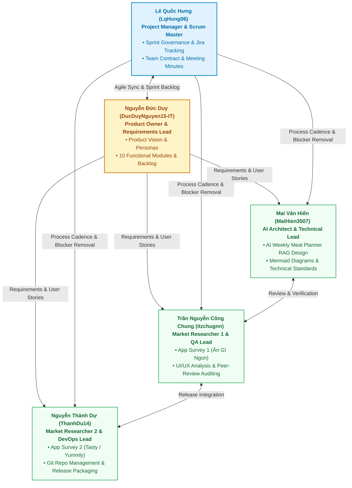
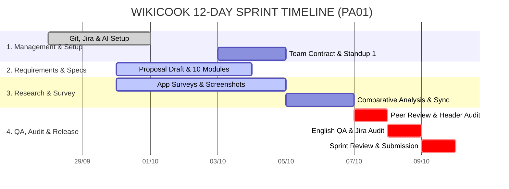

# TEAM CONTRACT: WIKICOOK TEAM

## DOCUMENT METADATA & RESPONSIBILITY MATRIX

| Section | Title | Performed by (Author) | Reviewed by | Edited by |
| :---: | :--- | :---: | :---: | :---: |
| **Section 1 - 3** | Roles, Communication & Work Schedule | **Lê Quốc Hưng (LqHung06)** | Nguyễn Đức Duy (DucDuyNguyen15-IT), Mai Văn Hiển (MaiHien3507) | Nguyễn Thành Dự (ThanhDu14) |
| **Section 4 - 5** | Code/Doc Standards & Accountability | **Lê Quốc Hưng (LqHung06) & Mai Văn Hiển (MaiHien3507)** | Nguyễn Đức Duy (DucDuyNguyen15-IT) | Trần Nguyễn Công Chung (itzchugnn) |
| **Section 6 - 8** | Governance, Conflict Resolution & Review | **Lê Quốc Hưng (LqHung06)** | Mai Văn Hiển (MaiHien3507) | Nguyễn Đức Duy (DucDuyNguyen15-IT) |

---

## 1. TEAM ROLES AND RESPONSIBILITIES
*Performed by: Lê Quốc Hưng (LqHung06) | Reviewed by: Nguyễn Đức Duy (DucDuyNguyen15-IT) | Edited by: Trần Nguyễn Công Chung (itzchugnn)*

**All 5 team members act as Full-stack Engineers**, actively engaging across all stages of the software engineering lifecycle( requirements analysis, system design, implementation, testing, and continuous deployment).

To ensure clear ownership, prevent organizational bottlenecks, and drive execution, specific leadership roles are designated as follows:



| Team Member | Primary Leadership Role | Core Ownership & Scope |
| :--- | :--- | :--- |
| **Lê Quốc Hưng (LqHung06)**| **Project Manager & Scrum Master** | Sprint governance, Jira tracking, Team Contract & Meeting Minutes |
| **Nguyễn Đức Duy (DucDuyNguyen15-IT)**| **Product Owner & Requirements Lead** | Vision, Problem Statement, Personas, 10 Functional Modules & Backlog |
| **Mai Văn Hiển (MaiHien3507)**| **AI Architect & Technical Lead** | AI Weekly Meal Planner RAG Architecture, Mermaid Diagrams & Technical Standards, English QA |
| **Nguyễn Thành Dự (ThanhDu14)**| **Market Researcher 2 & DevOps Lead** | App Survey 2 (Tasty/Yummly), Git Repo Management, Release Packaging (PDF/ZIP) |
| **Trần Nguyễn Công Chung (itzchugnn)**| **Market Researcher 1 & QA Lead** | App Survey 1 (Ăn Gì Ngon), UX benchmarking, Peer-Review Auditing |

### Detailed Role Descriptions

1. **Lê Quốc Hưng (PM & Scrum Master):**
   - Facilitates all Scrum events (Sprint Planning, Daily Standups, Sprint Review).
   - Maintains the Jira board, ensuring strict adherence to creation, assignment, and completion dates.
   - Manages project risks, tracks critical milestones, and coordinates inter-member deliverables.
2. **Nguyễn Đức Duy (PO & Requirements Lead):**
   - Defines product vision, target personas, user stories, and functional requirement specifications.
   - Prioritizes product backlog items to maximize practical end-user value.
   - Formats and structures technical documentation in Markdown.
3. **Mai Văn Hiển (AI Architect & Technical Lead):**
   - Researches, architectures, and models the AI Weekly Meal Planner (AI Menu Generator) and RAG planning pipelines.
   - Enforces technical documentation rigor, diagrams syntax (Mermaid), and English quality standards.
   - Audits AI account registrations across the team.
4. **Nguyễn Thành Dự (Market Researcher 2 & DevOps Lead):**
   - Conducts benchmark analysis of competitor App 2 (Tasty / Yummly) and synthesizes differentiation opportunities.
   - Manages Git repository architecture, branching rules, and versioning pipelines.
   - Owns final release packaging (Markdown-to-PDF compilation and ZIP archiving).
5. **Trần Nguyễn Công Chung (Market Researcher 1 & QA Lead):**
   - Conducts in-depth market benchmarking of existing culinary web applications (App 1 - Ăn Gì Ngon).
   - Analyzes competitor UI/UX workflows, capturing high-fidelity screenshots with comprehensive captions.
   - Leads the peer-review cross-checking process and QA audits.

---

## 2. COMMUNICATION PLAN
*Performed by: Lê Quốc Hưng (LqHung06) | Reviewed by: Nguyễn Đức Duy (DucDuyNguyen15-IT) | Edited by: Nguyễn Thành Dự (ThanhDu14)*

Efficient, transparent communication is vital for agile collaboration. The team establishes the following protocols:

### 2.1. Communication Channels & Tool Stack

**Zalo**

- **Group Chat:** Used for general communication, announcements, Sprint updates, and Git commit notifications.
- **Group Calls by Google Meet:** Used for Scrum meetings, pair-writing sessions, and direct discussions.
- **Urgent Communication:** Reserved for emergency alerts, unexpected blockers, or immediate meeting requests.

**GitHub Repository & Jira Software Cloud:**

- Official repository for version-controlled code, documentation, and task tracking.

### 2.2. Communication & Response Guidelines

- Members are encouraged to check and respond to team messages regularly, especially during active development periods.
- Team members should try to **pick up assigned tasks early** and communicate any questions or blockers as soon as possible.
- Urgent issues or blockers should be communicated promptly so that the team can support and resolve them together.
- There are no strict response-time requirements outside active working periods. Members are expected to respond when reasonably available.

### 2.3. Meeting Cadence & Scrum Protocols

- **Meeting Frequency:**
  - 1 Sprint Planning Meeting (Day 1).
  - 2 Daily Scrum / Standup Meetings (Day 6 & Day 9).
  - 1 Sprint Review & Retrospective Meeting (Day 12).
- **Attendance & Participation:** Members are encouraged to attend meetings on time and actively participate in discussions. If a member cannot attend, they should inform the team in advance when possible and provide a brief progress update.
- **Task Completion:** Members are encouraged to **start their tasks early and complete them before the agreed deadline** whenever possible, leaving sufficient time for review, testing, and handling unexpected issues.

---

## 3. WORK SCHEDULE AND DEADLINES
*Performed by: Lê Quốc Hưng (LqHung06) | Reviewed by: Nguyễn Đức Duy (DucDuyNguyen15-IT) | Edited by: Nguyễn Thành Dự (ThanhDu14)*

The team adopts a **12-Day Sprint Model (September 28, 2026 – October 09, 2026)**, segmented into clear functional workstreams:



### Milestone Deadlines

- **Day 2 (Sep 29):** Private GitHub repo initialized; Jira Board created with 24 tasks.
- **Day 4 (Oct 01):** Part B (Project Proposal: Sections 1, 2, 3) completed by Member 2.
- **Day 5 (Oct 02):** Screenshots and initial analysis for App 1 & App 2 uploaded.
- **Day 6 (Oct 03):** AI Weekly Meal Planner feature and Mermaid data flow diagram completed by Member 3.
- **Day 7 (Oct 04):** Team Contract drafted by Member 1. Standup Meeting 1 convened.
- **Day 9 (Oct 06):** 100% first drafts of all documents committed and pushed to GitHub. Standup Meeting 2 convened.
- **Day 10 (Oct 07):** Cross peer-review finished; 3-tier header metadata verified across all sections.
- **Day 11 (Oct 08):** Comprehensive English QA proofreading completed; Jira Board audited with screenshot evidence.
- **Day 12 (Oct 09):** Final Sprint Review convened; Markdown documents exported to PDF; ZIP package submitted to Moodle **4 hours prior to deadline**.

**Deadline Flexibility:** Team members are encouraged to start and complete their assigned tasks **before the scheduled deadlines** whenever possible. Deadlines serve as target dates rather than fixed start dates, so members do not need to wait until the deadline approaches to begin their work. Completing tasks early is welcomed and allows additional time for review, testing, and addressing unexpected issues.

### Contingency Plan for Delays

If any task falls behind schedule by more than 24 hours:

1. The assigned member must immediately report the bottleneck in the `#sprint-01` channel.
2. Project Manager redistributes auxiliary tasks or assigns a peer pair-writer to unblock the critical path.

---

## 4. CODE AND DOCUMENTATION STANDARDS
*Performed by: Lê Quốc Hưng (LqHung06), Mai Văn Hiển (MaiHien3507) | Reviewed by: Nguyễn Đức Duy (DucDuyNguyen15-IT) | Edited by: Trần Nguyễn Công Chung (itzchugnn)*

### 4.1. Version Control & Git Workflow

- **Repository Visibility:** Private repository on GitHub (`ThanhDu14/WikiCook`).
- **Branching Strategy:**
  - `main`: Protected production branch; only contains reviewed and tested deliverables.
  - `develop`: Integration branch for daily development.
  - Feature branches: Named format `feature/<task-id>-<short-description>` (e.g., `feature/scrum-8-functional-modules`).
- **Pull Request (PR) Policy:** Direct commits to `main` are strictly prohibited. All changes must pass a PR with at least 1 peer approval.

### 4.2. Commit Message Conventions

All commits must follow the prefix-based convention below.

**Required prefixes:**

| Prefix | When to use |
|:---|:---|
| `feat:` | Adding a new feature or functionality. |
| `fix:` | Fixing an existing bug or error. |
| `docs:` | Changes to documentation, Markdown files, README, diagrams, or project documents that do not affect functionality. |
| `style:` | Formatting, whitespace, or visual presentation adjustments without affecting logic. |
| `refactor:` | Code restructuring without changing functional behavior. |

**Examples:**

```bash
feat: add recipe search API
fix: handle invalid recipe input
docs: update project architecture
docs: add Mermaid data flow diagram
```

**Rules:**

- Commit messages must be concise and accurately describe the change.
- Avoid vague messages such as `update`, `change`, `fix stuff`, or `done`.
- Each commit should focus on one logical, related group of changes.
- Do not commit incomplete code without a justified reason.
- Never commit files containing passwords, API keys, tokens, or other sensitive information.
- Review all changed files before committing to avoid accidental inclusions.

---

### 4.3. Markdown Standards

All Markdown documents in the repository must follow these conventions:

**Heading hierarchy:**

- Use `#` for the document title (one per file).
- Use `##` for top-level sections.
- Use `###` for subsections.
- Do not skip heading levels or use headings arbitrarily for visual emphasis.

**Section Header Metadata Rule (Mandatory):**
Every top-level document section (`##`) must display the author-reviewer-editor metadata on the immediate line below the header (optional for subsections `###` to maintain document conciseness and visual flow). Metadata must follow the standardized naming convention `Full Name (GitHub_Username)`:

```markdown
## 3. KEY FUNCTIONAL FEATURES
*Performed by: [Author Name] | Reviewed by: [Reviewer Name] | Edited by: [Editor Name]*
```

**Lists:**

- Use bullet lists (`-`) for unordered items.
- Use numbered lists (`1.`, `2.`, ...) for sequential steps or procedures.
- Use Markdown tables when presenting structured, comparative data.

**Formatting in-text:**

- File and folder paths must use inline code formatting, e.g. `docs/management/team-contract.md`.
- Function names, class names, variable names, API endpoints, and CLI commands must use inline code when referenced in text.
- Code blocks must specify the language tag where possible, e.g.:

```cpp
// C++ example
```

```python
# Python example
```

**Media Assets:**

- All screenshots must be high-resolution PNGs stored in `docs/assets/screenshots/<category>/`, referenced with relative paths and accompanied by informative descriptive captions.

**General rules:**

- Documentation must be concise, clear, and consistent.
- Do not commit temporary documents, draft notes, or files unrelated to the project unless explicitly required.

---

### 4.4. Mermaid Standards

Mermaid diagrams should be used in documentation when a visual representation improves clarity. Applicable diagram types include:

- Flowchart
- Sequence Diagram
- Class Diagram
- Entity Relationship Diagram
- Architecture or Data Flow diagram

**Usage rules:**

- Mermaid code must be placed inside a fenced code block:

  ```mermaid
  flowchart LR
      A[User] --> B[Web Client]
  ```

- Do not use Mermaid syntax that is unsupported by the target renderer (e.g. GitHub Markdown).
- Node labels must be clear, meaningful, and consistent with project terminology.
- Do not use decorative emoji or icons inside diagrams.
- If a diagram becomes too complex, split it into smaller focused diagrams.
- Every relationship or flow arrow must have a clear, unambiguous meaning.
- After editing a Mermaid diagram, verify the syntax is valid to avoid breaking Markdown rendering.
- Diagrams that describe the system architecture or data flow must reflect the actual, implemented architecture — not assumptions or placeholder designs.

---

## 5. ACCOUNTABILITY AND PERFORMANCE
*Performed by: Lê Quốc Hưng (LqHung06), Mai Văn Hiển (MaiHien3507) | Reviewed by: Nguyễn Đức Duy (DucDuyNguyen15-IT) | Edited by: Trần Nguyễn Công Chung (itzchugnn)*

### 5.1. Contribution Evaluation Criteria

Each member's contribution will be evaluated based on the following criteria. Evidence must be traceable through Jira, Git commits, Pull Requests, code reviews, or documentation:

| Criteria | Description | Evidence |
|:---|:---|:---|
| **Task Completion** | Task completed within defined scope and requirements. | Jira task / PR |
| **Deadline** | Task delivered by the Sprint/task deadline; blocker reported proactively if at risk. | Sprint deadline / Jira |
| **Quality** | Code or documentation meets requirements, does not introduce critical errors due to lack of testing, and is clear enough for other members to continue using. | Code review / document review |
| **Git Contribution** | Commits follow the agreed convention and accurately reflect actual work. PR or branch updated according to team workflow where applicable. | Commit history / PR |
| **Teamwork** | Collaborates with other members, participates in reviews or support when needed, and communicates proactively when blocked. | Meeting notes / review / discussion |
| **Responsibility** | Proactively claims and executes tasks; does not abandon tasks mid-Sprint without notice; takes ownership of assigned work. | Task ownership / Jira progress |

---

### 5.2. Late Deadline Policy

The following penalty structure applies when a member misses a task deadline:

| Delay | Action & Penalty |
|:---|:---|
| **Under 24 hours** | Reminder issued; task must be completed immediately. No penalty if the member reported the delay in advance with a valid reason. |
| **24 to under 48 hours** | Formal written reminder; **5% deduction** from the contribution score for that task. |
| **48 to under 72 hours** | Warning recorded; **10% deduction** from the contribution score for that task. |
| **72 hours or more without valid reason** | Serious warning; **20% deduction** from the contribution score for that task. The team reviews overall Sprint contribution. |
| **Task not completed and no communication (> 48h)** | Task is recorded as incomplete. The team may reassign the task. The member will receive a **30%–50% peer-evaluation penalty**, and the matter will be formally escalated to the course Instructor / Teaching Assistant with documented Jira and Git evidence. |

**Exceptions — penalties may be waived or reduced when:**

- The member is ill or facing a serious personal situation.
- The task is blocked by another team member's unfinished work.
- Requirements changed after the task was assigned.
- The task scope expanded beyond the original estimate.
- An unforeseeable technical issue arose.

*In all exception cases, the member must notify the Scrum Master or the team as early as possible. The team will collectively decide whether to adjust the deadline or waive the penalty based on the actual circumstances.*

---

### 5.3. Accountability Process

**When a task is at risk of being late:**

1. Member identifies a blocker or risk.
2. Member notifies the team immediately
3. Team assesses the cause.
4. Deadline or task scope is adjusted if the reason is valid, or auxiliary pair-writer is assigned.
5. Member continues and completes the task.
6. Outcome is recorded in Jira and reflected in the Sprint record.

**When a member misses a deadline without prior notice:**

1. Task becomes overdue on the Jira board.
2. Scrum Master or team records the overdue status.
3. Member is asked to explain the reason within 12 hours.
4. Team evaluates the contribution level and delay impact for that task.
5. Penalty is applied if appropriate, according to Section 5.2.
6. Jira and Sprint records are updated accordingly.

---

## 6. DECISION-MAKING PROCESS
*Performed by: Lê Quốc Hưng (LqHung06) | Reviewed by: Mai Văn Hiển (MaiHien3507) | Edited by: Nguyễn Đức Duy (DucDuyNguyen15-IT)*

The team is committed to a collaborative, democratic decision-making process:

1. **Consensus Seeking (First Resort):** Architectural, technological, and scope decisions are openly debated during Sprint Planning to achieve unanimous agreement.
2. **Democratic Majority Vote:** If consensus cannot be reached within 30 minutes, a formal vote is called. A simple majority (≥ 3/5 votes) decides the outcome.
3. **Casting Vote (Final Say):** In the event of a tie or time-sensitive critical deadlock, **Lê Quốc Hưng (Project Manager)** holds the casting vote to guarantee project momentum.

---

## 7. CONFLICT RESOLUTION
*Performed by: Lê Quốc Hưng (LqHung06) | Reviewed by: Mai Văn Hiển (MaiHien3507) | Edited by: Nguyễn Đức Duy (DucDuyNguyen15-IT)*

Technical disagreements or team conflicts should be handled openly and constructively:

1. **Direct Discussion:** Members involved discuss the issue directly and focus on the task, requirements, and available evidence.
2. **Team Discussion:** If the issue remains unresolved, the team discusses it together and agrees on a suitable solution.
3. **Further Support:** If necessary, the team may seek guidance from the Teaching Assistant (TA) or Course Lecturer.

## 8. REVIEW AND UPDATE PROCESS
*Performed by: Lê Quốc Hưng (LqHung06) | Reviewed by: Mai Văn Hiển (MaiHien3507) | Edited by: Nguyễn Đức Duy (DucDuyNguyen15-IT)*

- **Review Frequency:** This contract is formally reviewed at the conclusion of each Sprint during the Sprint Retrospective meeting.
- **Amendment Protocol:** Any member may propose an amendment to workflow, SLA, or role assignments. An amendment takes effect immediately upon receiving approval from at least **4 out of 5 members** and must be documented in a dedicated Git commit.

---

## 9. TEAM MEMBER COMMITMENT & SIGNATURES
By committing this document to the repository, all 5 members acknowledge that they have read, understood, and agreed to abide by all clauses herein:

- **Lê Quốc Hưng (LqHung06 - Project Manager & Scrum Master):** *Confirmed*
- **Nguyễn Đức Duy (DucDuyNguyen15-IT - Product Owner & Requirements Lead):** *Confirmed*
- **Mai Văn Hiển (MaiHien3507 - AI Architect & Technical Lead):** *Confirmed*
- **Nguyễn Thành Dự (ThanhDu14 - Market Researcher 2 & DevOps Lead):** *Confirmed*
- **Trần Nguyễn Công Chung (itzchugnn - Market Researcher 1 & QA Lead):** *Confirmed*
