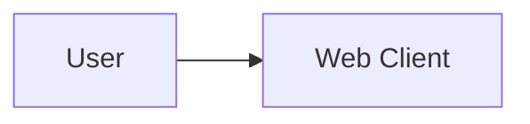

# Team Contract

*Author:*  
*Reviewer:*  
*Editor:*  

## 1. Team Roles and Responsibilities
- **Project Manager:** 
- **Lead Developer:** 
- **UI/UX Designer:** 
- **QA/Tester:** 

## 2. Communication Plan
- **Primary Channels:** Discord / Zalo / Slack
- **Meeting Schedule:** 

## 3. Work Schedule and Deadlines

## 4. Code and Documentation Standards

### 4.1 Markdown Standards

All Markdown documents in the repository must follow these conventions:

**Heading hierarchy**

- Use `#` for the document title (one per file).
- Use `##` for top-level sections.
- Use `###` for subsections.
- Do not skip heading levels or use headings arbitrarily for visual emphasis.

**Lists**

- Use bullet lists (`-`) for unordered items.
- Use numbered lists (`1.`, `2.`, ...) for sequential steps or procedures.
- Use Markdown tables when presenting structured, comparative data.

**Formatting in-text**

- File and folder paths must use inline code formatting, e.g. `docs/management/team-contract.md`.
- Function names, class names, variable names, API endpoints, and CLI commands must use inline code when referenced in text.
- Code blocks must specify the language tag where possible, e.g.:

```cpp
// C++ example
```

```python
# Python example
```

**General rules**

- Documentation must be concise, clear, and consistent.
- Do not commit temporary documents, draft notes, or files unrelated to the project unless explicitly required.

---

### 4.2 Mermaid Standards

Mermaid diagrams should be used in documentation when a visual representation improves clarity. Applicable diagram types include:

- Flowchart
- Sequence Diagram
- Class Diagram
- Entity Relationship Diagram
- Architecture or Data Flow diagram

**Usage rules**

- Mermaid code must be placed inside a fenced code block:



- Do not use Mermaid syntax that is unsupported by the target renderer (e.g. GitHub Markdown).
- Node labels must be clear, meaningful, and consistent with project terminology.
- Do not use decorative emoji or icons inside diagrams.
- If a diagram becomes too complex, split it into smaller focused diagrams.
- Every relationship or flow arrow must have a clear, unambiguous meaning.
- After editing a Mermaid diagram, verify the syntax is valid to avoid breaking Markdown rendering.
- Diagrams that describe the system architecture or data flow must reflect the actual, implemented architecture — not assumptions or placeholder designs.

---

### 4.3 Commit Message Conventions

All commits must follow the prefix-based convention below.

**Required prefixes**

| Prefix | When to use |
|--------|-------------|
| `feat:` | Adding a new feature or functionality. |
| `fix:` | Fixing an existing bug or error. |
| `docs:` | Changes to documentation, Markdown files, README, diagrams, or project documents that do not affect functionality. |

**Examples**

```
feat: add recipe search API
fix: handle invalid recipe input
docs: update project architecture
docs: add Mermaid data flow diagram
```

**Rules**

- Commit messages must be concise and accurately describe the change.
- Avoid vague messages such as `update`, `change`, `fix stuff`, or `done`.
- Each commit should focus on one logical, related group of changes.
- Do not commit incomplete code without a justified reason.
- Never commit files containing passwords, API keys, tokens, or other sensitive information.
- Review all changed files before committing to avoid accidental inclusions.

---

## 5. Accountability and Performance

### 5.1 Contribution Evaluation Criteria

Each member's contribution will be evaluated based on the following criteria. Evidence must be traceable through Jira, Git commits, Pull Requests, code reviews, or documentation.

| Criteria | Description | Evidence |
|----------|-------------|----------|
| **Task Completion** | Task completed within defined scope and requirements. | Jira task / PR |
| **Deadline** | Task delivered by the Sprint/task deadline; blocker reported proactively if at risk. | Sprint deadline / Jira |
| **Quality** | Code or documentation meets requirements, does not introduce critical errors due to lack of testing, and is clear enough for other members to continue using. | Code review / document review |
| **Git Contribution** | Commits follow the agreed convention and accurately reflect actual work. PR or branch updated according to team workflow where applicable. | Commit history / PR |
| **Teamwork** | Collaborates with other members, participates in reviews or support when needed, and communicates proactively when blocked. | Meeting notes / review / discussion |
| **Responsibility** | Proactively claims and executes tasks; does not abandon tasks mid-Sprint without notice; takes ownership of assigned work. | Task ownership / Jira progress |

---

### 5.2 Late Deadline Policy

The following penalty structure applies when a member misses a task deadline.

| Delay | Action |
|-------|--------|
| Under 24 hours | Reminder issued; task must be completed immediately. No penalty if the member reported the delay in advance with a valid reason. |
| 24 to under 48 hours | 5% deduction from the contribution score for that task. |
| 48 to under 72 hours | 10% deduction from the contribution score for that task. |
| 72 hours or more without valid reason | 20% deduction from the contribution score for that task. The team may review the member's overall Sprint contribution. |
| Task not completed and no communication | Task is recorded as incomplete. The team may reassign the task. The member's contribution score reflects the unfinished portion. |

**Exceptions — penalties may be waived or reduced when:**

- The member is ill or facing a serious personal situation.
- The task is blocked by another team member's unfinished work.
- Requirements changed after the task was assigned.
- The task scope expanded beyond the original estimate.
- An unforeseeable technical issue arose.

In all exception cases, the member must notify the Scrum Master or the team as early as possible. The team will collectively decide whether to adjust the deadline or waive the penalty based on the actual circumstances.

---

### 5.3 Accountability Process

**When a task is at risk of being late:**

1. Member identifies a blocker or risk.
2. Member notifies the team immediately (via the agreed communication channel).
3. Team assesses the cause.
4. Deadline or task scope is adjusted if the reason is valid.
5. Member continues and completes the task.
6. Outcome is recorded in Jira and reflected in the Sprint record.

**When a member misses a deadline without prior notice:**

1. Task becomes overdue.
2. Scrum Master or team records the overdue status.
3. Member is asked to explain the reason.
4. Team evaluates the contribution level for that task.
5. Penalty is applied if appropriate, according to Section 5.2.
6. Jira and Sprint records are updated accordingly.

---

## 6. Decision-Making Process

## 7. Conflict Resolution

## 8. Review and Update Process
