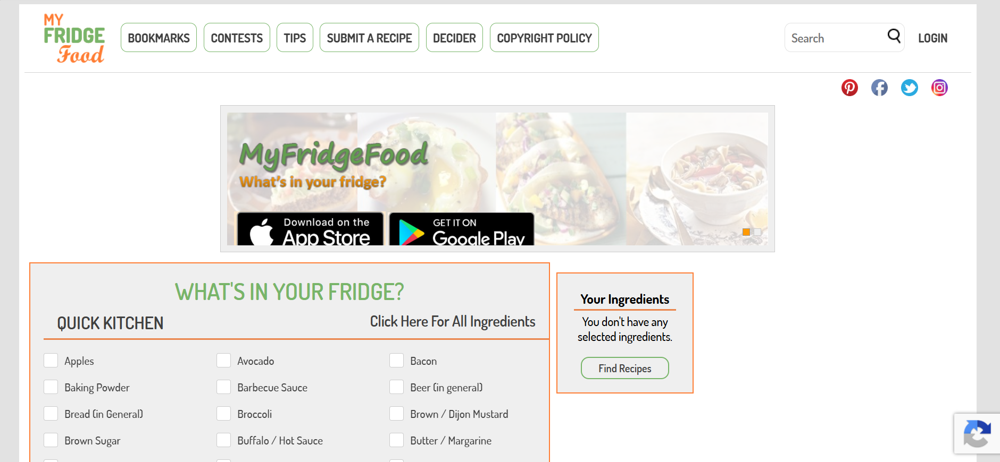
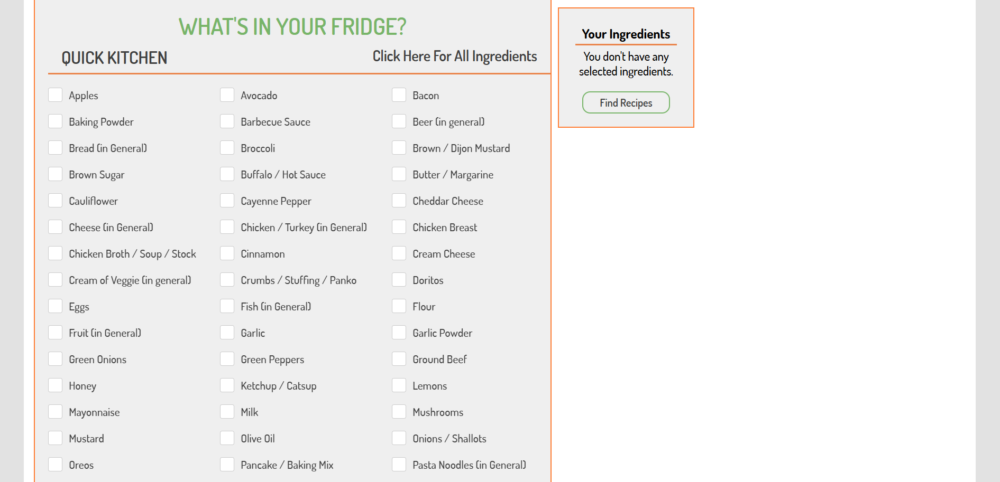
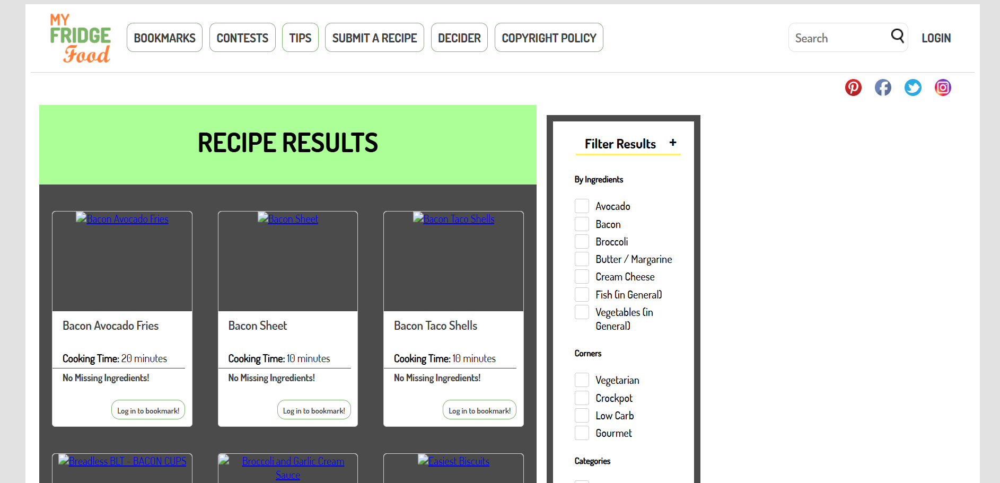
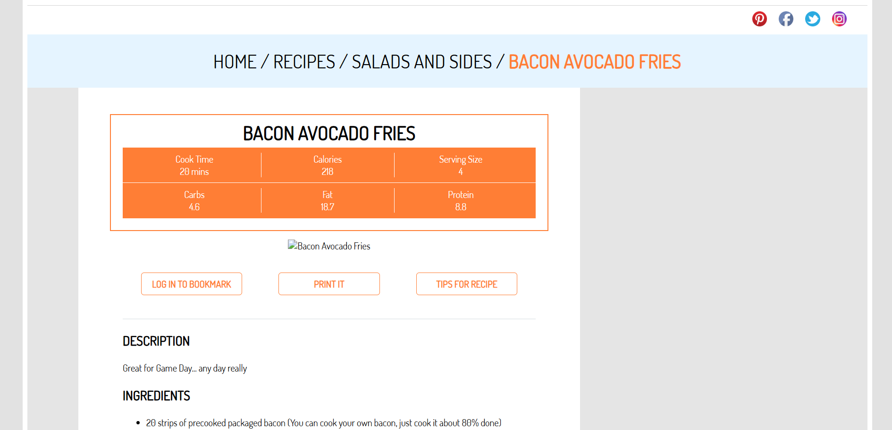
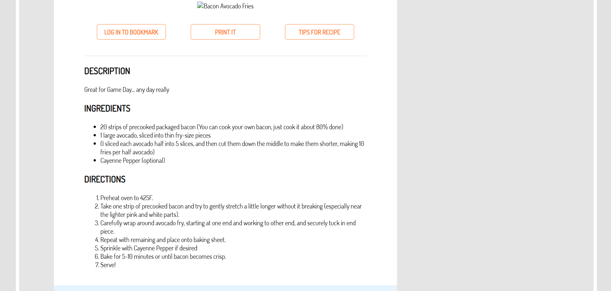
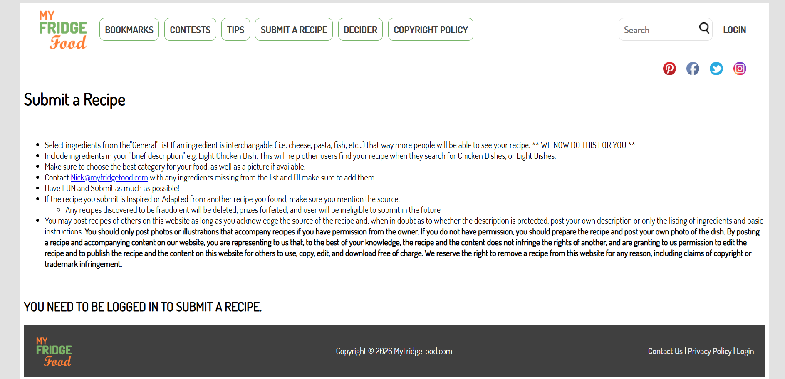
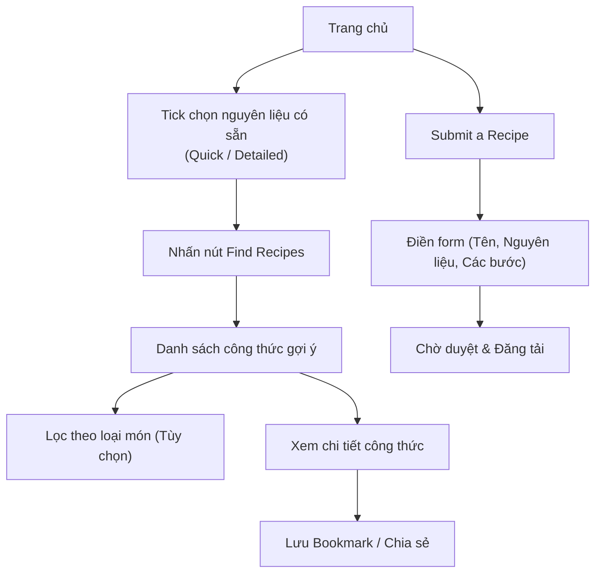

# Khảo sát ứng dụng: MyFridgeFood

> **Người khảo sát:** Trần Nguyễn Công Chung  

---

## 1. Tổng quan ứng dụng

**MyFridgeFood** là một trong những trang web tiên phong và nổi tiếng nhất với mô hình **"Reverse Recipe Search"** (Tìm kiếm công thức ngược). Thay vì chọn món rồi đi chợ, người dùng chỉ cần chọn những gì đang có trong tủ lạnh, hệ thống sẽ gợi ý các món ăn có thể nấu được ngay.

**Đặc điểm cốt lõi:**
- Giao diện cực kỳ đơn giản, tập trung 100% vào danh sách nguyên liệu.
- Dữ liệu công thức được đóng góp từ cộng đồng.
- Không yêu cầu đăng nhập để sử dụng tính năng cốt lõi.

---

## 2. Các màn hình và tính năng chính

### 2.1. Trang chủ — "What's in your fridge?"

**Mô tả:** Không giống các trang web hiện đại có Hero section lớn, MyFridgeFood hiển thị ngay một bảng checklist nguyên liệu khổng lồ ngay tại trang chủ. 
- Nguyên liệu được chia thành 2 chế độ: **Quick Kitchen** (các nguyên liệu phổ biến nhất) và **Detailed** (danh sách đầy đủ được nhóm theo thịt, rau củ, gia vị...).
- Nút "Find Recipes" nổi bật để bắt đầu tìm kiếm.

### 2.2. Trang kết quả tìm kiếm (Recipe Results)

**Mô tả:** Sau khi chọn nguyên liệu và nhấn tìm kiếm, hệ thống trả về danh sách các công thức phù hợp.
- Hiển thị theo dạng Grid hoặc List.
- Mỗi card công thức có: Tên món, hình ảnh, đánh giá.
- Có thanh bộ lọc bên trên để lọc theo loại món

### 2.3. Trang chi tiết công thức (Recipe Detail)

**Mô tả:** Trang hiển thị chi tiết cách nấu một món ăn.
- Bao gồm: Hình ảnh món ăn, thời gian chuẩn bị, thời gian nấu.
- Danh sách nguyên liệu chi tiết.
- Hướng dẫn từng bước.

### 2.4. Trang "Submit a Recipe" (Đóng góp công thức)

**Mô tả:** Form cho phép người dùng chia sẻ công thức của họ.
- Yêu cầu nhập: Tên món, danh mục, thời gian nấu, nguyên liệu, các bước thực hiện và tải ảnh lên.
- Đây là nguồn dữ liệu chính giúp MyFridgeFood phong phú.

---

## 3. Phân tích UI/UX

### 3.1. Điểm mạnh

| Khía cạnh | Phân tích |
|-----------|-----------|
| **Core Value First** | Cung cấp giá trị ngay lập tức. Người dùng vào web là thấy ngay danh sách chọn nguyên liệu mà không cần cuộn qua các phần quảng cáo hay giới thiệu dài dòng. |
| **Quick vs Detailed** | Có chế độ "Quick Kitchen" chỉ hiển thị các nguyên liệu cơ bản (Trứng, sữa, bơ, muối...), giúp người dùng lười cũng có thể dùng nhanh chóng. |
| **No friction** | Không bắt buộc tạo tài khoản vẫn có thể tìm kiếm công thức. |
| **Community Driven** | Tính năng submit công thức giúp mở rộng database miễn phí và tạo cảm giác cộng đồng. |

### 3.2. Điểm yếu / Hạn chế

| Khía cạnh | Phân tích |
|-----------|-----------|
| **UI Lỗi thời** | Giao diện mang hơi hướng web những năm 2010. Không có tính thẩm mỹ cao, thiếu khoảng trắng (whitespace) và hierarchy chưa rõ ràng. |
| **Quá nhiều Text** | Bảng checklist nguyên liệu hiển thị theo cột bằng chữ, gây choáng ngợp và khó tìm nhanh. Nếu có icon hoặc nhóm màu sắc sẽ tốt hơn. |
| **Quảng cáo** | Có khá nhiều banner quảng cáo chèn ngang nội dung làm giảm trải nghiệm người dùng. |
| **Không có Smart Suggestion** | Chỉ khớp nguyên liệu một cách cơ học (matching dựa trên tag). Không gợi ý được các món thay thế nguyên liệu linh hoạt như AI. |

---

## 4. Sơ đồ User Flow chính

---

## 5. Bảng tổng hợp tính năng

| STT | Tính năng | Có | Chi tiết |
|-----|-----------|:---:|----------|
| 1 | Tìm kiếm theo nguyên liệu | ✅ | Core feature của web |
| 2 | Phân loại Quick / Detailed list | ✅ | Hữu ích cho UX |
| 3 | Lọc công thức | ✅ | Theo loại bữa ăn |
| 4 | Xem chi tiết công thức | ✅ | Step-by-step text |
| 5 | Đóng góp công thức (UGC) | ✅ | Form cho người dùng |
| 6 | Đánh giá / Bình luận | ✅ | Hệ thống 5 sao và comment |
| 7 | AI Gợi ý thay thế | ❌ | Không có AI |
| 8 | Lên thực đơn (Meal plan) | ❌ | Chỉ tìm món lẻ tẻ |
| 9 | Danh sách đi chợ | ❌ | Ngược lại với concept của web |
| 10| Cộng đồng mạnh | ⚠️ | Có bình luận nhưng không có profile người dùng sâu |

---

## 6. UI/UX Patterns đáng chú ý (áp dụng cho WikiCook)

### 6.1. Patterns nên tham khảo

1. **Immediate Value:** Đưa ngay công cụ tìm kiếm nguyên liệu ra màn hình chính, không giấu sau menu.
2. **Quick Ingredient List:** WikiCook nên có một danh sách "Nguyên liệu cơ bản" (như Hành, tỏi, nước mắm, đường, trứng...) được tick sẵn hoặc dễ chọn bằng 1 click để tiết kiệm thời gian cho user.
3. **User Submission:** Cho phép người dùng dễ dàng đóng góp công thức để làm giàu hệ sinh thái.

### 6.2. Patterns cần cải thiện

1. **Giao diện nhập nguyên liệu:** Thay vì làm một cái bảng chữ khổng lồ như MyFridgeFood, WikiCook nên dùng:
   - **Thanh tìm kiếm có auto-suggest.**
   - **Chip/Tag UI** để hiển thị nguyên liệu đã chọn.
   - Hoặc **Chụp ảnh tủ lạnh** để tự nhận diện nguyên liệu.
2. **AI Recipe Generation:** Thay vì chỉ filter từ Database có sẵn, WikiCook có thể dùng AI để "Sáng tạo" ra công thức mới dựa trên chính xác những gì người dùng có (thậm chí gợi ý nguyên liệu thay thế).
3. **Hiện đại hóa UI:** Sử dụng thiết kế sạch sẽ, premium như đã phân tích ở MealPlan VN.

---

## 7. So sánh sơ bộ: MyFridgeFood vs WikiCook (dự kiến)

| Tiêu chí | MyFridgeFood | WikiCook (dự kiến) |
|----------|:------------:|:------------------:|
| **Concept cốt lõi** | Tìm kiếm món dựa trên nguyên liệu | AI hỗ trợ tìm/tạo món dựa trên nguyên liệu |
| **Giao diện chọn nguyên liệu**| Bảng checkbox tĩnh, nhiều chữ | Search bar thông minh, tag, có thể có AI Image |
| **Nguồn công thức** | User submitted + Admin | AI generated + Database chuẩn + User submitted |
| **Gợi ý linh hoạt** | Rất cứng (chỉ map theo keyword) | Cực kỳ linh hoạt (AI hiểu cách thay thế gia vị) |
| **Trải nghiệm UI** | Cũ, nhiều quảng cáo | Hiện đại, không gián đoạn |
| **Hướng dẫn nấu** | Text thuần | Text + Timer + Tips từ AI |

---

## 8. Kết luận

**MyFridgeFood** là minh chứng rõ ràng cho việc: **Tính năng "Tìm công thức theo nguyên liệu" là một nhu cầu có thật và rất lớn.** Sự thành công của họ đến từ việc giải quyết đúng một pain point duy nhất: "Tôi có ngần này đồ, tôi nấu được món gì?".

Tuy nhiên, MyFridgeFood đã cũ kỹ về mặt công nghệ và UX. Đây là cơ hội vàng cho **WikiCook**. Bằng cách lấy Core Logic của MyFridgeFood kết hợp với **Generative AI** và một **Giao diện (UI) hiện đại, cao cấp**, WikiCook hoàn toàn có thể trở thành phiên bản "MyFridgeFood 2.0" vượt trội hơn về mọi mặt, đặc biệt là khả năng cá nhân hóa và tùy biến công thức.

---
