# EXISTING APP SURVEY

## DOCUMENT METADATA & RESPONSIBILITY MATRIX
| Section | Content | Performed by (Author) | Reviewed by | Edited by |
| :---: | :--- | :---: | :---: | :---: |
| **Section 1** | Survey of App 1: MyFridgeFood | **Trần Nguyễn Công Chung** | Mai Văn Hiển | **Lê Quốc Hưng** |
| **Section 2** | Feature Comparison Matrix | **Trần Nguyễn Công Chung** | Mai Văn Hiển | **Lê Quốc Hưng** |
| **Section 3** | UI/UX Screenshots & Analysis | **Trần Nguyễn Công Chung** | Mai Văn Hiển | **Lê Quốc Hưng** |
| **Section 4** | Key Takeaways & Opportunities | **Trần Nguyễn Công Chung** | Mai Văn Hiển | **Lê Quốc Hưng** |
| **Section 5** | Survey of App 2: Ăn Gì Ngon | **Nguyễn Thành Dự** | Nguyễn Đức Duy | **Lê Quốc Hưng** |
| **Section 6** | Feature Comparison Matrix | **Nguyễn Thành Dự** | Nguyễn Đức Duy | **Lê Quốc Hưng** |
| **Section 7** | UI/UX Screenshots & Analysis | **Nguyễn Thành Dự** | Nguyễn Đức Duy | **Lê Quốc Hưng** |
| **Section 8** | Key Takeaways & Opportunities | **Nguyễn Thành Dự** | Nguyễn Đức Duy | **Lê Quốc Hưng** |

---

## 1. Surveyed Applications
*Performed by: Trần Nguyễn Công Chung | Reviewed by: Mai Văn Hiển | Edited by: Lê Quốc Hưng*

### 1.1. MyFridgeFood (myfridgefood.com)
* **Website URL:** [https://www.myfridgefood.com/](https://www.myfridgefood.com/)
* **Platform:** Responsive Website (Server-rendered, jQuery-based) with companion mobile apps (iOS & Android via PhoneGap).
* **Target Audience:** Anyone who wants to cook a meal using ingredients they already have at home — particularly home cooks, college students, and budget-conscious families.
* **App Overview:**
  MyFridgeFood is one of the pioneering platforms for **"Reverse Recipe Search"** — instead of browsing recipes and buying ingredients, users select what they already have in the fridge and the system suggests matching recipes. The platform features a community-driven recipe database (User-Generated Content), a bookmark system, and a recipe contest section. No account is required to use the core search functionality.

* **Feature Tree:**

```text
                    MYFRIDGEFOOD
                         │
        ┌────────────────┼────────────────┐
        │                │                │
   Ingredient Input    Recipe Output    Community
        │                │                │
   Quick Kitchen       Search Results    Submit Recipe
   Detailed List       Recipe Detail     Comments/Rating
   Checkbox Select     Bookmark          Contests
                       Filter by Type    Tips
```

* **Detailed Feature Group Descriptions:**
  * **Ingredient Input:**
    * *Quick Kitchen:* A simplified checklist displaying only the most common pantry staples (Eggs, Butter, Milk, Salt, Sugar, Flour, etc.) for fast selection with minimal cognitive load.
    * *Detailed List:* A comprehensive ingredient checklist grouped by categories (Meats, Vegetables, Dairy, Spices, Grains, etc.) with checkboxes, toggled via "Click Here For All Ingredients" button.
    * *Checkbox Select:* Users tick checkboxes next to each ingredient they have, then press the prominent "Find Recipes" button.
  * **Recipe Output:**
    * *Search Results:* Grid/List display of matching recipes. Each card shows: recipe name, thumbnail image, and star rating.
    * *Recipe Detail:* Full recipe page with: hero image, Prep Time, Cook Time, ingredient list, step-by-step Directions, and a community comments section with star ratings.
    * *Filter by Type:* Filter bar above results to narrow by meal category (Breakfast, Main Dish, Dessert, Snacks, etc.).
    * *Bookmark:* Logged-in users can save recipes to a personal Bookmarks page for later access.
  * **Community:**
    * *Submit Recipe:* A form allowing any registered user to contribute their own recipe (name, category, cook time, ingredients, directions, photo upload).
    * *Comments / Rating:* 5-star rating system and comment section on each recipe detail page.
    * *Contests:* Periodic recipe contests to encourage community participation.
    * *Tips:* A dedicated Tips section for general cooking advice.

---

## 2. Feature Comparison Matrix
*Performed by: Trần Nguyễn Công Chung | Reviewed by: Mai Văn Hiển | Edited by: Lê Quốc Hưng*

Comparative feature matrix between **MyFridgeFood (`myfridgefood.com`)** and **WikiCook** across core functional modules and AI assistant capability:

| No. | Feature Module | MyFridgeFood (`myfridgefood.com`) | WikiCook (Proposed) | Comparative Notes & Assessment |
| :---: | :--- | :---: | :---: | :--- |
| **1** | **Account & Profile Management** | 🟡 Partial | 🟢 Complete | MyFridgeFood supports basic Login/Register for bookmarks and submission. Lacks dietary profiles, allergen preferences, and household settings. |
| **2** | **Recipe Search & Filtering** | 🟡 Partial | 🟢 Complete | MyFridgeFood matches ingredients mechanically via checkboxes. WikiCook adds full-text keyword search, calorie/allergen filters, and AI search. |
| **3** | **Weekly Meal Planner** | ❌ Not Available | 🟢 Complete | MyFridgeFood only handles single recipe lookups. WikiCook provides a full drag-and-drop weekly planner with AI menu auto-generation. |
| **4** | **Automated Shopping List** | ❌ Not Available | 🟢 Complete | Opposite to MyFridgeFood's model. WikiCook aggregates ingredients from meal plans and categorizes items by supermarket aisle. |
| **5** | **Hands-Free Mode & Timers** | ❌ Not Available | 🟢 Complete | MyFridgeFood displays static text recipe pages. WikiCook provides a fullscreen mode with large typography and concurrent step timers. |
| **6** | **Recipe Creation & Contribution** | 🟢 Available | 🟢 Community | Both platforms support user-submitted recipes. MyFridgeFood uses a basic form; WikiCook provides a rich multimedia creation wizard. |
| **7** | **Community Reviews & Cooksnaps** | 🟡 Partial | 🟢 Interactive | MyFridgeFood has star ratings and text comments. WikiCook adds finished dish photo uploads (*Cooksnaps*) and structured review tips. |
| **8** | **Bookmarks & Custom Collections** | 🟡 Partial | 🟢 Advanced | MyFridgeFood has a flat Bookmarks list. WikiCook supports customizable thematic albums and organized collections. |
| **9** | **Nutritional & Allergy Analysis** | ❌ Not Available | 🟢 Detailed | MyFridgeFood displays no nutritional data. WikiCook auto-calculates Calories, Macros (Protein/Carbs/Fat), and attaches dietary safety tags via LLM. |
| **10** | **Admin Dashboard & Content Moderation** | ❌ Not Available | 🟢 Complete | MyFridgeFood lacks moderation workflows; WikiCook provides administrative queues for recipe approval, user management, and platform analytics. |
| **11** | **Smart Chef AI Assistant & Meal Planner** | ❌ Not Available | 🟢 LLM-Powered AI | MyFridgeFood relies on static tag matching. WikiCook leverages LLMs with RAG for natural language planning, ingredient substitutions, and meal recommendations. |

*Notation Key:* 🟢 *Complete / Standard* | 🟡 *Partial / Basic Support* | ❌ *Not Supported / Missing*

---

## 3. UI/UX Analysis and Screenshots
*Performed by: Trần Nguyễn Công Chung | Reviewed by: Mai Văn Hiển | Edited by: Lê Quốc Hưng*

### 3.1. Screenshots

#### Figure 1: Homepage — Quick Kitchen Ingredient Checklist
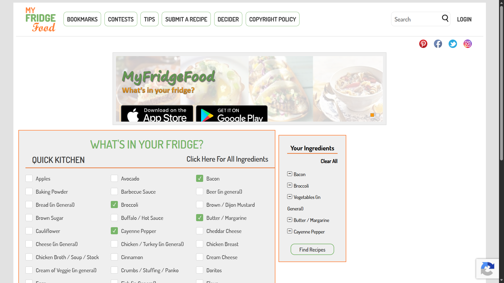
*Homepage displays the "WHAT'S IN YOUR FRIDGE?" heading with Quick Kitchen mode — a simplified checklist of common pantry staples. The "Click Here For All Ingredients" button switches to the Detailed mode with full categorized ingredients.*

#### Figure 2: Detailed Ingredient List (Full Categories)
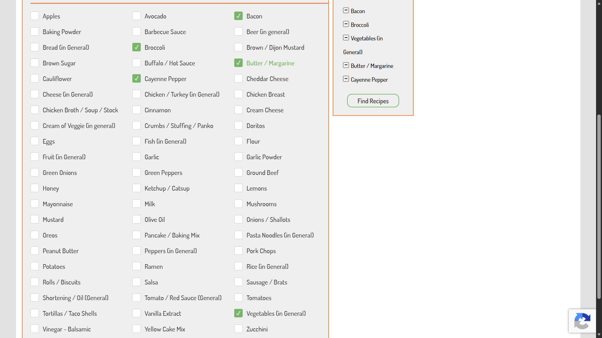
*Detailed ingredient view showing the full categorized checklist (Meats, Dairy, Vegetables, Spices, Grains, etc.) with the "Find Recipes" button prominently visible.*

#### Figure 3: Recipe Search Results
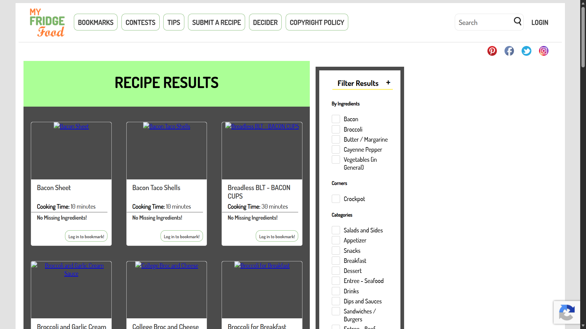
*Search results page showing matching recipes in a grid layout. Each recipe card displays: thumbnail image, recipe name, and star rating. Filter bar at top allows narrowing by meal type.*

#### Figure 4: Recipe Detail Page
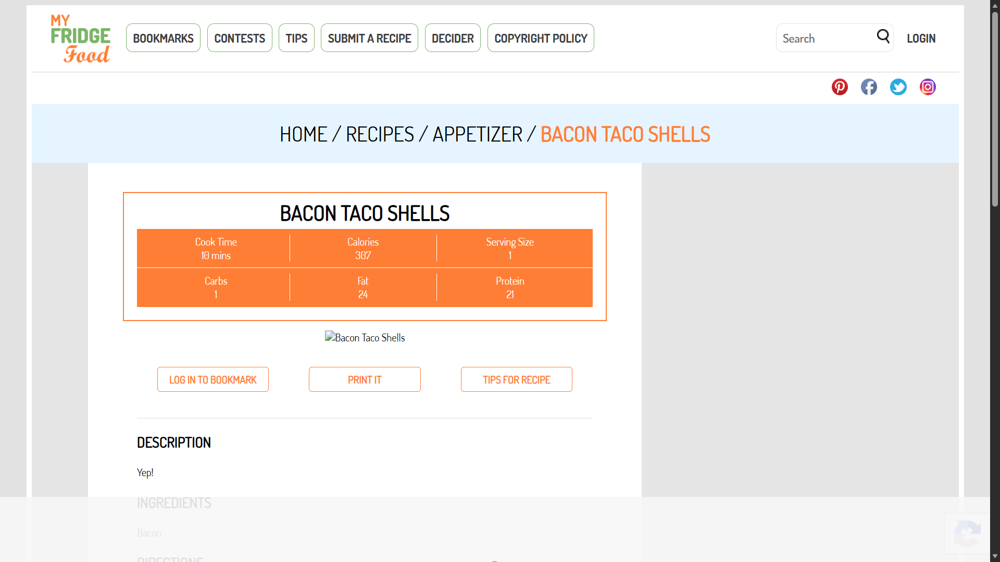
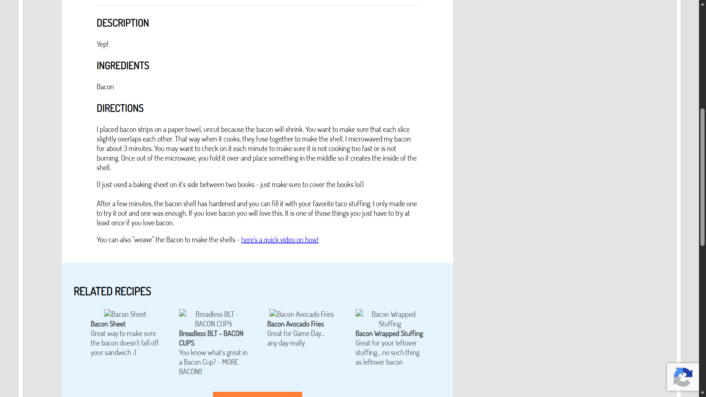
*Recipe detail page with hero image, Prep Time & Cook Time metadata, full Ingredients list, and step-by-step Directions.*

#### Figure 5: Community Comments & Rating
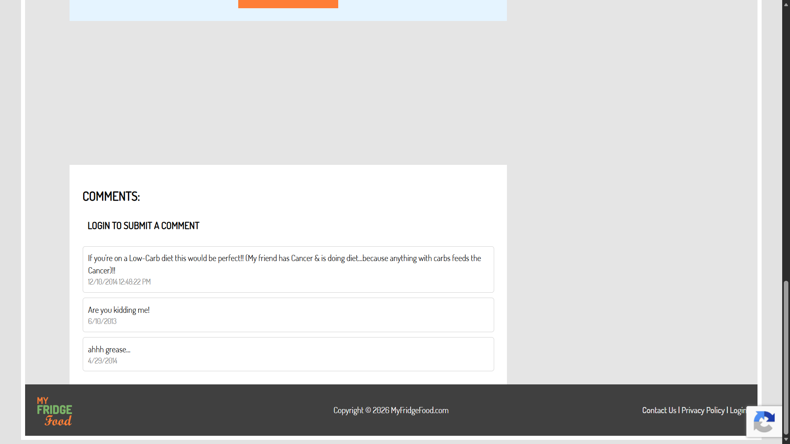
*Comment section below the recipe showing 5-star ratings and user-submitted text comments.*

#### Figure 6: Submit a Recipe Form
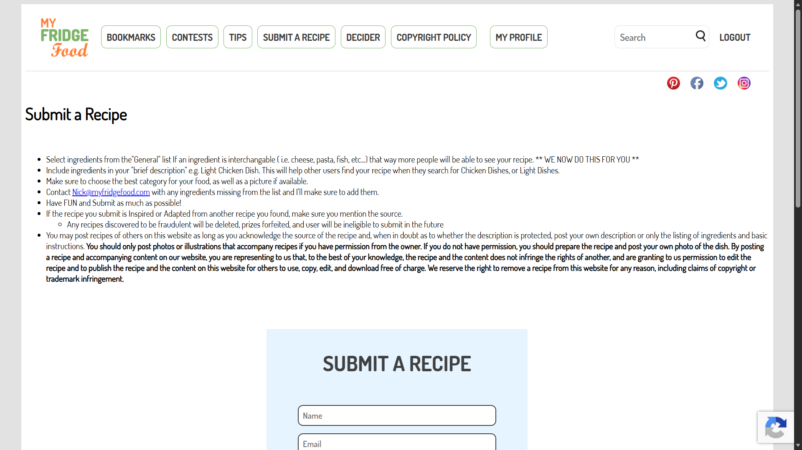
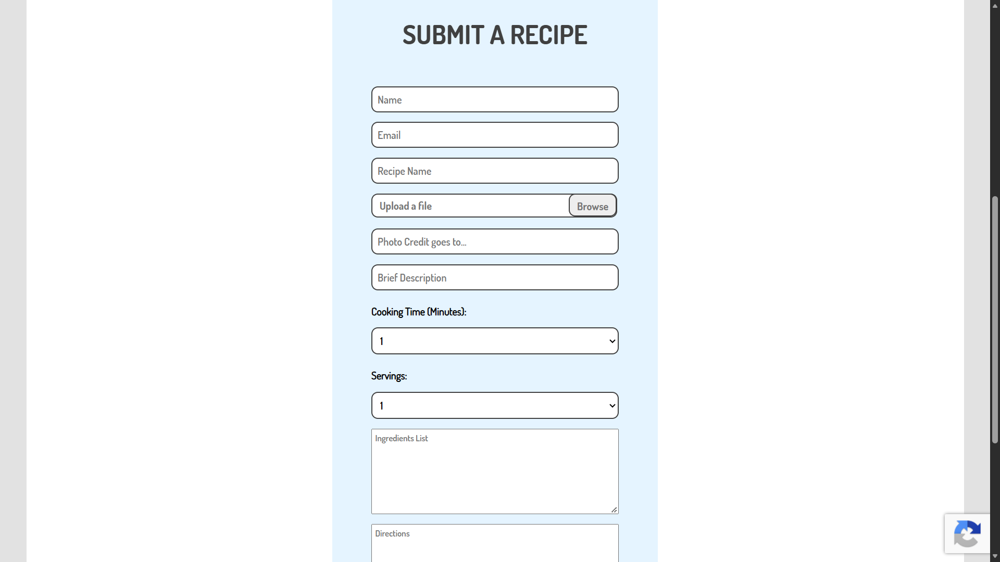
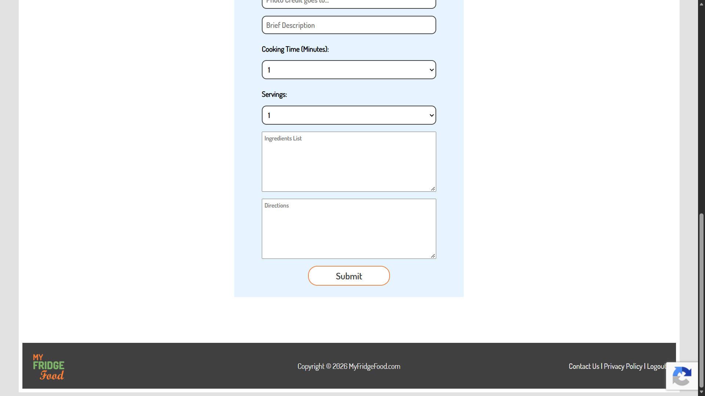
*Recipe submission form allowing registered users to contribute recipes: name, category, cook time, ingredients, directions, and photo upload.*

---

### 3.2. UI/UX Analysis

#### Strengths:
* **Immediate Core Value (Zero Friction):** No landing page, no hero section, no marketing copy — the ingredient checklist is displayed immediately on page load, delivering value within seconds.
* **Quick vs Detailed Toggle:** Two input modes cater to different user patience levels — "Quick Kitchen" for casual users, "Detailed" for thorough cooks.
* **No Account Required:** Core search functionality works without registration, minimizing friction for first-time visitors.
* **Community-Driven Content:** User recipe submission and rating system create a self-growing database without editorial overhead.
* **Cross-Platform Availability:** Companion iOS & Android apps extend reach beyond the web.

#### Weaknesses:
* **Severely Outdated UI (circa 2010):** No modern design principles — lacks whitespace, visual hierarchy, responsive grid, or any contemporary aesthetic. Typography and color scheme feel dated.
* **Overwhelming Text-based Ingredient List:** The Detailed checklist is a massive wall of text checkboxes, causing cognitive overload. No icons, images, or color-coding to aid scanning.
* **Intrusive Advertising:** Multiple ad banners interrupt the content flow, degrading user experience significantly.
* **No AI or Smart Matching:** Recipe matching is purely mechanical keyword/tag matching — cannot suggest ingredient substitutions, handle partial matches, or generate creative combinations.
* **No Nutritional Information:** Recipes display no calorie counts, macro breakdowns, or dietary/allergen labels.
* **Static Recipe Presentation:** Recipes are displayed as plain text — no cooking mode, no timers, no interactive step tracking.

---

## 4. Key Takeaways & Opportunities
*Performed by: Trần Nguyễn Công Chung | Reviewed by: Mai Văn Hiển | Edited by: Lê Quốc Hưng*

### 4.1. Key Takeaways for WikiCook:
1. **"Ingredient-First" Model is a Proven Need:** MyFridgeFood's enduring popularity validates that "What can I cook with what I have?" is a real, widespread pain point. WikiCook must make this a first-class feature.
2. **Immediate Value Delivery:** Placing the core tool (ingredient selector) front-and-center on the homepage — no scrolling, no intro — dramatically reduces time-to-value. WikiCook should adopt this principle.
3. **Quick Preset Lists:** The "Quick Kitchen" concept (pre-selecting common staples like salt, oil, garlic) saves significant user effort. WikiCook should implement a "Common Vietnamese Pantry" quick-select.
4. **User-Generated Content Grows the Database:** Community recipe submission is a cost-effective way to scale the recipe library. WikiCook should make contribution easy and rewarding.

### 4.2. Breakthrough Opportunities & Differentiators for WikiCook:
1. **AI-Powered Ingredient Understanding:** MyFridgeFood matches ingredients mechanically. WikiCook can use AI to understand ingredient relationships — suggesting substitutions (e.g., "no fish sauce? use soy sauce + lime"), handling partial matches, and even generating novel recipes from available ingredients.
2. **Modern Ingredient Input UX:** Replace the text-heavy checkbox wall with a smart search bar (auto-suggest), chip/tag UI for selected items, and potentially AI Vision (photo-based ingredient recognition from fridge photos).
3. **Nutritional & Dietary Intelligence:** Automatically attach calorie/macro breakdowns and allergen/dietary safety tags (Gluten-Free, Vegetarian, etc.) to every recipe — something MyFridgeFood completely lacks.
4. **Premium, Contemporary Design:** MyFridgeFood's outdated UI is its biggest weakness. WikiCook has a clear opportunity to deliver the same core value in a visually stunning, modern interface with smooth animations and responsive design.

---

## 5. Surveyed Applications
*Performed by: Nguyễn Thành Dự | Reviewed by: Nguyễn Đức Duy | Edited by: Lê Quốc Hưng*

### 5.1. Ăn Gì Ngon (angingon.com)
* **Website URL:** [https://www.angingon.com/](https://www.angingon.com/)
* **Platform:** Responsive Web Application (Single Page Application / Progressive Web App - Astro Framework & TailwindCSS).
* **Target Audience:** Homemakers, independent young adults, and Vietnamese families seeking daily cooking recipes, kitchen tips, and kitchen appliance reviews.
* **App Overview:** 
  Ăn Gì Ngon is an online recipe-sharing platform in Vietnam with a repository of over **19,000+ recipes** and kitchen tips. Beyond serving as a food blog, the platform incorporates advanced features upon logging in: **Weekly Meal Planner**, **AI-Powered Menu Generation**, **Family Management**, **Automated Shopping List**, and **Saved Favorites Collections**.

* **Feature Tree:**

```text
                    ĂN GÌ NGON
                         │
        ┌────────────────┼────────────────┐
        │                │                │
     Discovery        Recipe          Personalization
        │                │                │
   Search/Categories   Ingredients      AI Menu
   Featured            Instructions      Favorites
   Latest              Time             Family taste
                       Difficulty
```

* **Detailed Feature Group Descriptions:**
  * **Discovery:**
    * *Search / Categories:* Keyword search combined with multi-dimensional filtering on the left sidebar — filter by **Category** (Snacks, Kitchen Tips, Cakes & Pastries, Soups, Porridges, Vegetarian, Desserts, Fried Dishes, Rolls & Salads...), **Post Type** (Recipe / Roundup / Tips / Others), and **Difficulty** (Easy / Medium / Hard).
    * *Featured:* Displays highlighted recipes in the Hero Section with large imagery and engaging titles.
    * *Latest:* Grid view of recently updated articles (4-column grid on Desktop), where each card displays: thumbnail image, prep time, cook time, difficulty level, category, and a bookmark button.
  * **Recipe:**
    * *Ingredients:* Lists required ingredients for each recipe (including serving size, e.g., "For 2 - 3 people").
    * *Instructions:* Step-by-step cooking instructions with visual photos and a clear Table of Contents (01 Ingredients, 02 Preparation Steps).
    * *Time:* Displays separate preparation time and cooking time (e.g., "15 mins • 10 mins"), along with serving size ("2 - 3 people").
    * *Difficulty:* Difficulty level (Easy / Medium / Hard), displayed with intuitive icons.
  * **Personalization — *Requires Login*:**
    * *AI Menu:* **"AI Menu Generator"** button on the Meal Planner page, automatically suggesting Breakfast/Lunch/Dinner menus for each day of the week.
    * *Meal Planner:* Weekly meal planning with a calendar view by day (Wednesday → Saturday...), categorized into 3 meals (Breakfast / Lunch / Dinner), allowing users to add/remove dishes and generate shopping lists from selected days.
    * *Family:* "Family" dashboard allowing management of family profiles.
    * *Favorites:* "Saved" section storing collections of favorite recipes.
    * *Login:* Authentication via **Google OAuth** or **Email/Password**, with links to Terms of Service & Privacy Policy.

---

## 6. Feature Comparison Matrix
*Performed by: Nguyễn Thành Dự | Reviewed by: Nguyễn Đức Duy | Edited by: Lê Quốc Hưng*

Comparative feature matrix between **Ăn Gì Ngon (`angingon.com`)** and **WikiCook** across core functional modules and AI assistant capability:

| No. | Feature Module | Ăn Gì Ngon (`angingon.com`) | WikiCook (Proposed) | Comparative Notes & Assessment |
| :---: | :--- | :---: | :---: | :--- |
| **1** | **Account & Profile Management** | 🟡 Basic | 🟢 Complete | Ăn Gì Ngon supports Google OAuth / Email login with Family dashboard & management. However, it lacks detailed dietary profiles / allergen warning settings like WikiCook. |
| **2** | **Recipe Search & Filtering** | 🟢 Good | 🟢 Complete | Ăn Gì Ngon features multi-dimensional filters (Category, Post Type, Difficulty) + AI Search Hero. WikiCook adds filtering by calories, allergens & cooking methods. |
| **3** | **Weekly Meal Planner** | 🟢 Available | 🟢 Complete | Ăn Gì Ngon features a daily/3-meal Planner (Breakfast-Lunch-Dinner) + AI menu generator. WikiCook adds drag-and-drop interactivity. |
| **4** | **Automated Shopping List** | 🟡 Basic | 🟢 Complete | Ăn Gì Ngon has a "Select dates to create shopping list" button. WikiCook automatically aggregates ingredients from selected meal plans and categorizes items by supermarket aisle. |
| **5** | **Hands-Free Mode & Timers** | ❌ Not Available | 🟢 Complete | Ăn Gì Ngon presents static blog pages requiring scrolling; WikiCook offers a large-font fullscreen interface & concurrent timers. |
| **6** | **Recipe Creation & Contribution** | ❌ Not Available | 🟢 Community | Ăn Gì Ngon relies on 1-way editorial publishing; WikiCook allows community members to create & publish recipes. |
| **7** | **Community Reviews & Cooksnaps** | ❌ Not Available | 🟢 Interactive | Ăn Gì Ngon lacks comments, 5-star ratings, or photo sharing of finished dishes (*Cooksnaps*). |
| **8** | **Bookmarks & Custom Collections** | 🟡 Basic | 🟢 Advanced | Ăn Gì Ngon has a "Saved" section with bookmark buttons on cards. WikiCook supports custom album/theme organization. |
| **9** | **Nutritional & Allergy Analysis** | ❌ Not Available | 🟢 Detailed | WikiCook automatically calculates Calories, Macros (Protein/Carbs/Fat), and attaches dietary safety tags via LLM. |
| **10** | **Admin Dashboard & Content Moderation** | ❌ Not Available | 🟢 Complete | Ăn Gì Ngon relies solely on in-house editorial content without community moderation queues; WikiCook provides full administrative recipe review, category taxonomy management, and user governance. |
| **11** | **Smart Chef AI Assistant & Meal Planner** | 🟡 AI Menu Generator | 🟢 LLM-Powered AI | Ăn Gì Ngon features automated menu generation + AI Search Hero. WikiCook leverages LLMs with RAG for natural language recipe discovery, ingredient-based dish generation, and nutritional breakdown. |

*Notation Key:* 🟢 *Complete / Standard* | 🟡 *Partial / Basic Support* | ❌ *Not Supported / Missing*

---

## 7. UI/UX Analysis and Screenshots
*Performed by: Nguyễn Thành Dự | Reviewed by: Nguyễn Đức Duy | Edited by: Lê Quốc Hưng*

### 7.1. Screenshots

#### Figure 7: Recipe Library Page & Multi-dimensional Filtering
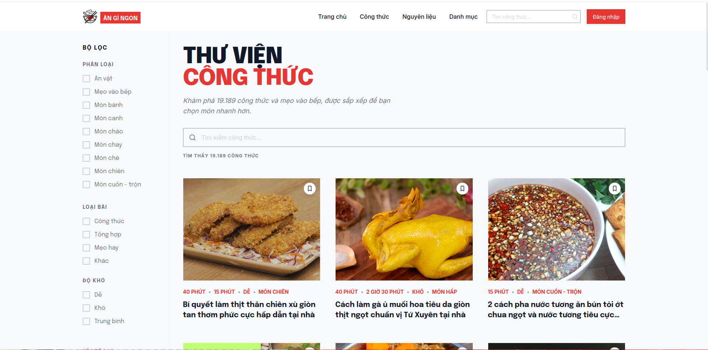
*Left sidebar displays filters by Category (Snacks, Kitchen Tips, Cakes, Soups...), Post Type (Recipe / Roundup / Tips), and Difficulty (Easy / Hard / Medium). Each recipe card displays: thumbnail image, prep time, cook time, difficulty, category, and a bookmark button.*

#### Figure 8: Category Page
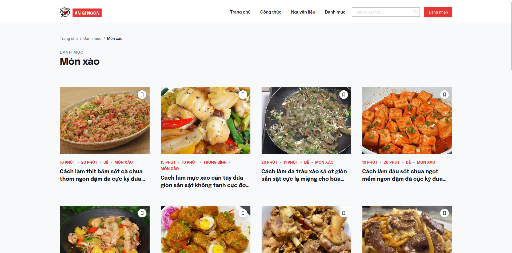
*Clear breadcrumbs (Home > Category > Stir-fry). Each card displays prep time, cook time, difficulty, category, and a top-right bookmark button.*

#### Figure 9: Recipe Detail Page (Blog Recipe)
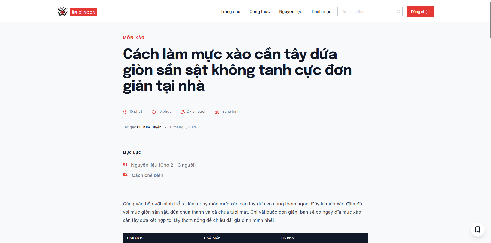
*Large serif title, detailed metadata (15 mins prep • 10 mins cook • 2-3 people • Medium), author & publish date, Table of Contents (01 Ingredients, 02 Preparation Steps), and bottom-right bookmark button.*

#### Figure 10: Weekly Meal Planner & AI Menu Generator

*Left sidebar navigation (Overview, Family, Menu, Saved). Meal Planner interface divided by days (Wednesday → Saturday), each day having 3 meals (Breakfast/Lunch/Dinner) with a "+ Add dish" button. Top right features the **"AI Menu Generator"** button. Top header provides "Select dates to create shopping list" functionality.*

#### Figure 11: Login Screen

*Login modal supporting: Sign in with Google (OAuth) or Email/Password. Includes "Forgot?" password link and links to Terms of Service & Privacy Policy.*

---

### 7.2. UI/UX Analysis

#### 🟢 Strengths:
* **Minimalist & Modern Interface:** Deep red-orange and white color scheme, with serif typography for article headlines creating a professional editorial feel.
* **Impressive Hero Section:** Prominent message *"What do you want to cook today?"* with integrated **AI Search Hero** input supporting natural language queries.
* **Effective Multi-dimensional Filtering:** Checkbox sidebar filters (Category / Post Type / Difficulty) enable quick narrowing of results across 19,000+ recipes.
* **Intuitive Meal Planner:** Weekly planner clearly split by days/meals, featuring automated AI menu generation and shopping list creation.
* **Responsive & Smooth Performance:** Built on Astro Framework + TailwindCSS, offering fast load times.

#### 🔴 Weaknesses:
* **Traditional 1-Way Blog Model:** Users can only read articles published by the editorial team; they cannot contribute recipes or user-generated content.
* **Lack of Community Interaction:** No comment section, 5-star ratings, or photo uploads of finished dishes (*Cooksnaps*).
* **Sub-optimal Cooking Experience:** Recipe details are presented as static blog pages requiring continuous scrolling. Lacks a Hands-Free Mode or built-in cooking timers.
* **Lack of Nutritional Analysis:** Does not provide Calorie/Macro calculation tables or allergen warning badges for recipes.

---

## 8. Key Takeaways & Opportunities
*Performed by: Nguyễn Thành Dự | Reviewed by: Nguyễn Đức Duy | Edited by: Lê Quốc Hưng*

### 8.1. Key Takeaways for WikiCook:
1. **Natural Language Search Experience (AI Search):** Prominent AI search bar directly on the Homepage creates an intuitive and user-friendly experience. WikiCook should adopt and enhance this.
2. **Effective Multi-dimensional Sidebar Filters:** Checkboxes by Category / Post Type / Difficulty help users refine results quickly — WikiCook should expand this to include filters for Calories & Allergens.
3. **Meal Planner + AI Menu Generation:** Ăn Gì Ngon implements this feature effectively. WikiCook can excel further with a drag-and-drop interface and automated shopping list aggregation.
4. **Clean Design Focused on Food Photography:** High-quality imagery and clean layouts significantly improve user retention.

### 8.2. Breakthrough Opportunities & Differentiators for WikiCook:
1. **Hands-Free Cooking Mode:** Ăn Gì Ngon displays recipes as static scrollable blogs. WikiCook innovates with a large-font fullscreen interface accompanied by concurrent multi-step timers.
2. **2-Way Cooking Community:** Ăn Gì Ngon operates on a 1-way model (editorials only). WikiCook allows users to contribute recipes, post 5-star reviews, and share Cooksnaps.
3. **Nutritional Personalization & Allergen Warnings:** Ăn Gì Ngon lacks nutritional analysis. WikiCook automatically calculates Calories/Macros and attaches food safety labels (Gluten-Free, Dairy-Free, etc.).
