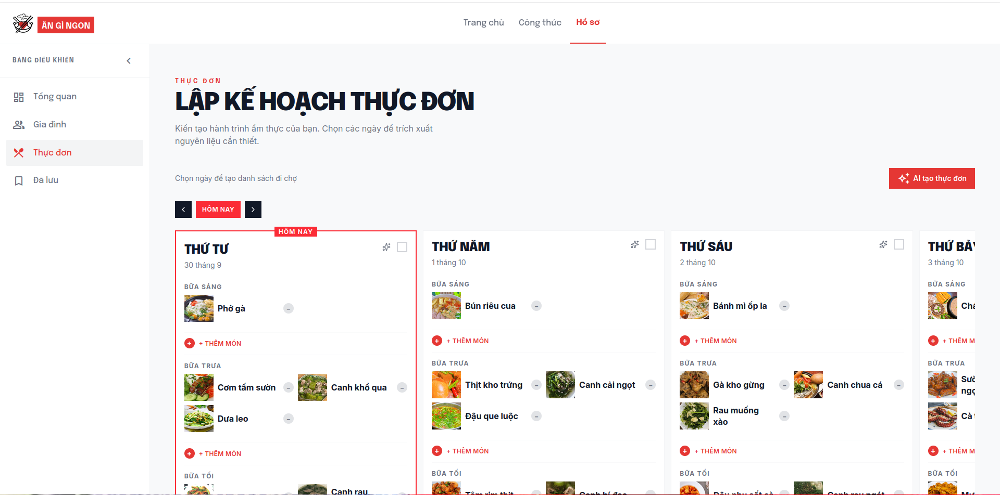
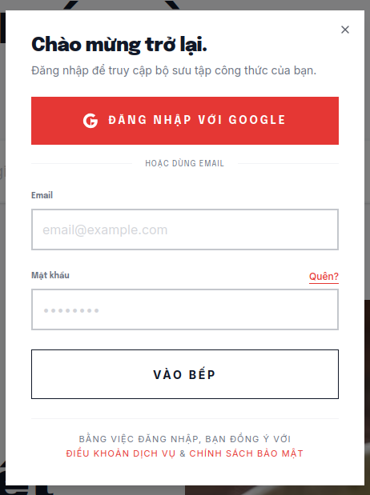

# Existing App Survey

*Author: Nguyen Thanh Du*
*Reviewer:* 
*Editor:*  

## 1. Surveyed Applications

### 1.1. Ăn Gì Ngon (angingon.com)
* **Website URL:** [https://www.angingon.com/](https://www.angingon.com/)
* **Platform:** Responsive Web Application (Single Page Application / Progressive Web App - Astro Framework & TailwindCSS).
* **Target Audience:** Homemakers, independent young adults, and Vietnamese families seeking daily cooking recipes, kitchen tips, and kitchen appliance reviews.
* **App Overview:** 
  Ăn Gì Ngon is an online recipe-sharing platform in Vietnam with a repository of over **19,000+ recipes** and kitchen tips. Beyond serving as a food blog, the platform incorporates advanced features upon logging in: **Weekly Meal Planner**, **AI-Powered Menu Generation**, **Family Management**, **Automated Shopping List**, and **Saved Favorites Collections**.

* **Feature Tree:**

```text
                    ĂN GÌ NGON
                         │
        ┌────────────────┼────────────────┐
        │                │                │
     Discovery        Recipe          Personalization
        │                │                │
   Search/Categories   Ingredients      AI Menu
   Featured            Instructions      Favorites
   Latest              Time             Family taste
                       Difficulty
```

* **Detailed Feature Group Descriptions:**
  * **Discovery:**
    * *Search / Categories:* Keyword search combined with multi-dimensional filtering on the left sidebar — filter by **Category** (Snacks, Kitchen Tips, Cakes & Pastries, Soups, Porridges, Vegetarian, Desserts, Fried Dishes, Rolls & Salads...), **Post Type** (Recipe / Roundup / Tips / Others), and **Difficulty** (Easy / Medium / Hard).
    * *Featured:* Displays highlighted recipes in the Hero Section with large imagery and engaging titles.
    * *Latest:* Grid view of recently updated articles (4-column grid on Desktop), where each card displays: thumbnail image, prep time, cook time, difficulty level, category, and a bookmark button.
  * **Recipe:**
    * *Ingredients:* Lists required ingredients for each recipe (including serving size, e.g., "For 2 - 3 people").
    * *Instructions:* Step-by-step cooking instructions with visual photos and a clear Table of Contents (01 Ingredients, 02 Preparation Steps).
    * *Time:* Displays separate preparation time and cooking time (e.g., "15 mins • 10 mins"), along with serving size ("2 - 3 people").
    * *Difficulty:* Difficulty level (Easy / Medium / Hard), displayed with intuitive icons.
  * **Personalization — *Requires Login*:**
    * *AI Menu:* **"AI Menu Generator"** button on the Meal Planner page, automatically suggesting Breakfast/Lunch/Dinner menus for each day of the week.
    * *Meal Planner:* Weekly meal planning with a calendar view by day (Wednesday → Saturday...), categorized into 3 meals (Breakfast / Lunch / Dinner), allowing users to add/remove dishes and generate shopping lists from selected days.
    * *Family:* "Family" dashboard allowing management of family profiles.
    * *Favorites:* "Saved" section storing collections of favorite recipes.
    * *Login:* Authentication via **Google OAuth** or **Email/Password**, with links to Terms of Service & Privacy Policy.


## 2. Feature Comparison Matrix

Comparative feature matrix between **Ăn Gì Ngon (`angingon.com`)** and **WikiCook** across 10 core functional modules and AI assistant capability:

| No. | Feature Module | Ăn Gì Ngon (`angingon.com`) | WikiCook (Proposed) | Comparative Notes & Assessment |
| :---: | :--- | :---: | :---: | :--- |
| **1** | **Account & Profile Management** | 🟡 Basic | 🟢 Complete | Ăn Gì Ngon supports Google OAuth / Email login with Family dashboard & management. However, it lacks detailed dietary profiles / allergen warning settings like WikiCook. |
| **2** | **Recipe Search & Filtering** | 🟢 Good | 🟢 Complete | Ăn Gì Ngon features multi-dimensional filters (Category, Post Type, Difficulty) + AI Search Hero. WikiCook adds filtering by calories, allergens & cooking methods. |
| **3** | **Weekly Meal Planner** | 🟢 Available | 🟢 Complete | Ăn Gì Ngon features a daily/3-meal Planner (Breakfast-Lunch-Dinner) + AI menu generator. WikiCook adds drag-and-drop interactivity. |
| **4** | **Automated Shopping List** | 🟡 Basic | 🟢 Complete | Ăn Gì Ngon has a "Select dates to create shopping list" button. WikiCook automatically aggregates ingredients from selected meal plans and categorizes items by supermarket aisle. |
| **5** | **Hands-Free Mode & Timers** | ❌ Not Available | 🟢 Complete | Ăn Gì Ngon presents static blog pages requiring scrolling; WikiCook offers a large-font fullscreen interface & concurrent timers. |
| **6** | **Recipe Creation & Contribution** | ❌ Not Available | 🟢 Community | Ăn Gì Ngon relies on 1-way editorial publishing; WikiCook allows community members to create & publish recipes. |
| **7** | **Community Reviews & Cooksnaps** | ❌ Not Available | 🟢 Interactive | Ăn Gì Ngon lacks comments, 5-star ratings, or photo sharing of finished dishes (*Cooksnaps*). |
| **8** | **Bookmarks & Custom Collections** | 🟡 Basic | 🟢 Advanced | Ăn Gì Ngon has a "Saved" section with bookmark buttons on cards. WikiCook supports custom album/theme organization. |
| **9** | **Nutritional & Allergy Analysis** | ❌ Not Available | 🟢 Detailed | WikiCook automatically calculates Calories, Macros (Protein/Carbs/Fat), and attaches dietary safety tags via LLM. |
| **10** | **Smart Chef AI Assistant** | 🟡 AI Menu Generator | 🟢 LLM-Powered AI | Ăn Gì Ngon features automated menu generation + AI Search Hero. WikiCook leverages LLMs for natural language recipe discovery, ingredient-based dish generation, and nutritional breakdown. |

*Notation Key:* 🟢 *Complete / Standard* | 🟡 *Partial / Basic Support* | ❌ *Not Supported / Missing*

## 3. UI/UX Analysis and Screenshots

### 3.1. Screenshots

#### Figure 1: Recipe Library Page & Multi-dimensional Filtering

*Left sidebar displays filters by Category (Snacks, Kitchen Tips, Cakes, Soups...), Post Type (Recipe / Roundup / Tips), and Difficulty (Easy / Hard / Medium). Each recipe card displays: thumbnail image, prep time, cook time, difficulty, category, and a bookmark button.*

#### Figure 2: Category Page

*Clear breadcrumbs (Home > Category > Stir-fry). Each card displays prep time, cook time, difficulty, category, and a top-right bookmark button.*

#### Figure 3: Recipe Detail Page (Blog Recipe)

*Large serif title, detailed metadata (15 mins prep • 10 mins cook • 2-3 people • Medium), author & publish date, Table of Contents (01 Ingredients, 02 Preparation Steps), and bottom-right bookmark button.*

#### Figure 4: Weekly Meal Planner & AI Menu Generator

*Left sidebar navigation (Overview, Family, Menu, Saved). Meal Planner interface divided by days (Wednesday → Saturday), each day having 3 meals (Breakfast/Lunch/Dinner) with a "+ Add dish" button. Top right features the **"AI Menu Generator"** button. Top header provides "Select dates to create shopping list" functionality.*

#### Figure 5: Login Screen

*Login modal supporting: Sign in with Google (OAuth) or Email/Password. Includes "Forgot?" password link and links to Terms of Service & Privacy Policy.*

---

### 3.2. UI/UX Analysis

#### 🟢 Strengths:
* **Minimalist & Modern Interface:** Deep red-orange and white color scheme, with serif typography for article headlines creating a professional editorial feel.
* **Impressive Hero Section:** Prominent message *"What do you want to cook today?"* with integrated **AI Search Hero** input supporting natural language queries.
* **Effective Multi-dimensional Filtering:** Checkbox sidebar filters (Category / Post Type / Difficulty) enable quick narrowing of results across 19,000+ recipes.
* **Intuitive Meal Planner:** Weekly planner clearly split by days/meals, featuring automated AI menu generation and shopping list creation.
* **Responsive & Smooth Performance:** Built on Astro Framework + TailwindCSS, offering fast load times.

#### 🔴 Weaknesses:
* **Traditional 1-Way Blog Model:** Users can only read articles published by the editorial team; they cannot contribute recipes or user-generated content.
* **Lack of Community Interaction:** No comment section, 5-star ratings, or photo uploads of finished dishes (*Cooksnaps*).
* **Sub-optimal Cooking Experience:** Recipe details are presented as static blog pages requiring continuous scrolling. Lacks a Hands-Free Mode or built-in cooking timers.
* **Lack of Nutritional Analysis:** Does not provide Calorie/Macro calculation tables or allergen warning badges for recipes.

---

## 4. Key Takeaways & Opportunities

### 4.1. Key Takeaways for WikiCook:
1. **Natural Language Search Experience (AI Search):** Prominent AI search bar directly on the Homepage creates an intuitive and user-friendly experience. WikiCook should adopt and enhance this.
2. **Effective Multi-dimensional Sidebar Filters:** Checkboxes by Category / Post Type / Difficulty help users refine results quickly — WikiCook should expand this to include filters for Calories & Allergens.
3. **Meal Planner + AI Menu Generation:** Ăn Gì Ngon implements this feature effectively. WikiCook can excel further with a drag-and-drop interface and automated shopping list aggregation.
4. **Clean Design Focused on Food Photography:** High-quality imagery and clean layouts significantly improve user retention.

### 4.2. Breakthrough Opportunities & Differentiators for WikiCook:
1. **Hands-Free Cooking Mode:** Ăn Gì Ngon displays recipes as static scrollable blogs. WikiCook innovates with a large-font fullscreen interface accompanied by concurrent multi-step timers.
2. **2-Way Cooking Community:** Ăn Gì Ngon operates on a 1-way model (editorials only). WikiCook allows users to contribute recipes, post 5-star reviews, and share Cooksnaps.
3. **Nutritional Personalization & Allergen Warnings:** Ăn Gì Ngon lacks nutritional analysis. WikiCook automatically calculates Calories/Macros and attaches food safety labels (Gluten-Free, Dairy-Free, etc.).
