# PROJECT PROPOSAL: WIKICOOK
**Course:** CS300 - CSC13002: Introduction to Software Engineering  
**Project:** WikiCook - Smart Cooking Assistant & Culinary Social Platform  
**Academic Year:** Fall Semester (2026 - 2027)  

---

## DOCUMENT METADATA & RESPONSIBILITY MATRIX
| Section | Title | Performed by (Author) | Reviewed by | Edited by |
| :---: | :--- | :---: | :---: | :---: |
| **Section 1** | Overview, Vision & Practical Value | **DucDuyNguyen15-IT**  |  **ThanhDu14** | **LqHung06** |
| **Section 2** | Target Users & Operating Environments | **DucDuyNguyen15-IT**  |  **ThanhDu14** | **LqHung06** |
| **Section 3** | Key Functional Features (10 Modules) | **DucDuyNguyen15-IT**  |  **ThanhDu14** | **LqHung06** |
| **Section 4** | AI Smart Chef Assistant & Data Flow | **MaiHien3507** | **DucDuyNguyen15-IT**  , **ThanhDu14** | **LqHung06** |
| **Section 5** | End-to-End User Journey & Workflow Diagram | **DucDuyNguyen15-IT** , **LqHung06** | **ThanhDu14** | **LqHung06** |

---

## 1. PROJECT OVERVIEW & VISION
*Performed by: DucDuyNguyen15-IT (Member 2) | Reviewed by: Member 1 | Edited by: **LqHung06**

### 1.1. Problem Statement
In the fast-paced modern urban environment, cooking at home presents several recurring challenges for individuals and families:
1. **Daily Decision Fatigue ("What to cook today?"):** Everyday consumers spend an average of 15 to 30 minutes pondering daily meal choices, often constrained by repetitive menus, limited inspiration, and time scarcity after long work hours.
2. **Fragmented Culinary Resources:** Most current recipe websites are cluttered with intrusive display advertisements, lack dynamic portion scaling (e.g., automatically recalculating ingredient quantities from 2 servings to 5 servings), and fail to bridge the gap between recipes and grocery shopping lists.
3. **Dietary & Health Compliance Difficulties:** Individuals managing specific dietary restrictions (e.g., lactose intolerance, gluten allergies, diabetic or keto diets) struggle to verify whether online recipes meet their nutritional and allergen safety criteria.
4. **Lack of Kitchen-Friendly Cooking Guidance:** Traditional recipe blog posts require constant scrolling and screen tapping — extremely inconvenient when the cook's hands are wet, greasy, or covered in flour during active meal preparation.

### 1.2. Product Vision
**WikiCook** is envisioned as an all-in-one, intelligent culinary companion and community ecosystem designed to revolutionize how home cooks plan, shop, prepare, and share meals. 

WikiCook bridges the divide between **daily meal confusion** and **delightful dinner tables** by:
* Providing smart recipe discovery with multi-criteria filtering and AI-powered natural language search.
* Empowering cooks of all experience levels with an interactive, hands-free cooking mode equipped with integrated countdown timers for a distraction-free kitchen experience.
* Cultivating a healthy, collaborative community where culinary enthusiasts can share authentic family recipes, exchange cooking tips, and inspire sustainable cooking habits.
* Leveraging LLM-powered nutritional analysis to automatically estimate calories, macronutrients, and allergen warnings for every recipe.

### 1.3. Practical Value & Social Impact
* **Health & Wellness Improvement:** AI-powered nutritional breakdowns and automated allergen warnings enable families to sustain balanced nutrition and make informed dietary choices.
* **Time Efficiency:** Streamlined weekly meal planning with AI-generated menus and consolidated grocery checklists eliminate redundant supermarket trips and daily decision fatigue.
* **Community & Knowledge Sharing:** A two-way recipe contribution platform (unlike one-way editorial blogs) fosters authentic culinary exchange, preserves family cooking traditions, and builds social trust through verified Cooksnaps and community reviews.

---

## 2. TARGET USERS & OPERATING ENVIRONMENTS
*Performed by: DucDuyNguyen15-IT (Member 2) | Reviewed by: Member 1 | Edited by: Member 3*

### 2.1. User Personas (Actors)

```text
+-----------------------------------------------------------------------------------+
|                              WIKICOOK TARGET ACTORS                               |
+------------------------------------+----------------------------------------------+
| 1. The Busy Home Cook (Primary)    | - Needs quick recipes & step-by-step aid     |
|                                    | - Values time efficiency & meal planning     |
+------------------------------------+----------------------------------------------+
| 2. Recipe Contributor (Secondary)  | - Passionate food creator / home chef        |
|                                    | - Publishes dishes, seeks community feedback |
+------------------------------------+----------------------------------------------+
| 3. Dietary-Conscious User (Niche)  | - Requires strict allergen & macro filters   |
|                                    | - Values calorie tracking & clean eating     |
+------------------------------------+----------------------------------------------+
| 4. Platform Administrator (Admin)  | - Moderates user-submitted recipes & reviews |
|                                    | - Manages categories, users & platform data  |
+------------------------------------+----------------------------------------------+
```

#### Actor 1: The Busy Home Cook (Primary Persona)
* **Demographics:** Young working professionals, working parents, university students living independently (aged 20–45).
* **Core Goals:** Prepare quick, delicious, and nutritious meals within 20 to 45 minutes using whatever ingredients are currently on hand; avoid throwing away spoiled groceries.
* **Pain Points:** Exhausted after work; easily overwhelmed by lengthy, unstructured blog posts with buried ingredient lists; clumsy experience touching smartphone screens with wet or greasy hands while cooking.

#### Actor 2: The Recipe Contributor / Culinary Creator (Secondary Persona)
* **Demographics:** Passionate home chefs, culinary bloggers, and community recipe contributors (aged 22–55).
* **Core Goals:** Document culinary traditions and creative recipes; reach an appreciative audience; receive authentic reviews and photos of cooked dishes (*cooksnaps*) from other users.
* **Pain Points:** Lack of clean, specialized authoring tools; difficulty structuring preparation steps, ingredient quantities, and accompanying photos; poor attribution on generic social media.

#### Actor 3: The Health-Conscious & Dietary-Restricted User (Specialized Persona)
* **Demographics:** Fitness enthusiasts, vegetarians, vegans, and individuals with food allergies or chronic dietary requirements (aged 18–60).
* **Core Goals:** Filter recipes with zero tolerance for restricted ingredients (e.g., peanut-free, gluten-free, dairy-free); monitor estimated calories and macronutrient ratios per serving.
* **Pain Points:** Inaccurate nutritional labeling online; ambiguous ingredient naming; lack of automated substitution recommendations.

#### Actor 4: The Platform Administrator (System Persona)
* **Demographics:** WikiCook team operators, content moderators, and system administrators.
* **Core Goals:** Ensure recipe quality and community safety by reviewing user-submitted content before publication; manage recipe categories, ingredient taxonomies, and user accounts; monitor platform analytics and flag inappropriate content.
* **Pain Points:** High volume of user-generated content requiring efficient moderation workflows; need for bulk management tools to organize recipes, categories, and user reports at scale.

### 2.2. Operating Environments & Technical Ecosystem
* **Application Architecture:** Responsive Web Application (Single-Page Application / Progressive Web App).
* **Supported Client Environments:**
  * **Desktop & Laptop Browsers:** Modern versions of Google Chrome (v100+), Mozilla Firefox (v100+), Apple Safari (v15+), and Microsoft Edge on Windows, macOS, and Linux platforms (optimized for resolutions from 1280x720 up to 4K UHD).
  * **Mobile & Tablet Devices:** Touch-optimized viewports for iOS (Safari Mobile 15+) and Android (Chrome Mobile 100+), featuring fluid grids, collapsible menus, and oversized action buttons suitable for kitchen countertop usage.
* **Operating Constraints & Resilience:**
  * Requires active internet connectivity for cloud search, account synchronization, and AI queries.
  * Incorporates client-side caching (Local Storage / Service Workers) allowing an active cooking session (recipe text, timers, step checklists) to remain uninterrupted even if home Wi-Fi temporarily drops.

---

## 3. KEY FUNCTIONAL FEATURES
*Performed by: DucDuyNguyen15-IT (Member 2) | Reviewed by: Member 1, ThanhDu14 | Edited by: Member 3, ThanhDu14*

WikiCook provides a robust suite of **10 core feature modules**, engineered to deliver an end-to-end culinary journey from recipe discovery to final dish presentation:

### 3.1. User Authentication & Profile Management
* **What it does:** Allows users to register, log in (via Email/Password or OAuth Google/Apple), manage their personal avatar, and define dietary profiles (e.g., vegetarian, halal, keto, specific allergies, household size).
* **Why it is useful:** Personalizes all downstream recommendations according to the user's family size and dietary constraints, preventing accidental exposure to food allergens and saving preference setup time.

### 3.2. Smart Recipe Discovery & Multi-Criteria Filtering
* **What it does:** Provides full-text keyword search alongside multi-dimensional filters based on preparation time, cuisine origin (Vietnamese, Italian, Japanese, etc.), difficulty level, cooking method (air fryer, boiling, baking), and calories.
* **Why it is useful:** Enables users to find exactly what they desire within seconds rather than browsing through hundreds of irrelevant food posts.

### 3.3. Weekly Meal Planner & Schedule
* **What it does:** Provides an intuitive drag-and-drop calendar interface where users can assign breakfast, lunch, and dinner recipes for each day of the upcoming week. Includes an AI-powered auto-generation feature that suggests balanced daily menus.
* **Why it is useful:** Eradicates daily decision fatigue, promotes balanced home nutrition, and facilitates planned, stress-free bulk cooking.

### 3.4. Automated Smart Shopping List
* **What it does:** Automatically compiles ingredients from selected recipes or weekly meal plans into a consolidated shopping checklist, merging duplicate items and grouping entries by supermarket aisle category (Produce, Meat & Seafood, Spices & Condiments, Dairy & Eggs).
* **Why it is useful:** Eliminates duplicate purchases, speeds up supermarket grocery trips, and guarantees no crucial seasoning or herb is forgotten before cooking begins.

### 3.5. Interactive Hands-Free Cooking Mode & Integrated Timers
* **What it does:** Displays recipe execution in a clean, high-contrast, distraction-free fullscreen view with large text steps. Users can trigger concurrent countdown timers for distinct cooking stages (e.g., simmering broth for 15 mins while sautéing garlic for 2 mins) with audible alarms.
* **Why it is useful:** Prevents messy kitchen accidents on device touchscreens, eliminates overcooking or burned meals, and keeps the cook fully focused on food preparation.

### 3.6. Rich Recipe Creation & Multimedia Contribution Editor
* **What it does:** Provides a structured, multi-step creation wizard for community members to submit new recipes with ingredient measurements, equipment tags, yield adjustments, high-resolution step photos, and optional YouTube/TikTok embed links.
* **Why it is useful:** Maintains consistent, high-quality recipe documentation standards across the platform and incentivizes home chefs to share their culinary creations.

### 3.7. Community Reviews, Cooksnaps & Interactive Ratings
* **What it does:** Allows cooks to rate recipes on a 5-star scale, post text comments, share helpful modifications (e.g., "substituted fish sauce with soy sauce for vegan version"), and upload photos of their own finished results (*Cooksnaps*).
* **Why it is useful:** Fosters social trust and community engagement, providing real-world proof of whether a recipe turns out as promised before someone attempts it.

### 3.8. Personal Recipe Bookmarks & Custom Collections
* **What it does:** Enables users to save favorite recipes and organize them into personalized themed cookbooks (e.g., "Quick 15-Minute Dinners", "Tet Holiday Specials", "Healthy Lunchboxes").
* **Why it is useful:** Empowers users to curate their own private culinary repertoire for quick recall without having to search the entire global catalog repeatedly.

### 3.9. LLM-Powered Nutritional Analysis & Dietary Warning Badges
* **What it does:** Leverages a Large Language Model (LLM) API (e.g., Gemini, GPT) to automatically analyze a recipe's ingredient list and estimate caloric values, macronutrient distributions (protein, carbohydrates, fats), and prominent allergen/dietary safety tags (Gluten-Free, Dairy-Free, Nut-Free, Low-Sodium) per serving. Results are displayed with a disclaimer: *"Nutritional estimates are AI-generated and intended for reference purposes only."*
* **Why it is useful:** Eliminates the need for a complex nutritional database while still providing actionable dietary insights. Safeguards vulnerable family members with severe allergies and assists health-conscious users in meeting their fitness and wellness targets effortlessly.

### 3.10. Admin Dashboard & Content Moderation
* **What it does:** Provides a dedicated administrator panel with the following capabilities:
  * **Recipe Moderation Queue:** Review, approve, reject, or request revisions for user-submitted recipes before they are published to the public catalog. Includes bulk approve/reject actions for efficient moderation workflows.
  * **Recipe & Category Management:** Full CRUD (Create, Read, Update, Delete) operations on the recipe catalog. Manage recipe categories, cuisine tags, ingredient taxonomies, and featured/promoted recipe selections.
  * **User & Community Management:** View registered user accounts, handle user reports, suspend or ban accounts violating community guidelines, and manage user roles (regular user, verified contributor, moderator).
  * **Platform Analytics Overview:** Dashboard widgets displaying key metrics such as total recipes, new submissions pending review, active users, most popular recipes, and community engagement statistics.
* **Why it is useful:** Ensures content quality, community safety, and platform integrity. Prevents spam, plagiarized, or inappropriate recipe submissions from reaching end users. Enables efficient platform governance at scale as the recipe catalog and user base grow.

---

## 4. SPECIAL FEATURE: AI SMART CHEF ASSISTANT
*Performed by:* MaiHien3507 | Reviewed by: DucDuyNguyen15-IT , ThanhDu14 | Edited by: ThanhDu14*

*(This section is engineered by Member 3 under Task SCRUM-9: LLM-driven recipe suggestion, AI-powered nutritional analysis, natural language recipe search, and Mermaid Data Flow Diagram).*

---

## 5. END-TO-END USER JOURNEY & CULINARY WORKFLOW
*Performed by: DucDuyNguyen15-IT,LqHung06 | Reviewed by: ThanhDu14 | Edited by: LqHung06*

To provide a cohesive, architectural view of how WikiCook's 10 functional modules interconnect, the following end-to-end workflow illustrates the complete user lifecycle from initial onboarding, meal planning, and grocery shopping to interactive cooking and community feedback.

### 5.1. System Workflow Diagram (Mermaid)

```mermaid
flowchart TD
    User(["New / Existing User"])
    
    Auth["<b>3.1. Registration & Authentication</b><br/>• Email / Google OAuth Login<br/>• Dietary Profiling (Allergies, Family Serving Size)"]
    
    User --> Auth
    
    Auth --> UserIntent{"User Intent"}
    
    %% Recipe Contribution Branch
    UserIntent -- "Contribute Recipe" --> Wizard["<b>3.6. Recipe Creation Wizard</b><br/>• Structured Ingredient & Unit Input<br/>• Step-by-Step Photos, Videos & Cooking Timers"]
    
    Wizard --> Moderation["<b>3.10. Admin Content Moderation</b><br/>• Review, Approve, Reject, or Request Revision"]
    
    Moderation -- "Approved & Published" --> Discovery
    
    %% Recipe Discovery Branch
    UserIntent -- "Explore & Cook" --> Discovery["<b>3.2. Recipe Search & Multi-Criteria Filtering</b><br/>• Search by Keyword, Calories, Prep Time & Equipment<br/>• Inspect LLM Nutrition & Dietary Warning Badges (3.9)"]
    
    Discovery --> PrepChoice{"Preparation Route"}
    
    %% Weekly Meal Planning Route
    PrepChoice -- "Plan for the Week" --> MealPlanner["<b>3.3. Weekly Meal Planner</b><br/>• Drag-and-Drop Calendar Schedule<br/>• Or Trigger Automated AI Menu Generator"]
    
    MealPlanner --> ShoppingList["<b>3.4. Automated Smart Shopping List</b><br/>• Consolidate Ingredients from Selected Meals<br/>• Auto-Categorize Items by Supermarket Aisle<br/>• Interactive In-Store Checklist"]
    
    ShoppingList --> HandsFree
    
    %% Immediate Cooking Route
    PrepChoice -- "Cook Immediately" --> HandsFree["<b>3.5. Hands-Free Cooking Mode & Timers</b><br/>• Distraction-Free Fullscreen View with Large Typography<br/>• Concurrent Multi-Stage Countdown Timers with Audio Alarms"]
    
    %% Post-Cooking Engagement
    HandsFree -- "Finished Cooking" --> Review["<b>3.7. Community Reviews & Cooksnaps</b><br/>• 1-5 Star Interactive Ratings & Feedback<br/>• Upload Actual Finished Dish Photos (Cooksnaps)<br/>• Share Seasoning & Ingredient Substitution Tips"]
    
    Review -- "Save to Repertoire" --> Bookmarks["<b>3.8. Personal Bookmarks & Custom Collections</b><br/>• Organize into 'Family Favorites', 'Quick Dinners', 'Diet'..."]

    %% Styling
    classDef startNode fill:#ea580c,stroke:#c2410c,stroke-width:2px,color:#fff;
    classDef stepNode fill:#f8fafc,stroke:#0284c7,stroke-width:2px,color:#0f172a;
    classDef decisionNode fill:#fef3c7,stroke:#d97706,stroke-width:2px,color:#78350f;
    
    class User startNode;
    class Auth,Wizard,Moderation,Discovery,MealPlanner,ShoppingList,HandsFree,Review,Bookmarks stepNode;
    class UserIntent,PrepChoice decisionNode;
```



### 5.2. Text-Based Workflow Representation

```text
[ New / Existing User ]
           │
           ▼
┌────────────────────────────────────────────────────────┐
│  3.1. Registration & Authentication                    │
│  - Set up dietary preferences (Allergies, Portions)    │
└───────────────────────────┬────────────────────────────┘
                            │
               ┌────────────┴────────────┐
               ▼                         ▼
      [ Explore & Cook ]       [ Contribute Recipe ]
               │                         │
               │                         ▼
               │       ┌─────────────────────────────────────────┐
               │       │ 3.6. Recipe Creation Wizard             │
               │       │ - Structured ingredients & quantities   │
               │       │ - Steps, media, timer metadata          │
               │       └───────────────────┬─────────────────────┘
               │                           │
               │                           ▼
               │       ┌─────────────────────────────────────────┐
               │       │ 3.10. Admin Content Moderation          │
               │       │ - Approve / Reject / Request Revisions  │
               │       └───────────────────┬─────────────────────┘
               │                           │ (Once Approved)
               │ ◄─────────────────────────┘
               ▼
┌────────────────────────────────────────────────────────┐
│  3.2. Recipe Search & Multi-Criteria Filtering         │
│  - Filter by keyword, calories, time, equipment        │
│  - Inspect AI nutrition & allergen badges (3.9)       │
└───────────────────────────┬────────────────────────────┘
                            │
               ┌────────────┴────────────┐
               │ (Plan Weekly Meals)     │ (Cook Immediately)
               ▼                         │
┌───────────────────────────────┐        │
│ 3.3. Weekly Meal Planner      │        │
│ - Drag-and-drop weekly calendar│       │
│ - Or generate menu via AI     │        │
└──────────────┬────────────────┘        │
               │                         │
               ▼                         │
┌───────────────────────────────┐        │
│ 3.4. Automated Shopping List  │        │
│ - Auto-consolidate ingredients│        │
│ - Group by supermarket aisle  │        │
│ - Interactive mobile checklist│        │
└──────────────┬────────────────┘        │
               │                         │
               └────────────┬────────────┘
                            ▼
┌────────────────────────────────────────────────────────┐
│  3.5. Hands-Free Cooking Mode & Integrated Timers      │
│  - Distraction-free fullscreen view with large text    │
│  - Concurrent countdown timers for active cooking steps│
└───────────────────────────┬────────────────────────────┘
                            │ (Cooking Complete)
                            ▼
┌────────────────────────────────────────────────────────┐
│  3.7. Community Reviews & Cooksnaps                    │
│  - Rate 1 to 5 stars                                   │
│  - Upload actual finished dish photos (Cooksnaps)      │
│  - Share taste adjustment & substitution tips          │
└───────────────────────────┬────────────────────────────┘
                            │ (Save for Future Use)
                            ▼
┌────────────────────────────────────────────────────────┐
│  3.8. Personal Bookmarks & Custom Collections          │
│  - Save into "Family Favorites", "Healthy Weekdays"... │
└────────────────────────────────────────────────────────┘
```

