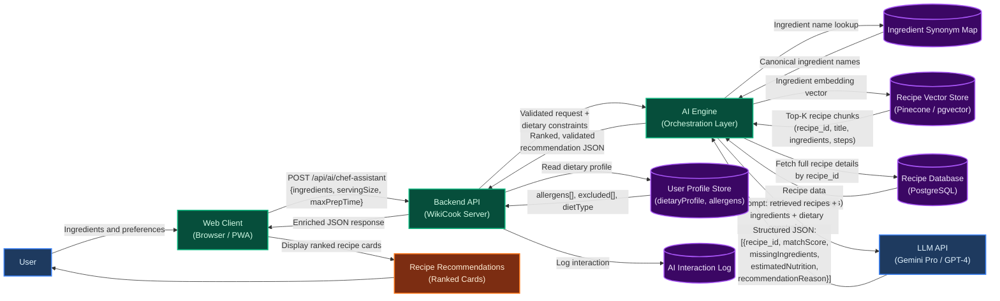

# PROJECT PROPOSAL: WIKICOOK
**Course:** CS300 - CSC13002: Introduction to Software Engineering  
**Project:** WikiCook - Smart Cooking Assistant & Culinary Social Platform  
**Academic Year:** Fall Semester (2026 - 2027)  

---

## DOCUMENT METADATA & RESPONSIBILITY MATRIX
| Section | Title | Performed by (Author) | Reviewed by | Edited by |
| :---: | :--- | :---: | :---: | :---: |
| **Section 1** | Overview, Vision & Practical Value | **DucDuyNguyen15-IT**  |  **ThanhDu14** | **LqHung06** |
| **Section 2** | Target Users & Operating Environments | **DucDuyNguyen15-IT**  |  **ThanhDu14** | **LqHung06** |
| **Section 3** | Key Functional Features (10 Modules) | **DucDuyNguyen15-IT**  |  **ThanhDu14** | **LqHung06** |
| **Section 4** | AI Smart Chef Assistant & Data Flow | **MaiHien3507** | **DucDuyNguyen15-IT**  , **ThanhDu14** | **LqHung06** |
| **Section 5** | End-to-End User Journey & Workflow Diagram | **DucDuyNguyen15-IT** , **LqHung06** | **ThanhDu14** | **LqHung06** |

---

## 1. PROJECT OVERVIEW & VISION
*Performed by: DucDuyNguyen15-IT (Member 2) | Reviewed by: Member 1 | Edited by: **LqHung06**

### 1.1. Problem Statement
In the fast-paced modern urban environment, cooking at home presents several recurring challenges for individuals and families:
1. **Daily Decision Fatigue ("What to cook today?"):** Everyday consumers spend an average of 15 to 30 minutes pondering daily meal choices, often constrained by repetitive menus, limited inspiration, and time scarcity after long work hours.
2. **Fragmented Culinary Resources:** Most current recipe websites are cluttered with intrusive display advertisements, lack dynamic portion scaling (e.g., automatically recalculating ingredient quantities from 2 servings to 5 servings), and fail to bridge the gap between recipes and grocery shopping lists.
3. **Dietary & Health Compliance Difficulties:** Individuals managing specific dietary restrictions (e.g., lactose intolerance, gluten allergies, diabetic or keto diets) struggle to verify whether online recipes meet their nutritional and allergen safety criteria.
4. **Lack of Kitchen-Friendly Cooking Guidance:** Traditional recipe blog posts require constant scrolling and screen tapping — extremely inconvenient when the cook's hands are wet, greasy, or covered in flour during active meal preparation.

### 1.2. Product Vision
**WikiCook** is envisioned as an all-in-one, intelligent culinary companion and community ecosystem designed to revolutionize how home cooks plan, shop, prepare, and share meals. 

WikiCook bridges the divide between **daily meal confusion** and **delightful dinner tables** by:
* Providing smart recipe discovery with multi-criteria filtering and AI-powered natural language search.
* Empowering cooks of all experience levels with an interactive, hands-free cooking mode equipped with integrated countdown timers for a distraction-free kitchen experience.
* Cultivating a healthy, collaborative community where culinary enthusiasts can share authentic family recipes, exchange cooking tips, and inspire sustainable cooking habits.
* Leveraging LLM-powered nutritional analysis to automatically estimate calories, macronutrients, and allergen warnings for every recipe.

### 1.3. Practical Value & Social Impact
* **Health & Wellness Improvement:** AI-powered nutritional breakdowns and automated allergen warnings enable families to sustain balanced nutrition and make informed dietary choices.
* **Time Efficiency:** Streamlined weekly meal planning with AI-generated menus and consolidated grocery checklists eliminate redundant supermarket trips and daily decision fatigue.
* **Community & Knowledge Sharing:** A two-way recipe contribution platform (unlike one-way editorial blogs) fosters authentic culinary exchange, preserves family cooking traditions, and builds social trust through verified Cooksnaps and community reviews.

---

## 2. TARGET USERS & OPERATING ENVIRONMENTS
*Performed by: DucDuyNguyen15-IT (Member 2) | Reviewed by: Member 1 | Edited by: Member 3*

### 2.1. User Personas (Actors)

```text
+-----------------------------------------------------------------------------------+
|                              WIKICOOK TARGET ACTORS                               |
+------------------------------------+----------------------------------------------+
| 1. The Busy Home Cook (Primary)    | - Needs quick recipes & step-by-step aid     |
|                                    | - Values time efficiency & meal planning     |
+------------------------------------+----------------------------------------------+
| 2. Recipe Contributor (Secondary)  | - Passionate food creator / home chef        |
|                                    | - Publishes dishes, seeks community feedback |
+------------------------------------+----------------------------------------------+
| 3. Dietary-Conscious User (Niche)  | - Requires strict allergen & macro filters   |
|                                    | - Values calorie tracking & clean eating     |
+------------------------------------+----------------------------------------------+
| 4. Platform Administrator (Admin)  | - Moderates user-submitted recipes & reviews |
|                                    | - Manages categories, users & platform data  |
+------------------------------------+----------------------------------------------+
```

#### Actor 1: The Busy Home Cook (Primary Persona)
* **Demographics:** Young working professionals, working parents, university students living independently (aged 20–45).
* **Core Goals:** Prepare quick, delicious, and nutritious meals within 20 to 45 minutes using whatever ingredients are currently on hand; avoid throwing away spoiled groceries.
* **Pain Points:** Exhausted after work; easily overwhelmed by lengthy, unstructured blog posts with buried ingredient lists; clumsy experience touching smartphone screens with wet or greasy hands while cooking.

#### Actor 2: The Recipe Contributor / Culinary Creator (Secondary Persona)
* **Demographics:** Passionate home chefs, culinary bloggers, and community recipe contributors (aged 22–55).
* **Core Goals:** Document culinary traditions and creative recipes; reach an appreciative audience; receive authentic reviews and photos of cooked dishes (*cooksnaps*) from other users.
* **Pain Points:** Lack of clean, specialized authoring tools; difficulty structuring preparation steps, ingredient quantities, and accompanying photos; poor attribution on generic social media.

#### Actor 3: The Health-Conscious & Dietary-Restricted User (Specialized Persona)
* **Demographics:** Fitness enthusiasts, vegetarians, vegans, and individuals with food allergies or chronic dietary requirements (aged 18–60).
* **Core Goals:** Filter recipes with zero tolerance for restricted ingredients (e.g., peanut-free, gluten-free, dairy-free); monitor estimated calories and macronutrient ratios per serving.
* **Pain Points:** Inaccurate nutritional labeling online; ambiguous ingredient naming; lack of automated substitution recommendations.

#### Actor 4: The Platform Administrator (System Persona)
* **Demographics:** WikiCook team operators, content moderators, and system administrators.
* **Core Goals:** Ensure recipe quality and community safety by reviewing user-submitted content before publication; manage recipe categories, ingredient taxonomies, and user accounts; monitor platform analytics and flag inappropriate content.
* **Pain Points:** High volume of user-generated content requiring efficient moderation workflows; need for bulk management tools to organize recipes, categories, and user reports at scale.

### 2.2. Operating Environments & Technical Ecosystem
* **Application Architecture:** Responsive Web Application (Single-Page Application / Progressive Web App).
* **Supported Client Environments:**
  * **Desktop & Laptop Browsers:** Modern versions of Google Chrome (v100+), Mozilla Firefox (v100+), Apple Safari (v15+), and Microsoft Edge on Windows, macOS, and Linux platforms (optimized for resolutions from 1280x720 up to 4K UHD).
  * **Mobile & Tablet Devices:** Touch-optimized viewports for iOS (Safari Mobile 15+) and Android (Chrome Mobile 100+), featuring fluid grids, collapsible menus, and oversized action buttons suitable for kitchen countertop usage.
* **Operating Constraints & Resilience:**
  * Requires active internet connectivity for cloud search, account synchronization, and AI queries.
  * Incorporates client-side caching (Local Storage / Service Workers) allowing an active cooking session (recipe text, timers, step checklists) to remain uninterrupted even if home Wi-Fi temporarily drops.

---

## 3. KEY FUNCTIONAL FEATURES
*Performed by: DucDuyNguyen15-IT (Member 2) | Reviewed by: Member 1, ThanhDu14 | Edited by: Member 3, ThanhDu14*

WikiCook provides a robust suite of **10 core feature modules**, engineered to deliver an end-to-end culinary journey from recipe discovery to final dish presentation:

### 3.1. User Authentication & Profile Management
* **What it does:** Allows users to register, log in (via Email/Password or OAuth Google/Apple), manage their personal avatar, and define dietary profiles (e.g., vegetarian, halal, keto, specific allergies, household size).
* **Why it is useful:** Personalizes all downstream recommendations according to the user's family size and dietary constraints, preventing accidental exposure to food allergens and saving preference setup time.

### 3.2. Smart Recipe Discovery & Multi-Criteria Filtering
* **What it does:** Provides full-text keyword search alongside multi-dimensional filters based on preparation time, cuisine origin (Vietnamese, Italian, Japanese, etc.), difficulty level, cooking method (air fryer, boiling, baking), and calories.
* **Why it is useful:** Enables users to find exactly what they desire within seconds rather than browsing through hundreds of irrelevant food posts.

### 3.3. Weekly Meal Planner & Schedule
* **What it does:** Provides an intuitive drag-and-drop calendar interface where users can assign breakfast, lunch, and dinner recipes for each day of the upcoming week. Includes an AI-powered auto-generation feature that suggests balanced daily menus.
* **Why it is useful:** Eradicates daily decision fatigue, promotes balanced home nutrition, and facilitates planned, stress-free bulk cooking.

### 3.4. Automated Smart Shopping List
* **What it does:** Automatically compiles ingredients from selected recipes or weekly meal plans into a consolidated shopping checklist, merging duplicate items and grouping entries by supermarket aisle category (Produce, Meat & Seafood, Spices & Condiments, Dairy & Eggs).
* **Why it is useful:** Eliminates duplicate purchases, speeds up supermarket grocery trips, and guarantees no crucial seasoning or herb is forgotten before cooking begins.

### 3.5. Interactive Hands-Free Cooking Mode & Integrated Timers
* **What it does:** Displays recipe execution in a clean, high-contrast, distraction-free fullscreen view with large text steps. Users can trigger concurrent countdown timers for distinct cooking stages (e.g., simmering broth for 15 mins while sautéing garlic for 2 mins) with audible alarms.
* **Why it is useful:** Prevents messy kitchen accidents on device touchscreens, eliminates overcooking or burned meals, and keeps the cook fully focused on food preparation.

### 3.6. Rich Recipe Creation & Multimedia Contribution Editor
* **What it does:** Provides a structured, multi-step creation wizard for community members to submit new recipes with ingredient measurements, equipment tags, yield adjustments, high-resolution step photos, and optional YouTube/TikTok embed links.
* **Why it is useful:** Maintains consistent, high-quality recipe documentation standards across the platform and incentivizes home chefs to share their culinary creations.

### 3.7. Community Reviews, Cooksnaps & Interactive Ratings
* **What it does:** Allows cooks to rate recipes on a 5-star scale, post text comments, share helpful modifications (e.g., "substituted fish sauce with soy sauce for vegan version"), and upload photos of their own finished results (*Cooksnaps*).
* **Why it is useful:** Fosters social trust and community engagement, providing real-world proof of whether a recipe turns out as promised before someone attempts it.

### 3.8. Personal Recipe Bookmarks & Custom Collections
* **What it does:** Enables users to save favorite recipes and organize them into personalized themed cookbooks (e.g., "Quick 15-Minute Dinners", "Tet Holiday Specials", "Healthy Lunchboxes").
* **Why it is useful:** Empowers users to curate their own private culinary repertoire for quick recall without having to search the entire global catalog repeatedly.

### 3.9. LLM-Powered Nutritional Analysis & Dietary Warning Badges
* **What it does:** Leverages a Large Language Model (LLM) API (e.g., Gemini, GPT) to automatically analyze a recipe's ingredient list and estimate caloric values, macronutrient distributions (protein, carbohydrates, fats), and prominent allergen/dietary safety tags (Gluten-Free, Dairy-Free, Nut-Free, Low-Sodium) per serving. Results are displayed with a disclaimer: *"Nutritional estimates are AI-generated and intended for reference purposes only."*
* **Why it is useful:** Eliminates the need for a complex nutritional database while still providing actionable dietary insights. Safeguards vulnerable family members with severe allergies and assists health-conscious users in meeting their fitness and wellness targets effortlessly.

### 3.10. Admin Dashboard & Content Moderation
* **What it does:** Provides a dedicated administrator panel with the following capabilities:
  * **Recipe Moderation Queue:** Review, approve, reject, or request revisions for user-submitted recipes before they are published to the public catalog. Includes bulk approve/reject actions for efficient moderation workflows.
  * **Recipe & Category Management:** Full CRUD (Create, Read, Update, Delete) operations on the recipe catalog. Manage recipe categories, cuisine tags, ingredient taxonomies, and featured/promoted recipe selections.
  * **User & Community Management:** View registered user accounts, handle user reports, suspend or ban accounts violating community guidelines, and manage user roles (regular user, verified contributor, moderator).
  * **Platform Analytics Overview:** Dashboard widgets displaying key metrics such as total recipes, new submissions pending review, active users, most popular recipes, and community engagement statistics.
* **Why it is useful:** Ensures content quality, community safety, and platform integrity. Prevents spam, plagiarized, or inappropriate recipe submissions from reaching end users. Enables efficient platform governance at scale as the recipe catalog and user base grow.

---

## 4. SPECIAL FEATURE: AI SMART CHEF ASSISTANT
*Performed by: MaiHien3507 | Reviewed by: DucDuyNguyen15-IT, ThanhDu14 | Edited by: ThanhDu14*

### 4.1. Purpose & User Value

The **AI Smart Chef Assistant** eliminates the single most frustrating moment in home cooking: standing in front of an open fridge with no idea what to make. By allowing users to **enter the ingredients they have on hand** and instantly receive curated, step-by-step recipe suggestions, the feature removes both cognitive friction and food waste in one interaction.

The feature combines two AI techniques in a single pipeline:
1. **Retrieval-Augmented Generation (RAG)** – the entered ingredients are converted into a dense embedding vector and used to semantically query WikiCook's curated recipe knowledge base (Vector Store), surfacing the top-K most contextually relevant recipe candidates.
2. **LLM Orchestration** – a language model receives the retrieved recipe context together with the user's personal dietary profile and produces personalised, ranked recipe recommendations with ingredient coverage scores and a nutritional estimate.

#### 4.1.1. Practical Value and UX Enhancement

The table below maps each user need to a concrete AI processing step and the resulting UX benefit, demonstrating that the feature operates significantly beyond keyword search or simple auto-suggest.

| User Need | AI Processing | User Benefit |
|:----------|:-------------|:-------------|
| "What can I cook with what I have?" | Ingredient list is embedded and used for **semantic vector search** against the WikiCook Recipe Vector Store, retrieving recipes whose ingredient profile is semantically closest to the user's input — not just recipes that share a keyword. | User receives up to 5 ranked recipe suggestions within seconds, without browsing or searching manually. |
| Reduce food waste | The system ranks recipes by **ingredient coverage score** (the proportion of required ingredients the user already possesses), prioritising recipes that require the fewest additional purchases. | Users cook with what they have, reducing spoilage and unplanned grocery trips. |
| Personalised results, not generic suggestions | The user's stored **dietary profile** (allergens, excluded ingredients, diet type) is injected into both the RAG filter and the LLM system prompt. Recipes containing excluded allergens are filtered before they ever reach the LLM. | Recommendations are safe for the user's dietary requirements by design, not by chance. |
| Control over meal constraints | **Serving size** and **maximum preparation time** are passed as hard constraints in the LLM prompt, instructing the model to only rank recipes that can be scaled to the requested yield within the prep-time budget. | Results are immediately actionable for the user's specific situation. |
| Trust in recipe accuracy | **RAG grounds the LLM in WikiCook's verified recipe knowledge base.** The LLM does not generate recipes from memory; it ranks and explains candidates retrieved from the database. This significantly reduces hallucination risk and ensures all suggestions are traceable to a real WikiCook recipe. | Users can trust that recommended recipes are achievable and community-verified, not AI-invented. |
| Understandable recommendations | The LLM produces a **plain-language explanation** for each suggestion: why the recipe matches the ingredient list, which ingredients are missing, and how the recipe aligns with the user's dietary constraints. | Users understand *why* a recipe was recommended, not just *what* was recommended. |
| Iterative, interactive experience | Users can **modify the ingredient list or adjust filters** and immediately re-submit. Each query is a fresh RAG retrieval + LLM call, returning updated results without a page reload. | The experience is interactive and exploratory, unlike a static search result page. |

---

### 4.2. User Flow (Use-Case Narrative)

| Step | Actor | Action |
|:----:|:------|:-------|
| 1 | User | Opens the **AI Chef** tab and selects **Manual Entry** mode. |
| 2 | User | Types ingredient names into the free-text input field with autocomplete suggestions, or selects from tag-chip recommendations. Unrecognised terms are flagged with a "Did you mean...?" prompt for user confirmation. |
| 3 | System | Validates the ingredient list (client-side: non-empty; server-side: format and length constraints). |
| 4 | System | Normalises ingredient names using the synonym and canonical-name map, then applies the user's **dietary profile** (allergens, excluded ingredients, serving size) as a filter mask. |
| 5 | System | Converts the filtered ingredient list into a semantic embedding vector and queries the **RAG Vector Store** (WikiCook recipe knowledge base), retrieving the top-K (default: 10) most relevant recipe documents. |
| 6 | System | Constructs a structured LLM prompt from the retrieved recipe context, the filtered ingredient list, and the user's dietary constraints, then calls the **Recipe Suggestion LLM**. |
| 7 | System | Receives a structured JSON response containing ranked recipe suggestions, each with: name, match score, missing ingredients, estimated prep time, and a live nutritional estimate. |
| 8 | User | Reviews the ranked suggestion cards, optionally adjusts the serving count or removes an ingredient, and taps **Cook This** to enter Hands-Free Cooking Mode (Section 3.5). |
| 9 | User | (Optional) Saves the suggestion to Personal Bookmarks (Section 3.8) or adds missing ingredients to the Smart Shopping List (Section 3.4). |

---

### 4.3. Inputs

| Input | Source | Format | Required |
|:------|:-------|:-------|:--------:|
| Manual ingredient list | Free-text field or tag-chip entry with autocomplete | Comma-separated or individually tagged ingredient names | Yes |
| User dietary profile | Authenticated user account | JSON (allergens[], excluded[], servingSize, dietType) | Yes |
| Serving size override | UI slider | Integer 1–20 | Optional |
| Maximum prep-time filter | UI input | Integer (minutes) | Optional |

---

### 4.4. Core AI Pipeline Architecture

The following five-step pipeline describes the complete data transformation from raw user input to personalised recipe recommendations. Each step identifies its inputs, the processing performed, and its output, making clear that the LLM acts as a **reasoning and ranking layer over retrieved context**, not as a database or search engine.

**Step 1 – Input Validation and Ingredient Normalisation**
- *Input:* Raw ingredient name list (strings) + serving size + max prep-time filter, submitted via `POST /api/ai/chef-assistant`.
- *Processing:* Validate that the list is non-empty and within the 30-item limit. Map each ingredient name to its canonical form using the Ingredient Synonym Map (e.g., "thit heo" → "pork", "ca chua" → "tomato"). Flag any unrecognised terms and return "Did you mean...?" suggestions to the client for user confirmation. Apply the user's dietary profile (allergens[], excluded[]) to remove any ingredients the user cannot consume.
- *Output:* A clean, canonical, dietary-safe ingredient list ready for semantic retrieval.
- *Contribution:* Ensures the downstream embedding and retrieval operate on unambiguous, standardised ingredient names, improving retrieval precision.

**Step 2 – Semantic Retrieval via Embedding and Vector Store**
- *Input:* Clean canonical ingredient list from Step 1.
- *Processing:* The ingredient list is passed to a text embedding model (e.g., text-embedding-3-small or Gemini Embedding) to produce a dense vector representation. This vector is used to perform an Approximate Nearest Neighbour (ANN) search over the WikiCook Recipe Vector Store (Pinecone or pgvector). The search returns the top-K (default K=10) recipe chunks whose semantic embedding is closest to the query vector. Each retrieved chunk contains: `recipe_id`, `title`, `ingredient_list`, and `preparation_steps`.
- *Output:* Top-K recipe context documents (retrieved from the Vector Store, not generated).
- *Contribution:* Grounds all subsequent LLM processing in real, verified WikiCook recipes. The LLM operates only on this retrieved context — it cannot hallucinate recipes that do not exist in the knowledge base.

**Step 3 – RAG Context Construction and LLM Prompt Assembly**
- *Input:* Top-K recipe context documents (Step 2) + clean ingredient list + dietary constraints + serving size + max prep-time.
- *Processing:* Construct a structured prompt containing: (a) a system role instruction specifying the LLM's task and output format, (b) the user's dietary constraints as hard filters, (c) the user's ingredient list and preferences, (d) the full text of the top-K retrieved recipe documents as grounding context. The prompt instructs the LLM to return a structured JSON array and to justify each recommendation from the provided context only.
- *Output:* Assembled LLM prompt ready for API call.
- *Contribution:* Implements the RAG pattern — the LLM receives a closed context to reason over, reducing hallucination and ensuring recommendations are traceable to genuine WikiCook recipes.

**Step 4 – LLM Recommendation and Ranking**
- *Input:* Assembled prompt (Step 3).
- *Processing:* Send the prompt to the LLM API (Gemini Pro / GPT-4) with JSON output mode enforced (function-calling or structured output schema). The LLM analyses the retrieved recipes against the ingredient list and dietary constraints, then returns a ranked JSON array. Each item includes: `recipe_id`, `matchScore` (proportion of required ingredients the user already has), `missingIngredients[]`, `estimatedPrepTime`, `estimatedNutrition`, and a short `recommendationReason`. Validate the JSON response against a strict schema; retry once if malformed.
- *Output:* Validated, ranked suggestion array in structured JSON.
- *Contribution:* Converts raw retrieved recipe data into personalised, ranked, and contextualised recommendations — the key value-add beyond a traditional keyword search.

**Step 5 – Post-Processing and Structured Response Assembly**
- *Input:* Ranked suggestion JSON (Step 4).
- *Processing:* Fetch full recipe records from the WikiCook Recipe Database using the `recipe_id` values returned by the LLM. Merge with the LLM's ranking scores and explanations. Attach allergen/dietary badges based on recipe tags. Scale nutritional estimates to the requested serving size. Log the interaction to the AI Interaction Log for feedback analytics.
- *Output:* Enriched HTTP/JSON response containing ranked recipe cards with all display-ready fields.
- *Contribution:* Ensures the response is complete, display-ready, and fully consistent with the WikiCook Recipe Database — the LLM output is validated and enriched, never used raw.

```text
 User Input (ingredients + preferences)
          |
          v
 [STEP 1] Input Validation & Normalisation
  (synonym map, dietary filter)
          |
          v
 [STEP 2] Embedding + ANN Vector Search
  (ingredient list  ->  dense vector  ->  Recipe Vector Store)
          |
  Top-K WikiCook Recipes (retrieved, not generated)
          |
          v
 [STEP 3] RAG Context + Prompt Construction
  (recipes + ingredients + dietary constraints  ->  LLM prompt)
          |
          v
 [STEP 4] LLM Ranking & Recommendation
  (prompt  ->  LLM API  ->  structured JSON: matchScore, missingIngredients,
   estimatedNutrition, recommendationReason)
          |
          v
 [STEP 5] Post-Processing & Response Assembly
  (merge with Recipe DB, attach allergen badges, scale nutrition)
          |
          v
 Ranked Recipe Recommendations  ->  Web Client  ->  User
```

---

### 4.5. Data Flow Diagram (Mermaid)

> **Diagram Type:** System Architecture Data Flow – illustrating the end-to-end path from User to Web Client to Backend API to AI Engine (with Vector Store, Recipe Database, User Profile, and LLM) and back to User.



**Legend:**

| Fill Colour | Node Type | Examples |
|:------------|:----------|:---------|
| Dark Blue | Actor / External Service | User, LLM API |
| Dark Green | System Layer | Web Client, Backend API, AI Engine |
| Purple | Data Store | Recipe Vector Store, Recipe DB, User Profile, Synonym Map, AI Log |
| Dark Orange | Output / Result | Recipe Recommendations |

---

### 4.6. Outputs

| Output Field | Format | Displayed As |
|:-------------|:-------|:-------------|
| `recipeName` | String | Recipe card title |
| `matchScore` | Float 0–1 → displayed as % | Ingredient coverage badge |
| `missingIngredients` | String array | Inline chips + "Add to Shopping List" CTA |
| `estimatedPrepTime` | Integer (minutes) | Prep-time badge on card |
| `estimatedNutrition` | `{calories, protein, carbs, fat}` per serving | Expandable nutrition panel |
| `allergenTags` | Badge array (Gluten-Free, Dairy-Free, etc.) | Inline warning chips |
| `recommendationReason` | Short plain-language string from LLM | Contextual explanation below recipe title |

> **Disclaimer displayed in UI:** *"Recipe suggestions are generated by AI based on available ingredients and may not account for all dietary conditions. Always verify allergen safety independently."*

---

### 4.7. Validation & Error Handling

| Failure Scenario | System Behaviour |
|:-----------------|:----------------|
| Ingredient list is empty on submission | Client-side validation blocks submission and highlights the input field; server-side returns HTTP 400 if bypassed |
| Unrecognised ingredient name | Normalisation step returns the closest synonym as a "Did you mean...?" suggestion; user must confirm before proceeding |
| No matching recipes found in Vector Store | System returns an informative empty-state message recommending the user broaden their ingredient list |
| Zero ingredients remain after dietary filter | System notifies the user that no eligible ingredients were found and recommends reviewing dietary profile settings |
| LLM returns malformed JSON | Backend validates against JSON Schema; retries once; on second failure, returns a graceful empty-state error message |
| Recipe LLM API rate-limit hit | Exponential back-off for up to 2 retries; if all fail, degrades gracefully to keyword-based fallback search on the WikiCook recipe index |
| User has incomplete dietary profile | Pipeline executes in full but appends a soft warning: *"Complete your dietary profile for personalised filtering."* |

---

### 4.8. API Contract

**Endpoint:** `POST /api/ai/chef-assistant`

**What the client sends:**
```json
{
  "ingredients": ["egg", "tomato", "chicken"],
  "servingSize": 2,
  "maxPrepTime": 30
}
```
The user's dietary profile (allergens, excluded ingredients, dietType) is **automatically retrieved from the authenticated user's stored profile** by the Backend — the client does not need to send it.

**What the Backend does:** Validates the request, reads the user's `dietaryProfile` from the User Profile Store, and forwards the combined payload to the AI Engine.

**What the AI Engine does:** Normalises ingredients → embeds into a vector → queries the Recipe Vector Store (top-K retrieval) → fetches full recipe details from the Recipe Database → constructs the LLM prompt → calls the LLM API → validates and ranks the structured JSON response.

**What the response returns:**
```json
{
  "suggestions": [
    {
      "recipeId": "wc-00421",
      "recipeName": "Tomato and Egg Stir-Fry",
      "matchScore": 0.92,
      "missingIngredients": ["scallion"],
      "estimatedPrepTime": 15,
      "estimatedNutrition": { "calories": 310, "protein": 18, "carbs": 12, "fat": 20 },
      "allergenTags": ["Dairy-Free", "Gluten-Free"],
      "recommendationReason": "Uses 11 of your 12 ingredients; quick to prepare within your 30-minute limit."
    }
  ]
}
```

**Additional constraints:** Endpoint is rate-limited to **10 requests / user / hour**. All approved WikiCook recipes are embedded and indexed in the Vector Store at publish time and re-indexed nightly.

---

### 4.9. Known Limitations

1. **No Quantity Information:** Users enter only ingredient names, not amounts. The system assumes each ingredient is available in a recipe-appropriate quantity; suggestions may not perfectly match actual stock levels.
2. **Naming Ambiguity:** Suggestion quality depends on how users phrase ingredient names (e.g., "thit heo" vs. "pork" vs. "pork belly"). The synonym and normalisation map mitigates this, but less common or highly regional names may not be resolved correctly.
3. **Hallucination Risk:** The LLM may occasionally produce a recipe step or nutritional value not grounded in the retrieved context. The RAG pipeline mitigates this risk, but the system-wide disclaimer and independent user verification remain essential.
4. **Offline Unavailability:** Both AI steps (RAG retrieval and LLM generation) require active internet connectivity. The feature is fully disabled in offline/PWA cached mode.

---

## 5. END-TO-END USER JOURNEY & CULINARY WORKFLOW
*Performed by: DucDuyNguyen15-IT,LqHung06 | Reviewed by: ThanhDu14 | Edited by: LqHung06*

To provide a cohesive, architectural view of how WikiCook's 10 functional modules interconnect, the following end-to-end workflow illustrates the complete user lifecycle from initial onboarding, meal planning, and grocery shopping to interactive cooking and community feedback.

### 5.1. System Workflow Diagram (Mermaid)


### 5.2. Text-Based Workflow Representation

```text
[ New / Existing User ]
           │
           ▼
┌────────────────────────────────────────────────────────┐
│  3.1. Registration & Authentication                    │
│  - Set up dietary preferences (Allergies, Portions)    │
└───────────────────────────┬────────────────────────────┘
                            │
               ┌────────────┴────────────┐
               ▼                         ▼
      [ Explore & Cook ]       [ Contribute Recipe ]
               │                         │
               │                         ▼
               │       ┌─────────────────────────────────────────┐
               │       │ 3.6. Recipe Creation Wizard             │
               │       │ - Structured ingredients & quantities   │
               │       │ - Steps, media, timer metadata          │
               │       └───────────────────┬─────────────────────┘
               │                           │
               │                           ▼
               │       ┌─────────────────────────────────────────┐
               │       │ 3.10. Admin Content Moderation          │
               │       │ - Approve / Reject / Request Revisions  │
               │       └───────────────────┬─────────────────────┘
               │                           │ (Once Approved)
               │ ◄─────────────────────────┘
               ▼
┌────────────────────────────────────────────────────────┐
│  3.2. Recipe Search & Multi-Criteria Filtering         │
│  - Filter by keyword, calories, time, equipment        │
│  - Inspect AI nutrition & allergen badges (3.9)       │
└───────────────────────────┬────────────────────────────┘
                            │
               ┌────────────┴────────────┐
               │ (Plan Weekly Meals)     │ (Cook Immediately)
               ▼                         │
┌───────────────────────────────┐        │
│ 3.3. Weekly Meal Planner      │        │
│ - Drag-and-drop weekly calendar│       │
│ - Or generate menu via AI     │        │
└──────────────┬────────────────┘        │
               │                         │
               ▼                         │
┌───────────────────────────────┐        │
│ 3.4. Automated Shopping List  │        │
│ - Auto-consolidate ingredients│        │
│ - Group by supermarket aisle  │        │
│ - Interactive mobile checklist│        │
└──────────────┬────────────────┘        │
               │                         │
               └────────────┬────────────┘
                            ▼
┌────────────────────────────────────────────────────────┐
│  3.5. Hands-Free Cooking Mode & Integrated Timers      │
│  - Distraction-free fullscreen view with large text    │
│  - Concurrent countdown timers for active cooking steps│
└───────────────────────────┬────────────────────────────┘
                            │ (Cooking Complete)
                            ▼
┌────────────────────────────────────────────────────────┐
│  3.7. Community Reviews & Cooksnaps                    │
│  - Rate 1 to 5 stars                                   │
│  - Upload actual finished dish photos (Cooksnaps)      │
│  - Share taste adjustment & substitution tips          │
└───────────────────────────┬────────────────────────────┘
                            │ (Save for Future Use)
                            ▼
┌────────────────────────────────────────────────────────┐
│  3.8. Personal Bookmarks & Custom Collections          │
│  - Save into "Family Favorites", "Healthy Weekdays"... │
└────────────────────────────────────────────────────────┘
```

