# PROJECT PROPOSAL: WIKICOOK

## DOCUMENT METADATA & RESPONSIBILITY MATRIX

| Section | Title | Performed by (Author) | Reviewed by | Edited by |
| :---: | :--- | :---: | :---: | :---: |
| **Section 1** | Overview, Vision & Practical Value | **Nguyễn Đức Duy (DucDuyNguyen15-IT)** | **Nguyễn Thành Dự (ThanhDu14)** | **Lê Quốc Hưng (LqHung06)** |
| **Section 2** | Target Users & Operating Environments | **Nguyễn Đức Duy (DucDuyNguyen15-IT)** | **Nguyễn Thành Dự (ThanhDu14)** | **Lê Quốc Hưng (LqHung06)** |
| **Section 3** | Key Functional Features (10 Modules) | **Nguyễn Đức Duy (DucDuyNguyen15-IT)** | **Nguyễn Thành Dự (ThanhDu14)** | **Lê Quốc Hưng (LqHung06)** |
| **Section 4** | AI Weekly Meal Planner & Data Flow | **Mai Văn Hiển (MaiHien3507)** | **Nguyễn Thành Dự (ThanhDu14)** | **Lê Quốc Hưng (LqHung06)** |
| **Section 5** | End-to-End User Journey & Workflow Diagram | **Nguyễn Đức Duy (DucDuyNguyen15-IT), Lê Quốc Hưng (LqHung06)** | **Nguyễn Thành Dự (ThanhDu14)** | **Mai Văn Hiển (MaiHien3507)** |

---

## 1. PROJECT OVERVIEW & VISION
*Performed by: Nguyễn Đức Duy (DucDuyNguyen15-IT) | Reviewed by: Nguyễn Thành Dự (ThanhDu14) | Edited by: Lê Quốc Hưng (LqHung06)*

### 1.1. Problem Statement

In the fast-paced modern urban environment, cooking at home presents several recurring challenges for individuals and families:

1. **Daily Decision Fatigue ("What to cook today?"):** Everyday consumers spend an average of 15 to 30 minutes pondering daily meal choices, often constrained by repetitive menus, limited inspiration, and time scarcity after long work hours.
2. **Fragmented Culinary Resources:** Most current recipe websites are cluttered with intrusive display advertisements, lack dynamic portion scaling (e.g., automatically recalculating ingredient quantities from 2 servings to 5 servings), and fail to bridge the gap between recipes and grocery shopping lists.
3. **Dietary & Health Compliance Difficulties:** Individuals managing specific dietary restrictions (e.g., lactose intolerance, gluten allergies, diabetic or keto diets) struggle to verify whether online recipes meet their nutritional and allergen safety criteria.
4. **Lack of Kitchen-Friendly Cooking Guidance:** Traditional recipe blog posts require constant scrolling and screen tapping — extremely inconvenient when the cook's hands are wet, greasy, or covered in flour during active meal preparation.

### 1.2. Product Vision

**WikiCook** is envisioned as an all-in-one, intelligent culinary companion and community ecosystem designed to revolutionize how home cooks plan, shop, prepare, and share meals.

WikiCook bridges the divide between **daily meal confusion** and **delightful dinner tables** by:

- Providing smart recipe discovery with multi-criteria filtering and AI-powered natural language search.
- Empowering cooks of all experience levels with an interactive, hands-free cooking mode equipped with integrated countdown timers for a distraction-free kitchen experience.
- Cultivating a healthy, collaborative community where culinary enthusiasts can share authentic family recipes, exchange cooking tips, and inspire sustainable cooking habits.
- Leveraging LLM-powered nutritional analysis to automatically estimate calories, macronutrients, and allergen warnings for every recipe.

### 1.3. Practical Value & Social Impact

- **Health & Wellness Improvement:** AI-powered nutritional breakdowns and automated allergen warnings enable families to sustain balanced nutrition and make informed dietary choices.
- **Time Efficiency:** Streamlined weekly meal planning with AI-generated menus and consolidated grocery checklists eliminate redundant supermarket trips and daily decision fatigue.
- **Community & Knowledge Sharing:** A two-way recipe contribution platform (unlike one-way editorial blogs) fosters authentic culinary exchange, preserves family cooking traditions, and builds social trust through verified Cooksnaps and community reviews.

---

## 2. TARGET USERS & OPERATING ENVIRONMENTS
*Performed by: Nguyễn Đức Duy (DucDuyNguyen15-IT) | Reviewed by: Nguyễn Thành Dự (ThanhDu14) | Edited by: Lê Quốc Hưng (LqHung06)*

### 2.1. User Personas (Actors)

```text
+-----------------------------------------------------------------------------------+
|                              WIKICOOK TARGET ACTORS                               |
+------------------------------------+----------------------------------------------+
| 1. The Busy Home Cook (Primary)    | - Needs quick recipes & step-by-step aid     |
|                                    | - Values time efficiency & meal planning     |
+------------------------------------+----------------------------------------------+
| 2. Recipe Contributor (Secondary)  | - Passionate food creator / home chef        |
|                                    | - Publishes dishes, seeks community feedback |
+------------------------------------+----------------------------------------------+
| 3. Dietary-Conscious User (Niche)  | - Requires strict allergen & macro filters   |
|                                    | - Values calorie tracking & clean eating     |
+------------------------------------+----------------------------------------------+
| 4. Platform Administrator (Admin)  | - Moderates user-submitted recipes & reviews |
|                                    | - Manages categories, users & platform data  |
+------------------------------------+----------------------------------------------+
```

#### Actor 1: The Busy Home Cook (Primary Persona)

- **Demographics:** Young working professionals, working parents, university students living independently (aged 20–45).
- **Core Goals:** Prepare quick, delicious, and nutritious meals within 20 to 45 minutes using whatever ingredients are currently on hand; avoid throwing away spoiled groceries.
- **Pain Points:** Exhausted after work; easily overwhelmed by lengthy, unstructured blog posts with buried ingredient lists; clumsy experience touching smartphone screens with wet or greasy hands while cooking.

#### Actor 2: The Recipe Contributor / Culinary Creator (Secondary Persona)

- **Demographics:** Passionate home chefs, culinary bloggers, and community recipe contributors (aged 22–55).
- **Core Goals:** Document culinary traditions and creative recipes; reach an appreciative audience; receive authentic reviews and photos of cooked dishes (*cooksnaps*) from other users.
- **Pain Points:** Lack of clean, specialized authoring tools; difficulty structuring preparation steps, ingredient quantities, and accompanying photos; poor attribution on generic social media.

#### Actor 3: The Health-Conscious & Dietary-Restricted User (Specialized Persona)

- **Demographics:** Fitness enthusiasts, vegetarians, vegans, and individuals with food allergies or chronic dietary requirements (aged 18–60).
- **Core Goals:** Filter recipes with zero tolerance for restricted ingredients (e.g., peanut-free, gluten-free, dairy-free); monitor estimated calories and macronutrient ratios per serving.
- **Pain Points:** Inaccurate nutritional labeling online; ambiguous ingredient naming; lack of automated substitution recommendations.

#### Actor 4: The Platform Administrator (System Persona)

- **Demographics:** WikiCook team operators, content moderators, and system administrators.
- **Core Goals:** Ensure recipe quality and community safety by reviewing user-submitted content before publication; manage recipe categories, ingredient taxonomies, and user accounts; monitor platform analytics and flag inappropriate content.
- **Pain Points:** High volume of user-generated content requiring efficient moderation workflows; need for bulk management tools to organize recipes, categories, and user reports at scale.

### 2.2. Operating Environments & Technical Ecosystem

- **Application Architecture:** Responsive Web Application (Single-Page Application / Progressive Web App).
- **Supported Client Environments:**
  - **Desktop & Laptop Browsers:** Modern versions of Google Chrome (v100+), Mozilla Firefox (v100+), Apple Safari (v15+), and Microsoft Edge on Windows, macOS, and Linux platforms (optimized for resolutions from 1280x720 up to 4K UHD).
  - **Mobile & Tablet Devices:** Touch-optimized viewports for iOS (Safari Mobile 15+) and Android (Chrome Mobile 100+), featuring fluid grids, collapsible menus, and oversized action buttons suitable for kitchen countertop usage.
- **Operating Constraints & Resilience:**
  - Requires active internet connectivity for cloud search, account synchronization, and AI queries.
  - Incorporates client-side caching (Local Storage / Service Workers) allowing an active cooking session (recipe text, timers, step checklists) to remain uninterrupted even if home Wi-Fi temporarily drops.

---

## 3. KEY FUNCTIONAL FEATURES
*Performed by: Nguyễn Đức Duy (DucDuyNguyen15-IT) | Reviewed by: Nguyễn Thành Dự (ThanhDu14) | Edited by: Lê Quốc Hưng (LqHung06)*

WikiCook provides a robust suite of **10 core feature modules**, engineered to deliver an end-to-end culinary journey from recipe discovery to final dish presentation:

### 3.1. User Authentication & Profile Management

- **What it does:** Allows users to register, log in (via Email/Password or OAuth Google/Apple), manage their personal avatar, and define dietary profiles (e.g., vegetarian, halal, keto, specific allergies, household size).
- **Why it is useful:** Personalizes all downstream recommendations according to the user's family size and dietary constraints, preventing accidental exposure to food allergens and saving preference setup time.

### 3.2. Smart Recipe Discovery & Multi-Criteria Filtering

- **What it does:** Provides full-text keyword search alongside multi-dimensional filters based on preparation time, cuisine origin (Vietnamese, Italian, Japanese, etc.), difficulty level, cooking method (air fryer, boiling, baking), and calories.
- **Why it is useful:** Enables users to find exactly what they desire within seconds rather than browsing through hundreds of irrelevant food posts.

### 3.3. Weekly Meal Planner & Schedule

- **What it does:** Provides an intuitive drag-and-drop calendar interface where users can assign breakfast, lunch, and dinner recipes for each day of the upcoming week. Includes an AI-powered auto-generation feature that suggests balanced daily menus.
- **Why it is useful:** Eradicates daily decision fatigue, promotes balanced home nutrition, and facilitates planned, stress-free bulk cooking.

### 3.4. Automated Smart Shopping List

- **What it does:** Automatically compiles ingredients from selected recipes or weekly meal plans into a consolidated shopping checklist, merging duplicate items and grouping entries by supermarket aisle category (Produce, Meat & Seafood, Spices & Condiments, Dairy & Eggs).
- **Why it is useful:** Eliminates duplicate purchases, speeds up supermarket grocery trips, and guarantees no crucial seasoning or herb is forgotten before cooking begins.

### 3.5. Interactive Hands-Free Cooking Mode & Integrated Timers

- **What it does:** Displays recipe execution in a clean, high-contrast, distraction-free fullscreen view with large text steps. Users can trigger concurrent countdown timers for distinct cooking stages (e.g., simmering broth for 15 mins while sautéing garlic for 2 mins) with audible alarms.
- **Why it is useful:** Prevents messy kitchen accidents on device touchscreens, eliminates overcooking or burned meals, and keeps the cook fully focused on food preparation.

### 3.6. Rich Recipe Creation & Multimedia Contribution Editor

- **What it does:** Provides a structured, multi-step creation wizard for community members to submit new recipes with ingredient measurements, equipment tags, yield adjustments, high-resolution step photos, and optional YouTube/TikTok embed links.
- **Why it is useful:** Maintains consistent, high-quality recipe documentation standards across the platform and incentivizes home chefs to share their culinary creations.

### 3.7. Community Reviews, Cooksnaps & Interactive Ratings

- **What it does:** Allows cooks to rate recipes on a 5-star scale, post text comments, share helpful modifications (e.g., "substituted fish sauce with soy sauce for vegan version"), and upload photos of their own finished results (*Cooksnaps*).
- **Why it is useful:** Fosters social trust and community engagement, providing real-world proof of whether a recipe turns out as promised before someone attempts it.

### 3.8. Personal Recipe Bookmarks & Custom Collections

- **What it does:** Enables users to save favorite recipes and organize them into personalized themed cookbooks (e.g., "Quick 15-Minute Dinners", "Tet Holiday Specials", "Healthy Lunchboxes").
- **Why it is useful:** Empowers users to curate their own private culinary repertoire for quick recall without having to search the entire global catalog repeatedly.

### 3.9. LLM-Powered Nutritional Analysis & Dietary Warning Badges

- **What it does:** Leverages a Large Language Model (LLM) API (e.g., Gemini, GPT) to automatically analyze a recipe's ingredient list and estimate caloric values, macronutrient distributions (protein, carbohydrates, fats), and prominent allergen/dietary safety tags (Gluten-Free, Dairy-Free, Nut-Free, Low-Sodium) per serving. Results are displayed with a disclaimer: *"Nutritional estimates are AI-generated and intended for reference purposes only."*
- **Why it is useful:** Eliminates the need for a complex nutritional database while still providing actionable dietary insights. Safeguards vulnerable family members with severe allergies and assists health-conscious users in meeting their fitness and wellness targets effortlessly.

### 3.10. Admin Dashboard & Content Moderation

- **What it does:** Provides a dedicated administrator panel with the following capabilities:
  - **Recipe Moderation Queue:** Review, approve, reject, or request revisions for user-submitted recipes before they are published to the public catalog. Includes bulk approve/reject actions for efficient moderation workflows.
  - **Recipe & Category Management:** Full CRUD (Create, Read, Update, Delete) operations on the recipe catalog. Manage recipe categories, cuisine tags, ingredient taxonomies, and featured/promoted recipe selections.
  - **User & Community Management:** View registered user accounts, handle user reports, suspend or ban accounts violating community guidelines, and manage user roles (regular user, verified contributor, moderator).
  - **Platform Analytics Overview:** Dashboard widgets displaying key metrics such as total recipes, new submissions pending review, active users, most popular recipes, and community engagement statistics.
- **Why it is useful:** Ensures content quality, community safety, and platform integrity. Prevents spam, plagiarized, or inappropriate recipe submissions from reaching end users. Enables efficient platform governance at scale as the recipe catalog and user base grow.

---

## 4. SPECIAL FEATURE: AI WEEKLY MEAL PLANNER
*Performed by: Mai Văn Hiển (MaiHien3507) | Reviewed by: Nguyễn Thành Dự (ThanhDu14) | Edited by: Lê Quốc Hưng (LqHung06)*

### 4.1. Purpose & User Value

The **AI Weekly Meal Planner** (also known as the AI Menu Generator) automates the most mentally exhausting part of home cooking: planning what to eat across an entire week. Instead of making 21 individual meal decisions, the user receives a complete, personalised **7-day meal plan** — covering breakfast, lunch, and dinner for every day — based on the user's dietary profile, household constraints, and ingredient preferences, all drawn from the WikiCook recipe knowledge base.

This feature is the proposed AI extension of the AI-powered auto-generation capability described in **Section 3.3 (Weekly Meal Planner)** and the automated shopping list generation described in **Section 3.4**. It targets the same AI menu generation opportunity identified in the existing-app survey (Ăn Gì Ngon's AI Menu Generator), but with a full LLM-orchestrated pipeline, integrated shopping list, and dietary constraint enforcement.

> **Implementation Status Notice:**
>
> - **Implemented in Workspace:** Manual Weekly Meal Planner calendar UI (Section 3.3), Smart Shopping List compilation (Section 3.4), and User Profile dietary preferences storage (Section 3.1).
> - **Proposed AI Architecture for PA1:** Vector Store index (pgvector), RAG semantic candidate retrieval, LLM-orchestrated 7-day (21-meal) planning pipeline, `POST /api/ai/weekly-meal-plan` endpoint, automated plan validation, and rate-limiting rules.

The feature combines two AI techniques in a single pipeline:

1. **Retrieval-Augmented Generation (RAG)** — the user's planning constraints and dietary profile are used to semantically query WikiCook's curated recipe knowledge base (Vector Store), surfacing a candidate set of contextually relevant recipes from which the AI constructs the weekly plan.
2. **LLM Orchestration** — a language model receives the retrieved recipe candidates and the user's constraints, then produces a structured 7-day meal plan (21 meals) as a coherent plan, not as 21 independent recommendations, ensuring variety, dietary compliance, and reasonable ingredient reuse across the week.

#### 4.1.1. Practical Value and UX Enhancement

The table below maps each user need to a concrete AI processing step and the resulting UX benefit, demonstrating that this feature addresses a planning problem — not a search problem.

| User Need | AI Processing | User Benefit |
|:----------|:-------------|:-------------|
| Avoid deciding 21 meals manually | LLM generates a coherent 7-day plan from candidate recipes, considering constraints across all slots simultaneously — not one meal at a time. | User receives a complete weekly meal plan in one interaction, eliminating daily decision fatigue for the entire week. |
| Plan meals that fit dietary restrictions | The user's dietary profile (allergens, excluded ingredients, diet type) is applied as a hard filter during RAG retrieval and reinforced in the LLM prompt. Allergen-violating recipes are excluded before reaching the LLM. | The retrieval and validation pipeline reduces the risk of dietary and allergen violations, while final user verification remains recommended. |
| Avoid eating the same dish every day | The LLM prompt explicitly instructs the model to maximise variety across the 7-day horizon, avoiding repeated recipes. | Users receive a diverse menu across the full week. |
| Reduce ingredient waste | The LLM is instructed to consider ingredient reuse across meals where feasible, reducing the number of unique ingredients required across the week. | Fewer distinct ingredients need to be purchased; leftover ingredients are more likely to be used. |
| Receive a shopping list automatically | After the meal plan is validated, the system aggregates all required ingredients from the 21 selected recipes and generates a consolidated shopping list (Section 3.4). | User does not need to manually compile ingredients; the shopping list is derived directly from the approved plan. |
| Trust that the plan uses real recipes | RAG grounds the LLM in WikiCook's verified recipe knowledge base. The LLM selects and arranges recipes from the retrieved candidate set; it does not invent recipes from training data. | Each selected meal is intended to reference a recipe retrieved from the WikiCook recipe knowledge base and validated against the Recipe Database. |
| Personalise for household size and time | Serving size and cooking time constraints are passed as hard constraints in the planning prompt. | The generated plan accounts for the user's household and available cooking time. |

---

### 4.2. User Flow (Use-Case Narrative)

| Step | Actor | Action |
|:----:|:------|:-------|
| 1 | User | Opens the **Weekly Meal Planner** page (Section 3.3) and selects **Generate with AI**. |
| 2 | User | Reviews pre-populated planning preferences drawn from the user profile: dietary restrictions, serving size, and cooking time limits. User confirms or adjusts these before triggering generation. |
| 3 | System | Validates the planning request (non-empty profile; valid `days`, `mealsPerDay`, and `servingSize` values). |
| 4 | System | Reads the authenticated user's full dietary profile (allergens, excluded ingredients, diet type, preferences) from the User Profile Store. |
| 5 | System | Performs semantic retrieval from the Recipe Vector Store using the user's dietary profile and planning constraints as the query context, returning a candidate recipe set sufficient to populate a 7-day plan. |
| 6 | System | Constructs a structured LLM prompt from the candidate recipes, user constraints, and planning horizon (7 days x 3 meals), then calls the LLM API. |
| 7 | System | Receives a structured JSON response representing a complete 7-day meal plan (21 meal slots), validates it against the plan schema, and generates the corresponding shopping list. |
| 8 | User | Reviews the generated plan in the Weekly Meal Planner calendar view. Each day shows Breakfast, Lunch, and Dinner, each linked to a WikiCook recipe. |
| 9 | User | (Optional) Swaps individual meals within the plan using the drag-and-drop interface (Section 3.3), views recipe details, or regenerates the plan with adjusted constraints. |
| 10 | User | Confirms the plan. The system finalises the shopping list (Section 3.4) from the 21 selected recipes and makes it available for the user. |

---

### 4.3. Inputs

| Input | Source | Format | Required |
|:------|:-------|:-------|:--------:|
| Dietary preferences and restrictions | Authenticated user profile | JSON (`allergens[]`, `excluded[]`, `dietType`) | Yes |
| Serving size | User profile / UI override | Integer 1–20 | Yes |
| Planning horizon | Fixed by feature design | 7 days, 3 meals per day (21 meal slots) | Yes |
| Maximum cooking time per meal | User profile / UI input | Integer (minutes) | Optional |
| Cuisine or category preferences | User profile | String array | Optional |
| Bookmarked / previously rated recipes | User activity history | Recipe ID references | Optional (used as preference signals if available) |

> **Note on unimplemented inputs:** Fields such as per-meal budget and weekday/weekend differentiation are not confirmed as implemented features in the current project scope. They are not included in the API contract below. If added in a future sprint, the planning prompt and API request schema should be extended accordingly.

---

### 4.4. Core AI Pipeline Architecture

The following six-step pipeline describes the complete data transformation from user planning request to validated 7-day meal plan and shopping list. Each step identifies its inputs, the processing performed, and its output. The LLM acts as a **weekly planning layer over a retrieved recipe candidate set**, not as a recipe database or search engine.

**Step 1 — Collect and Validate User Constraints**

- *Input:* `POST /api/ai/weekly-meal-plan` request — `days`, `mealsPerDay`, `servingSize`, optional `maxCookingTime`, optional `cuisinePreferences`.
- *Processing:* Validate that all required fields are present and within acceptable ranges. Read the authenticated user's dietary profile (`allergens[]`, `excluded[]`, `dietType`) from the User Profile Store. Merge profile data with request parameters into a unified constraint object.
- *Output:* Validated, merged planning constraint object.
- *Contribution:* Ensures the downstream retrieval and planning steps operate on a complete, consistent set of user requirements.

**Step 2 — Retrieve Candidate Recipes via RAG**

- *Input:* Validated planning constraints (Step 1).
- *Processing:* Encode the user's dietary preferences and planning context into a query vector using a text embedding model (e.g., Gemini Embedding or text-embedding-3-small). Perform Approximate Nearest Neighbour (ANN) search over the WikiCook Recipe Vector Store (pgvector or equivalent). Retrieve a candidate set of recipes (default top-K = 60 to 90) large enough to populate 21 meal slots with variety. Apply dietary and allergen filters to prune ineligible candidates before passing to the LLM. Each retrieved candidate includes: `recipe_id`, `title`, `ingredient_list`, `meal_type_tags`, `estimated_prep_time`, and `dietary_tags`.
- *Output:* Filtered candidate recipe set.
- *Contribution:* Grounds all LLM planning in real WikiCook recipes. The LLM can only assign recipes from this retrieved set, preventing hallucination of non-existent dishes.

**Step 3 — Build Planning Context**

- *Input:* Filtered candidate recipe set (Step 2) + validated constraints (Step 1).
- *Processing:* Construct a structured prompt containing: (a) a system role instruction defining the LLM's task as a meal planner, not a recipe generator; (b) the user's dietary constraints as hard rules; (c) the planning horizon (7 days x breakfast/lunch/dinner); (d) the full candidate recipe set as grounding context; (e) explicit instructions for variety, ingredient reuse, and constraint adherence across the full week. Specify the required JSON output schema.
- *Output:* Assembled LLM prompt.
- *Contribution:* Implements the RAG pattern — the LLM receives a closed context of real recipes to plan from, not an open-ended generation task.

**Step 4 — Generate Weekly Meal Plan**

- *Input:* Assembled prompt (Step 3).
- *Processing:* Call the LLM API (Gemini Pro / GPT-4) with structured JSON output mode enforced. The LLM produces a 7-day x 3-meal plan by selecting and arranging recipes from the candidate set. The model must satisfy: dietary constraints, variety across all 21 slots, plausible meal-type assignments (breakfast recipes assigned to breakfast slots), and cooking time constraints. The output is a structured JSON object representing the full plan.
- *Output:* Structured 7-day meal plan JSON (21 meal slots, each referencing a `recipe_id` from the candidate set).
- *Contribution:* Produces a coherent weekly plan as a single, constrained arrangement over 21 slots — not 21 independent recommendations.

**Step 5 — Validate and Post-process**

- *Input:* LLM-generated plan JSON (Step 4).
- *Processing:* Validate that the plan contains exactly 7 days and 3 meal slots per day. Confirm that all referenced `recipe_id` values exist in the WikiCook Recipe Database. Verify no dietary or allergen constraint is violated. Validate the JSON structure against the plan schema; retry the LLM call once if malformed. Fetch full recipe records for each of the 21 slots and assemble the enriched plan response.
- *Output:* Validated, enriched 7-day meal plan ready for delivery.
- *Contribution:* Ensures the plan is complete, constraint-compliant, and fully traceable to real WikiCook recipes before it reaches the user.

**Step 6 — Generate Shopping List**

- *Input:* Validated 7-day meal plan (Step 5) with 21 recipe references.
- *Processing:* Fetch the ingredient list for each of the 21 selected recipes from the Recipe Database. Aggregate all ingredients, merging duplicates and summing quantities where possible. Group the consolidated list by supermarket category (Produce, Meat and Seafood, Dairy and Eggs, Spices and Condiments), consistent with Section 3.4. Scale quantities by the user's serving size.
- *Output:* Consolidated shopping list derived from the approved meal plan.
- *Contribution:* Closes the loop from meal planning to grocery preparation. The shopping list is not a separate feature but a direct downstream output of the weekly plan.

```text
 User Planning Request (constraints + preferences)
          |
          v
 [STEP 1] Collect and Validate User Constraints
  (merge user profile + request parameters)
          |
          v
 [STEP 2] RAG: Semantic Retrieval from Recipe Vector Store
  (constraints -> embedding -> ANN search -> dietary filter)
          |
   Candidate Recipe Set (top-K filtered recipes)
          |
          v
 [STEP 3] Build Planning Context
  (candidate recipes + constraints + plan schema -> LLM prompt)
          |
          v
 [STEP 4] LLM: Generate Weekly Meal Plan
  (prompt -> LLM API -> structured JSON: 7 days x 3 meals = 21 slots)
          |
          v
 [STEP 5] Validate and Post-process
  (schema check, recipe existence check, constraint verification, retry if invalid)
          |
          v
 [STEP 6] Generate Shopping List
  (aggregate ingredients from 21 recipes -> deduplicate -> group by category)
          |
          v
 7-Day Meal Plan + Shopping List -> Backend -> Web Client -> User
```

---

### 4.5. Data Flow Diagram (Mermaid)

> **Diagram Type:** System Architecture Data Flow — illustrating the end-to-end path from User to Web Client to Backend API to AI Meal Planning Engine (with Recipe Vector Store, Recipe Database, User Profile, and LLM) and back to User, including Shopping List generation.

```mermaid
flowchart LR
    User["User"]
    WebClient["Web Client (Browser / PWA)"]
    Backend["Backend API (WikiCook Server)"]
    AIEngine["AI Meal Planning Engine"]
    UserProfile[("User Profile Store (dietaryProfile, allergens)")]
    VectorStore[("Recipe Vector Store (pgvector)")]
    RecipeDB[("Recipe Database (PostgreSQL)")]
    LLM["LLM API (Gemini Pro / GPT-4)"]
    Validator["Plan Validation and Post-processing"]
    MealPlan["7-Day Meal Plan (21 meal slots)"]
    ShoppingList["Shopping List"]

    User -->|"Preferences and planning constraints"| WebClient
    WebClient -->|"POST /api/ai/weekly-meal-plan"| Backend

    Backend -->|"Read dietary profile"| UserProfile
    UserProfile -->|"allergens, excluded, dietType, preferences"| Backend

    Backend -->|"Validated request and dietary constraints"| AIEngine

    AIEngine -->|"Semantic recipe retrieval query"| VectorStore
    VectorStore -->|"Candidate recipe set (top-K filtered)"| AIEngine

    AIEngine -->|"Fetch recipe details by recipe_id"| RecipeDB
    RecipeDB -->|"Recipe metadata, ingredients, tags"| AIEngine

    AIEngine -->|"Planning context: candidates + constraints + plan schema"| LLM
    LLM -->|"Structured JSON: 7-day meal plan (21 slots)"| AIEngine

    AIEngine --> Validator
    Validator -->|"Validated 7-day meal plan"| MealPlan
    MealPlan -->|"Aggregate ingredients for 21 meals"| ShoppingList

    Validator -->|"Enriched plan and shopping list"| Backend
    Backend -->|"Plan and shopping list response"| WebClient
    WebClient --> User

    classDef actor   fill:#1e3a5f,stroke:#3b82f6,stroke-width:2px,color:#e0f2fe;
    classDef service fill:#064e3b,stroke:#10b981,stroke-width:2px,color:#d1fae5;
    classDef store   fill:#3b0764,stroke:#a855f7,stroke-width:2px,color:#f3e8ff;
    classDef output  fill:#7c2d12,stroke:#f97316,stroke-width:2px,color:#ffedd5;

    class User,LLM actor;
    class WebClient,Backend,AIEngine,Validator service;
    class VectorStore,RecipeDB,UserProfile store;
    class MealPlan,ShoppingList output;
```



**Legend:**

| Fill Colour | Node Type | Examples |
|:------------|:----------|:---------|
| Dark Blue | Actor / External Service | User, LLM API |
| Dark Green | System Layer | Web Client, Backend API, AI Engine, Validator |
| Purple | Data Store | Recipe Vector Store, Recipe DB, User Profile |
| Dark Orange | Output | 7-Day Meal Plan, Shopping List |

---

### 4.6. Outputs

#### Primary Output: 7-Day Meal Plan

| Output Field | Format | Displayed As |
|:-------------|:-------|:-------------|
| `planId` | UUID string | Internal plan identifier |
| `days` | Array of 7 day objects | Weekly calendar view in Meal Planner (Section 3.3) |
| `days[].date` | ISO date string | Column header in calendar |
| `days[].breakfast` | `{recipeId, recipeName, estimatedPrepTime, dietaryTags[]}` | Breakfast slot in calendar |
| `days[].lunch` | `{recipeId, recipeName, estimatedPrepTime, dietaryTags[]}` | Lunch slot in calendar |
| `days[].dinner` | `{recipeId, recipeName, estimatedPrepTime, dietaryTags[]}` | Dinner slot in calendar |

#### Secondary Output: Shopping List

| Output Field | Format | Displayed As |
|:-------------|:-------|:-------------|
| `shoppingList` | Array of ingredient groups | Categorised checklist in Shopping List (Section 3.4) |
| `shoppingList[].category` | String (e.g., `Produce`, `Meat and Seafood`) | Aisle group header |
| `shoppingList[].items[]` | `{name, quantity, unit}` | Individual checklist items |

> **Disclaimer displayed in UI:** *"This meal plan is generated by AI based on your dietary profile and available recipes. Nutritional balance and allergen safety should be independently verified before following the plan."*

---

### 4.7. Validation & Error Handling

| Failure Scenario | System Behaviour |
|:-----------------|:----------------|
| User dietary profile is missing or incomplete | Pipeline executes with available data; a soft warning is appended: *"Complete your dietary profile for more personalised planning."* |
| Insufficient candidate recipes after dietary filter (an insufficient number of eligible candidate recipes to construct a sufficiently varied 7-day meal plan) | System returns a descriptive error recommending the user relax dietary or time constraints, or expand cuisine preferences. |
| LLM returns a plan with fewer than 21 meal slots | Backend validates slot count; retries the LLM call once with an explicit correction instruction. |
| LLM references a `recipe_id` not in the candidate set or not in the Recipe Database | Validator removes invalid references; affected slots are flagged as unfilled and returned to the client for manual selection. |
| LLM returns malformed JSON | Backend validates against plan JSON schema; retries once; on second failure, returns a graceful error message with instructions to retry. |
| LLM API rate-limit or timeout | Exponential back-off for up to 2 retries; if all fail, the system notifies the user and degrades gracefully (the manual Meal Planner interface remains fully usable). |
| Dietary or allergen constraint violated in generated plan | Validator detects violation during post-processing and removes the offending meal slot; the slot is flagged for manual selection by the user. |

---

### 4.8. API Contract

> **Status: Proposed** — This endpoint is the proposed design for PA1. Backend implementation status should be confirmed before marking as implemented.

**Endpoint:** `POST /api/ai/weekly-meal-plan`

**What the client sends:**

```json
{
  "days": 7,
  "mealsPerDay": 3,
  "servingSize": 2,
  "maxCookingTimePerMeal": 45,
  "cuisinePreferences": ["Vietnamese", "Japanese"]
}
```

The user's dietary profile (`allergens`, `excluded`, `dietType`) is **automatically retrieved from the authenticated user's stored profile** by the Backend — the client does not need to send it. Fields `maxCookingTimePerMeal` and `cuisinePreferences` are optional.

**What the Backend does:** Validates the request, reads the user's `dietaryProfile` from the User Profile Store, and forwards the combined payload to the AI Engine.

**What the AI Engine does:** Encodes planning constraints into an embedding vector — queries the Recipe Vector Store (semantic retrieval, top-K) — filters candidates by dietary constraints — fetches recipe details from the Recipe Database — constructs the LLM planning prompt — calls the LLM API — validates the structured JSON plan — generates the shopping list.

**What the response returns:**

```json
{
  "planId": "wc-plan-00041",
  "days": [
    {
      "date": "2026-10-05",
      "breakfast": {
        "recipeId": "wc-00124",
        "recipeName": "Congee with Ginger and Chicken",
        "estimatedPrepTime": 25,
        "dietaryTags": ["Gluten-Free", "Dairy-Free"]
      },
      "lunch": {
        "recipeId": "wc-00387",
        "recipeName": "Vietnamese Lemongrass Pork Rice",
        "estimatedPrepTime": 35,
        "dietaryTags": ["Dairy-Free"]
      },
      "dinner": {
        "recipeId": "wc-00512",
        "recipeName": "Miso Soup with Tofu and Wakame",
        "estimatedPrepTime": 20,
        "dietaryTags": ["Gluten-Free", "Vegan"]
      }
    }
  ],
  "shoppingList": [
    {
      "category": "Produce",
      "items": [
        { "name": "Ginger", "quantity": 50, "unit": "g" },
        { "name": "Lemongrass", "quantity": 3, "unit": "stalks" }
      ]
    },
    {
      "category": "Meat and Seafood",
      "items": [
        { "name": "Chicken thigh", "quantity": 400, "unit": "g" },
        { "name": "Pork shoulder", "quantity": 300, "unit": "g" }
      ]
    }
  ]
}
```

**Additional constraints:** Endpoint is rate-limited to **5 requests / user / hour**. All approved WikiCook recipes are embedded and indexed in the Vector Store at publish time and re-indexed nightly.

---

### 4.9. Known Limitations

1. **Recipe Database Coverage:** The quality and variety of the generated plan depend directly on the number and diversity of recipes in the WikiCook Recipe Database and Vector Store. If the database contains few recipes matching the user's dietary constraints, the system may be unable to generate a sufficiently varied plan.
2. **LLM Planning Optimality:** The LLM produces a plausible plan, not a provably optimal one. Ingredient reuse, nutritional balance, and variety heuristics are approximated through prompt engineering, not guaranteed by a formal optimisation algorithm.
3. **Hallucination Risk:** The RAG pipeline grounds the LLM in retrieved WikiCook recipes, but post-processing validation is essential to catch any `recipe_id` references that do not match the Recipe Database.
4. **Nutritional Balance:** Nutritional balance across the 7-day plan is a soft constraint communicated via prompt. The system does not guarantee specific calorie or macronutrient targets unless explicit nutritional data per recipe is integrated (Section 3.9).
5. **Ingredient Quantity Accuracy:** Shopping list quantities are aggregated from recipe ingredient data. Accuracy depends on how precisely ingredient quantities are stored in the Recipe Database.
6. **Offline Unavailability:** Both RAG retrieval and LLM generation require active internet connectivity. The AI Weekly Meal Planner is fully disabled in offline/PWA cached mode. The manual Meal Planner drag-and-drop interface (Section 3.3) remains available offline.
7. **Constraint Conflicts:** When multiple constraints conflict (e.g., a very short cooking time combined with strict dietary requirements and a large serving size), the system may return a reduced plan or an error rather than violating a constraint silently.

---

## 5. END-TO-END USER JOURNEY & CULINARY WORKFLOW
*Performed by: Nguyễn Đức Duy (DucDuyNguyen15-IT), Lê Quốc Hưng (LqHung06) | Reviewed by: Nguyễn Thành Dự (ThanhDu14) | Edited by: Mai Văn Hiển (MaiHien3507)*

To provide a cohesive, architectural view of how WikiCook's 10 functional modules interconnect, the following end-to-end workflow illustrates the complete user lifecycle from initial onboarding, meal planning, and grocery shopping to interactive cooking and community feedback.

### 5.1. System Workflow Diagram (Mermaid)


### 5.2. Text-Based Workflow Representation

```text
[ New / Existing User ]
           │
           ▼
┌────────────────────────────────────────────────────────┐
│  3.1. Registration & Authentication                    │
│  - Set up dietary preferences (Allergies, Portions)    │
└───────────────────────────┬────────────────────────────┘
                            │
               ┌────────────┴────────────┐
               ▼                         ▼
      [ Explore & Cook ]       [ Contribute Recipe ]
               │                         │
               │                         ▼
               │       ┌─────────────────────────────────────────┐
               │       │ 3.6. Recipe Creation Wizard             │
               │       │ - Structured ingredients & quantities   │
               │       │ - Steps, media, timer metadata          │
               │       └───────────────────┬─────────────────────┘
               │                           │
               │                           ▼
               │       ┌─────────────────────────────────────────┐
               │       │ 3.10. Admin Content Moderation          │
               │       │ - Approve / Reject / Request Revisions  │
               │       └───────────────────┬─────────────────────┘
               │                           │ (Once Approved)
               │ ◄─────────────────────────┘
               ▼
┌────────────────────────────────────────────────────────┐
│  3.2. Recipe Search & Multi-Criteria Filtering         │
│  - Filter by keyword, calories, time, equipment        │
│  - Inspect AI nutrition & allergen badges (3.9)       │
└───────────────────────────┬────────────────────────────┘
                            │
               ┌────────────┴────────────┐
               │ (Plan Weekly Meals)     │ (Cook Immediately)
               ▼                         │
┌───────────────────────────────┐        │
│ 3.3. Weekly Meal Planner      │        │
│ - Drag-and-drop weekly calendar│       │
│ - Or generate menu via AI     │        │
└──────────────┬────────────────┘        │
               │                         │
               ▼                         │
┌───────────────────────────────┐        │
│ 3.4. Automated Shopping List  │        │
│ - Auto-consolidate ingredients│        │
│ - Group by supermarket aisle  │        │
│ - Interactive mobile checklist│        │
└──────────────┬────────────────┘        │
               │                         │
               └────────────┬────────────┘
                            ▼
┌────────────────────────────────────────────────────────┐
│  3.5. Hands-Free Cooking Mode & Integrated Timers      │
│  - Distraction-free fullscreen view with large text    │
│  - Concurrent countdown timers for active cooking steps│
└───────────────────────────┬────────────────────────────┘
                            │ (Cooking Complete)
                            ▼
┌────────────────────────────────────────────────────────┐
│  3.7. Community Reviews & Cooksnaps                    │
│  - Rate 1 to 5 stars                                   │
│  - Upload actual finished dish photos (Cooksnaps)      │
│  - Share taste adjustment & substitution tips          │
└───────────────────────────┬────────────────────────────┘
                            │ (Save for Future Use)
                            ▼
┌────────────────────────────────────────────────────────┐
│  3.8. Personal Bookmarks & Custom Collections          │
│  - Save into "Family Favorites", "Healthy Weekdays"... │
└────────────────────────────────────────────────────────┘
```
