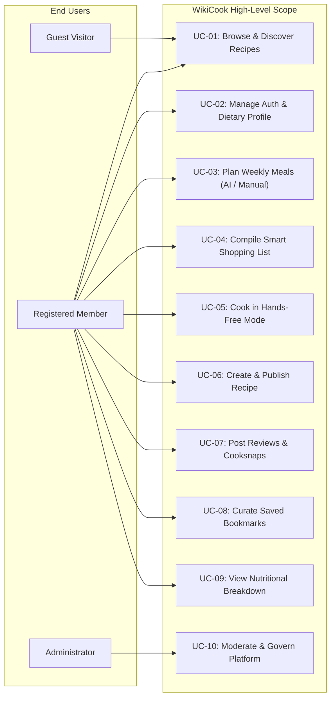

# VISION DOCUMENT: WIKICOOK

## DOCUMENT METADATA & RESPONSIBILITY MATRIX

| Section | Title | Performed by (Author) | Reviewed by | Edited by |
| :---: | :--- | :---: | :---: | :---: |
| **Section 1** | Positioning & Problem Statement | **Nguyễn Đức Duy (DucDuyNguyen15-IT)** | **Nguyễn Thành Dự (ThanhDu14)** | **Lê Quốc Hưng (LqHung06)** |
| **Section 2** | User Profiles & Persona | **Nguyễn Đức Duy (DucDuyNguyen15-IT)** | **Nguyễn Thành Dự (ThanhDu14)** | **Lê Quốc Hưng (LqHung06)** |
| **Section 3** | Scope & High-Level Use Cases | **Nguyễn Đức Duy (DucDuyNguyen15-IT)** | **Nguyễn Thành Dự (ThanhDu14)** | **Lê Quốc Hưng (LqHung06)** |

---

## 1. Positioning & Problem Statement
*Performed by: Nguyễn Đức Duy (DucDuyNguyen15-IT) | Reviewed by: Nguyễn Thành Dự (ThanhDu14) | Edited by: Lê Quốc Hưng (LqHung06)*

### 1.1. Problem Statement

| Problem Element | Description |
|:---|:---|
| **The problem of** | Daily culinary decision fatigue, unstructured recipes with ads, lack of cooking-mode guidance, and difficulty adhering to dietary restrictions. |
| **Affects** | Busy working professionals, independent students, homemakers, and dietary-restricted individuals. |
| **The impact of which is** | Wasted time (15–30 mins/day deciding meals), spoiled on-hand groceries, kitchen messes from device touchscreens, and accidental allergen exposure. |
| **A successful solution would** | Provide an intelligent, all-in-one culinary ecosystem with on-hand ingredient search, hands-free cooking guidance with step timers, automated meal planning via AI, and verified nutritional insights. |

### 1.2. Product Positioning Statement

* **For** busy home cooks, culinary creators, and health-conscious eaters
* **Who** seek quick, nutritious home meals and community culinary inspiration without daily planning stress
* **WikiCook is** an intelligent culinary web application and recipe-sharing ecosystem
* **That** streamlines meal planning, aggregates supermarket shopping lists, provides distraction-free hands-free cooking assistance with concurrent countdown timers, and calculates nutritional breakdowns via LLM
* **Unlike** static recipe blogs cluttered with advertisements or mechanical ingredient matching platforms (e.g. MyFridgeFood, Ăn Gì Ngon)
* **Our product** bridges the entire workflow from on-hand pantry discovery to the dining table with AI-orchestrated weekly meal planning and 2-way social Cooksnap verification.

---

## 2. User Profiles & Persona
*Performed by: Nguyễn Đức Duy (DucDuyNguyen15-IT) | Reviewed by: Nguyễn Thành Dự (ThanhDu14) | Edited by: Lê Quốc Hưng (LqHung06)*

```text
+-----------------------------------------------------------------------------------+
|                              WIKICOOK CORE PERSONAS                               |
+------------------------------------+----------------------------------------------+
| 1. The Busy Home Cook (Primary)    | - Needs quick recipes & step-by-step aid     |
|                                    | - Values time efficiency & meal planning     |
+------------------------------------+----------------------------------------------+
| 2. Recipe Contributor (Secondary)  | - Passionate food creator / home chef        |
|                                    | - Publishes dishes, seeks community feedback |
+------------------------------------+----------------------------------------------+
| 3. Dietary-Conscious User (Niche)  | - Requires strict allergen & macro filters   |
|                                    | - Values calorie tracking & clean eating     |
+------------------------------------+----------------------------------------------+
| 4. Platform Administrator (Admin)  | - Moderates user-submitted recipes & reviews |
|                                    | - Manages categories, users & platform data  |
+------------------------------------+----------------------------------------------+
```

### 2.1. Primary Persona: The Busy Home Cook
* **Profile:** Young working professional, college student, or working parent (aged 20–45).
* **Needs:** Find reliable recipes cookable in 20–45 minutes using ingredients already on hand; hands-free guidance while cooking to avoid smudging the smartphone.
* **Key Success Metric:** Minimizes decision time to < 3 minutes and completes cooking without burned steps.

### 2.2. Secondary Persona: The Recipe Contributor
* **Profile:** Passionate food blogger or culinary hobbyist (aged 22–55).
* **Needs:** Clean authoring tools to share authentic family recipes with ingredients, measurements, and step photos; receive community feedback and Cooksnaps.
* **Key Success Metric:** Consistent attribution, positive ratings, and community engagement.

### 2.3. Specialized Persona: Health-Conscious & Dietary-Restricted User
* **Profile:** Fitness enthusiast, vegan, or individual with food allergies (aged 18–60).
* **Needs:** Strict filtering against allergens (gluten, lactose, nuts) and automated nutritional breakdown per serving.
* **Key Success Metric:** Safe meal preparation with zero allergen violations and transparent macro estimates.

### 2.4. System Persona: Platform Administrator
* **Profile:** WikiCook operations team and content moderators.
* **Needs:** Efficient review queues for user submissions, moderation tools, category taxonomy management, and platform analytics.
* **Key Success Metric:** Clean catalog quality, spam eradication, and safe community standards.

---

## 3. Scope & High-Level Use Cases
*Performed by: Nguyễn Đức Duy (DucDuyNguyen15-IT) | Reviewed by: Nguyễn Thành Dự (ThanhDu14)* | Edited by: Lê Quốc Hưng (LqHung06)*

### 3.1. High-Level Use Cases



### 3.2. Scope Boundary

* **In-Scope (Release Roadmap):**
  - Responsive Web Application (optimized for 360px mobile up to 4K desktop).
  - 10 Core Functional Modules (Authentication, Search/Filter, Meal Planner, Shopping List, Hands-Free Mode, Recipe Wizard, Reviews/Cooksnaps, Bookmarks, Nutrition, Admin Dashboard).
  - AI Weekly Meal Planner using RAG semantic candidate retrieval over pgvector and LLM orchestration.
* **Out-of-Scope (Future Enhancements):**
  - Native iOS/Android app store deployment (Phase 2).
  - Direct supermarket online order fulfillment and payment gateway integration.
  - Smart kitchen IoT hardware synchronization (smart ovens/fridges).
