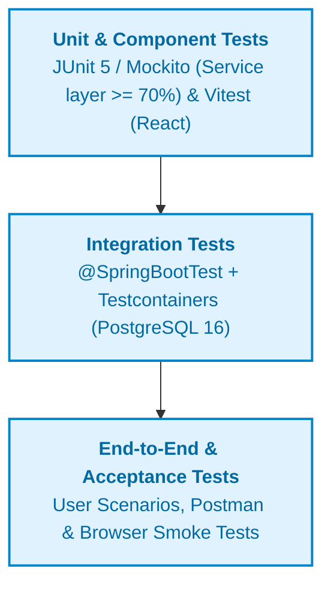

# TEST PLAN: WIKICOOK

## DOCUMENT METADATA & RESPONSIBILITY MATRIX

| Section | Title | Performed by (Author) | Reviewed by | Edited by |
| :---: | :--- | :---: | :---: | :---: |
| **Section 1** | Testing Strategy | **Trần Nguyễn Công Chung (itzchugnn)** | **Mai Văn Hiển (MaiHien3507)** | **Lê Quốc Hưng (LqHung06)** |
| **Section 2** | Scope & Environment | **Trần Nguyễn Công Chung (itzchugnn)** | **Mai Văn Hiển (MaiHien3507)** | **Lê Quốc Hưng (LqHung06)** |
| **Section 3** | Test Types (Unit, Integration, E2E) | **Trần Nguyễn Công Chung (itzchugnn)** | **Mai Văn Hiển (MaiHien3507)** | **Lê Quốc Hưng (LqHung06)** |

---

## 1. Testing Strategy
*Performed by: Trần Nguyễn Công Chung (itzchugnn) | Reviewed by: Mai Văn Hiển (MaiHien3507) | Edited by: Lê Quốc Hưng (LqHung06)*

### 1.1. Test-First Philosophy & Quality Gates

In strict accordance with **Principle II (Test-First — NON-NEGOTIABLE)** of the WikiCook Constitution (`.specify/memory/constitution.md`), all engineering phases enforce test-driven quality:

1. **Red → Green → Refactor Cycle:** Tests must be authored and execute with a failing state before functional implementation code is written.
2. **Mandatory Code Coverage Threshold:** Business logic within the backend `service` package must achieve **≥ 70% line and branch coverage** (measured via JaCoCo). Pull requests that fail to satisfy this threshold will be blocked by CI quality gates.
3. **Spec-to-Test Traceability:** Every acceptance scenario documented in a feature specification (`spec.md`) must map to at least one automated test case.

---

## 2. Scope & Environment
*Performed by: Trần Nguyễn Công Chung (itzchugnn) | Reviewed by: Mai Văn Hiển (MaiHien3507) | Edited by: Lê Quốc Hưng (LqHung06)*

### 2.1. Testing Scope

* **In-Scope:**
  - Backend business services, access control, and RESTful API endpoints.
  - Database persistence mapping and migration integrity (Flyway).
  - Frontend component rendering, user interactions, and form validations.
  - AI payload validation, rate-limiting, and error-handling fallbacks.
* **Out-of-Scope (for PA01 / Early Sprints):**
  - Full-scale distributed load stress testing (> 10,000 concurrent virtual users).
  - Physical multi-device hardware lab testing.

### 2.2. Test Execution Environments

* **Backend Test Harness:** Java 21, JUnit 5, Mockito, AssertJ, and Spring Boot Test.
* **Database Isolation:** Real PostgreSQL 16 instances launched via **Testcontainers** (H2 in-memory substitution is strictly prohibited by project constitution).
* **Frontend Test Harness:** Vitest, React Testing Library, and jsdom.
* **Continuous Integration:** Automated execution via `mvn verify` and `npm test` on feature branches.

---

## 3. Test Types (Unit, Integration, E2E)
*Performed by: Trần Nguyễn Công Chung (itzchugnn) | Reviewed by: Mai Văn Hiển (MaiHien3507) | Edited by: Lê Quốc Hưng (LqHung06)*

### 3.1. Unit Testing
* **Target:** Individual domain methods in backend Service classes and utility helpers.
* **Tooling:** JUnit 5, Mockito for repository/external client mocking.
* **Objective:** Verify business rules, exception throwing, and boundary conditions in complete isolation.

### 3.2. Integration Testing
* **Target:** REST `@RestController` endpoints, security filter chains, and Spring Data JPA queries.
* **Tooling:** `@SpringBootTest`, `@AutoConfigureMockMvc`, Testcontainers with real PostgreSQL.
* **Objective:** Verify correct HTTP status codes, JSON payload formatting, transaction rollbacks, and schema migration compatibility.

### 3.3. Component & Frontend Testing
* **Target:** React UI components (forms, modal dialogues, recipe cards, timer widgets).
* **Tooling:** Vitest + React Testing Library.
* **Objective:** Validate component rendering, accessibility attributes, client-side validation, and state changes.

### 3.4. End-to-End & Manual Testing
* **Target:** Complete user journeys (Sign up → Sign in → Recipe Discovery → Meal Planner → Shopping List).
* **Tooling:** Postman collections and manual QA verification across desktop and mobile viewports.
